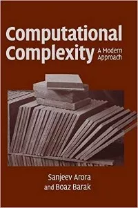

## 目录

基础数据分析：

- Excel
- SQL
- Python
- Pandas
- Numpy

进阶数据分析：

- Scipy
- Scikit-learn
- Pytorch / TensorFLow
- Fastai

进阶大数据分析：

- Hive
- Spark
- Flink

基础数据可视化：

- matplotlib
- Seaborn
- igraph

进阶数据可视化：

- PyEcharts
- Plotly / Plotly Express / Cufflink
- Altair

基础自然语言处理：

- Gensim

进阶自然语言处理（依赖于Pytorch/TensorFlow的各类NLP框架）：

- HanLP

基础关系网络分析：

- Networkx
- Gephi
- IBM i2

进阶关系网络分析（图神经网络）：

- Pytorch Geometric

其他基础技能：

- Linux
- Git
- Markdown
- Flask/FastAPI
- Docker
- Tableau / Power BI
- R

业务相关：

- 公司的数据表内容及数据台账
- 公司的产品线及产品生态

## 技术路线图

## 书单

### Ⅰ. 机器学习

#### 一、机器学习综述篇

机器学习算法的一般流程，是按照学习问题的性质设计模型，利用优化算法来最小化模型的正则化经验风险，从而学习出最优模型，然后应用到新的测试数据上。根据学习问题、模型、优化算法、正则化方法的不同，学习算法分为许多种类。浏览机器学习算法综述类书籍的目录，就不难发现机器学习的算法体系。以下3本机器学习综述类书籍，能**帮助你建立对机器学习的整体认知**：

**1）Pattern recognition and machine learning**

作者：Christoper M. Bishop

适合人群：初级到中级学者

推荐指数：★★★★★

主要内容：本书全面介绍了模式识别和机器学习，包括近年来的最新发展。如果你对机器学习、统计学、信号处理、计算机视觉、数据挖掘等方向感兴趣，都可以学习这本书。在打开这本书前，你不需要有模式识别或机器学习的知识，但至少要熟悉多元微积分和基本线性代数，有一些概率论知识会更好，书中也会有对基本概率理论的介绍。

推荐理由：这本书浅显易懂，生动形象，较为全面地涵盖了线性回归、神经网络、核方法等经典的监督机器学习算法，以及非监督的概率图模型和EM算法，非常适合初步接触机器学习算法的读者们。

**2）Neural networks and learning machines**

作者：Simon Haykin

适合人群：初级到中级学者

推荐指数：★★★★★

主要内容：本书共15章，是关于神经网络的非常全面的、最新的论述，内容包括Rosenblatt感知器、回归模型、多层感知器、核方法和径向基函数网络、支持向量机、正则化理论、信息论学习模型等。

推荐理由：这本书从神经网络讲起，循序渐进，从感知机、多层感知机、径向基函数感知机，过渡到核方法和SVM，然后讨论学习算法与信息论和统计的关联关系，最后介绍动态系统的学习及其与递归神经网络的关系。

**3）Deep Learning**

作者：Ian Goodfellow, Yuoshua Bengio, Aaron Couville

适合人群：初级到中级学者

推荐指数：★★★★★

主要内容：本书是深度学习领域奠基性的经典教材，包含三部分：一，介绍基本的数学工具和机器学习的概念，作为深度学习的预备知识；二，系统深入地讲解现今已成熟的深度学习方法和技术；三，讨论具有前瞻性的方向和想法，它们是深度学习未来的研究重点。本书适合各个相关专业的学生，以及不具有机器学习或统计背景的软件工程师，来快速补充深度学习知识并将其投入实际应用。

推荐理由：这本书侧重深度学习在2006年再次兴起、获得更大成功之后的新进展，尤其介绍了深度学习在自然语言处理、语音识别、计算机视觉、在线推荐等中的应用，而且包含了表达学习这一研究视角。

#### 二、机器学习算法优化篇

机器学习算法的最终性能会受到三个因素的影响：模型空间的表达力、优化算法的收敛速率、泛化能力。在表达力方面，除了神经网络的普遍逼近定理之外，定量的研究非常有限。推荐以下3本介绍优化算法的书籍：

**1）Convex optimization**

作者：Steve Boyd

适合人群：初级到中级学者

推荐指数：★★★★★

主要内容：本书分为理论、应用、算法三大部分。理论部分介绍基础概念、知识和方法；应用部分介绍凸优化在解决逼近与拟合、统计估计和几何关系分析这三类实际问题中的应用；算法部分介绍求解无约束凸优化模型、等式约束凸优化模型以及包含不等式约束的凸优化模型的经典数值方法，以及如何利用凸优化理论分析这些方法的收敛性质。

推荐理由：内容全面，侧重算法，更适合初学者，能够帮助读者对凸优化理论和方法建立完整的认识。

 

**2）Convex analysis and optimization**

作者：Dimitri P. Bertsekas et,al.

适合人群：中级到高级学者

推荐指数：★★★★★

主要内容：本书对凸分析及其优化进行了全面的阐述，除此之外，还通过引入一些新的分析视角来重构该主题理论。

推荐理由：本书侧重凸算法的性质，更适合对凸分析感兴趣的学者。

 

**3）The nature of Statistical learning theory**

作者：Vladimir Vapnik

适合人群：中级到高级学者

推荐指数：★★★★★

主要内容：本书讨论了统计理论背后的基本思想，包括学习和概括。作者将学习视为基于经验数据的函数估计的一般问题，重点讨论了学习理论及其与统计学的关系，进一步发展了学习理论和SVM算法。

推荐理由：在泛化方面，除了可以参考综述类书籍的正则化技术章节之外，Vapnik的这本书将泛化性能描述成统计推断问题，提出了著名的VC容度来解答泛化问题，并由此设计了结构风险最小原则，引出SVM算法。

近几年，深度学习的理论受到学术界的广泛关注，希望不远的将来我们能对深度学习的逼近、优化、泛化有更深入全面的了解，涌现出一批深度学习理论的书籍。

#### 三、机器学习理论延展篇

前文中的机器学习理论均以统计学描述学习算法性能。除此之外，信息论、博弈论、计算复杂度的相关理论也与机器学习联系密切，因此在这里推荐一些相关书籍作为机器学习的理论延展。

 

**信息论**

作者：Thomas M. Cover, Joy A. Thomas

适合人群：初级到中级学者

推荐指数：★★★★★

主要内容：这本书是信息论领域中的一本简明易懂的教材，对熵、信源、信道容量、率失真、数据压缩与编码理论、复杂度理论、网络信息论和假设检验等进行了介绍，能在理论和应用方面为读者打下坚实的基础。

推荐理由：信息论对理解模型有独特的视角，可以给出非监督概率生成模型的统一体系，也有人尝试用来理解深度学习的信息瓶颈。这本书中概念清楚，内容完整。

 

**博弈论**

**A course in game theory**

作者：Martin J. Osborne, Ariel Rubinstein

适合人群：初级到中级学者

推荐指数：★★★★★

主要内容：本书介绍了博弈论的基本概念和理论基础，由四部分组成：战略博弈、完全信息扩展博弈、不完全信息扩展博弈以及联盟博弈。

推荐理由：随着交互环境中强化学习技术的兴起，博弈论为我们描述或者建立agent的行为提供了有效的概念。这本书中将理论与例子结合，直观易懂。

 

**计算复杂度**

**Computational complexity：A modern approach**

作者：Sanjeev Arora

适合人群：中级到高级学者

推荐指数：★★★★★

主要内容: 这本书涵盖了计算复杂度理论的经典成果和最近的成就，可作为任何感兴趣的读者的自学参考。

推荐理由：计算复杂度刻画了算法的效率，尤其是针对离散的组合优化。如果对与机器学习有重要关系的加密、量子计算感兴趣，可以通过Sanjeev Arora的这本书对计算复杂度有更深入的了解。

#### 四、数学基础篇

另外，还有极其重要的一点——入坑机器学习的你，别忘了打好数学功底！作为理解和改进机器学习算法的必经之路，数学是一切的基础。从概率论、代数到实变函数，扎扎实实走好每一步，才能让后面的进阶学习更加顺利。

**Probability**

作者：A.N.Shiryaev

适合人群：初级到高级学者

推荐指数：★★★★★

推荐理由：概率论是统计学和机器学习的基本描述语言，值得好好学习。推荐Probability，这本书不仅内容全面，推导清晰，而且有直观的例子。读者可以跳过书中部分较深入的章节。

**高等代数**

出版社：高等教育出版社

适合人群：初级到中级学者

推荐指数：★★★★★

推荐理由：代数是处理矩阵问题的主要技术，同时可以帮助深入理解（线性）空间。推荐高等教育出版社的《高等代数》，概念清晰，重要定理及证明完整，并配有大量习题。

此外，实变函数能够帮助我们深入理解收敛、微分、积分，并结合测度论过渡到随机积分和随机微分方程，而随机微分方程是描述随机动态系统的主要技术。泛函分析中算子的概念和四大定理对机器学习很有用处，比如理解Q-learning的Bellman 算子，用压缩映射定理刻画强化学习问题的不动点，等等。因此，以下四本相关书籍也值得大家仔细阅读。

**实变函数论**

作者：周民强

**测度与概率**

作者：严士健，刘秀芳

 

**泛函分析讲义**

作者：张恭庆，郭懋正

**随机微分方程引论**

作者：龚光鲁

### Ⅱ. 计算机视觉

计算机视觉是从图像和视频中提出数值或符号信息的计算系统，更形象一点说，计算机视觉是让计算机具备像人类一样的眼睛，看到图像，并理解图像。加州大学洛杉矶分校统计学和计算机科学教授教授朱松纯曾表示“**人的大脑皮层的活动大约70%是在处理视觉相关信息。视觉就相当于人脑的大门。如果不能处理视觉信息的话，整个人工智能系统是个空架子，只能做符号推理，没法研究真实世界的人工智能。**”

一起来看看这些计算机视觉领域的修炼秘笈吧！下一个计算机视觉高手也许就是你哦！

#### 一、综合篇

**1. Computer Vision: A Modern Approach**

作者：David A. Forsyth,‎ Jean Ponce

出版时间：2003（第一版），2011（第二版）

适合人群：初级到中级学者

推荐指数：★★★★★

主要内容：本书包含了计算机视觉领域众多问题：成像、面向单张图像的早期视觉、面向多张图像的早期视觉、中层视觉问题、高层视觉问题，也包括了相关的视觉应用，如基于图像的建模与绘制、以人为中心的视觉问题、图像搜索，最后，作者也简要讲述了视觉算法相关的优化技术。

推荐理由：本书既有对计算机视觉问题的系统的讲解，又有对相关问题的详细的讲述。通过本书，读者能够实现计算机视觉应用。本教材成书较早（第一版：2003，第二版：2011），但内容全面广泛，可作为高年级本科生或研究生的教材或参考书，也可作为计算机视觉工程人员的参考书。本书也适合作为计算机视觉相关领域，包括多媒体搜索、计算机图像学、机器人、图像处理、以及成像等领域的研究人员参考书。

图书主页：http://luthuli.cs.uiuc.edu/~daf/book/book.html

**2. Computer Vision: Algorithms and Applications**

作者：Richard Szeliski

出版时间：2010

适合人群：初级到中级学者

推荐指数：★★★★★

本书内容：本教材包含用于分析理解图像的各种各样的技术，同时也讲述了具有挑战性的现实世界的视觉问题，比如医学图像，以及适合于个人相册的图像编辑技术等。具体课题包括：成像，图像处理，特征检测、匹配与分割，基于特征的对齐，基于运动的结构重建，图像粘贴，计算摄影学，立体对齐，三维重建，基于图像的绘制和识别等等。作者也提供了计算机视觉算法涉及到的线性代数、数值优化技术、贝叶斯建模与推理。

推荐理由：本书是作者多年从事计算机视觉教学与研究的成果，按照课程项目的方式组织。可供高年级本科生和研究生计算机视觉课程的教材。

图书主页：http://szeliski.org/Book/

#### 二、几何篇

**1. Multiple View Geometry in Computer Vision**

作者：Richard Hartley, Andrew Zisserman

出版时间：2000 （第一版），2004（第二版）

适合人群：初级到中级学者

推荐指数：★★★★★

本书内容：理解真实世界的三维结构是计算机视觉领域的一个基本问题。本书内容包括三维几何与重建所需要的计算相关的几何原则及物体的代数表达。本书以统一框架的形式给出了场景重建的理论与实现细节。同时作者也提供了详尽的背景知识、应用和实现算法的解释。

推荐理由：本教材系统是多视角几何经典教材，既包含经典的方法，又包括现代的方法。本书写作清晰明了，又不失连贯性。本书可作为计算机视觉和计算机图形学等课程高年级本科生和研究生教材，对于自动驾驶、机器人、AR/VR、无人机、地理测绘等领域研究人员和技术人员是重要的参考书。

图书主页：http://www.robots.ox.ac.uk/~vgg/hzbook/

**2. An Invitation to 3-D Vision: From Images to Geometric Models**

作者：Yi Ma, Stefano Soatto,‎ Jana Kosecká,‎ S. Shankar Sastry

出版时间：2005

适合人群：初级到中级学者

推荐指数：★★★★★

主要内容：本书着重讲述了计算机视觉中的重要问题：利用线性代数和矩阵理论从一系列二维图像中重建三维结构和运动。本书的特点是一套基于多幅图像的研究几何和重建几何模型的统一框架，也包括了图像形成、基本的图像处理方法以及特征提取等内容，同时也给出实现视觉算法及系统的操作指南。

推荐理由：本书适合于计算机视觉、应用数学、计算机图形学，及机器人等方向的高年级本科生、研究生以及研究人员。同时作者也提供了算法实现的程序，对于自动驾驶、机器人、AR/VR、无人机、地理测绘等领域研究人员和技术人员是重要的参考书。

图书主页：http://vision.ucla.edu/MASKS/

**3. 计算机视觉： 计算理论与算法基础**

作者：马颂德，张正友

出版时间：1998 （第一版），2003（第二版）

适合人群：初级到中级

推荐指数：★★★★★

主要内容：计算机视觉从信息处理的层次研究视觉信息的认知过程，以及视觉信息处理的计算理论、表达与计算方法。本书系统地介绍了计算机视觉的重要理论与算法，包括图像特征提取、摄像机定标、立体视觉、运动视觉(或称序列图像分析)、由图像灰度恢复三维物体形状的方法、物体建模与识别方法以及距离图像分析方法等。

推荐理由：本书主要涵盖了计算机视觉领域早期视觉的问题，对相关问题的研究背景和实现方法做了详细阐述。可作为高年级本科生或研究生的教材或参考书，也可供自动驾驶，AR/VR，无人机，地理测绘等领域研究人员和技术人员参考。

#### 三、机器学习篇

**1. Computer Vision: Models, Learning, and Inference**

作者：Simon J.D. Prince

出版时间：2012

适合人群：初级到中级学者

推荐指数：★★★★★

主要内容：本书介绍了解决计算机视觉问题的概率模型学习与推理的方法，讲述了如何利用训练数据建立观察图像和要估计的内容的联系，例如估计三维结构。本书包括概率基础知识、概率图模型、图分割方法、多视觉几何、相机标定、人脸识别、目标跟踪等等。书中共介绍了70多种算法。

推荐理由：本书可以看成计算机视觉与机器学习结合的果实，提供了应用于计算机视觉研究的机器学习（深度学习除外）基本知识，描述简明直观。本教材可作为高年级本科生以及研究生计算机视觉教材，也适合于计算机视觉从业人员。

图书主页：http://www.computervisionmodels.com/

**2. Pattern Recognition and Machine Learning**

作者：Christopher Bishop

出版时间：2006

适合人群：初级到中级学者

推荐指数：★★★★★

主要内容：本书是第一本从贝叶斯的角度讲述模式识别，用图模型的方式描述离散概率分布的书籍。内容包括：线性回归模型、线性分类模型、神经网络、核方法、稀疏核方法、图模型、混合模型与期望最大化算法、近似推理、采样方法、连续隐变量模型等。

推荐理由：本书主要讲述应用于模式识别问题的机器学习方法，也包括视觉识别问题，适合作为高年级本科生及研究生的教材，也是计算机视觉领域研究人员及从业人员学习机器学习的参考书。

图书主页：https://www.microsoft.com/en-us/research/people/cmbishop/#!prml-book?from=https%3A%2F%2Fresearch.microsoft.com%2F%7Ecmbishop%2FPRML%2Findex.htm

**3. Deep Learning**

作者：Ian Goodfellow and Yoshua Bengio and Aaron Courville

出版时间：2016

适合人群：初级、中级到高级学者

推荐指数：★★★★☆

主要内容：本书包括三大部分，第一部分介绍了基本的数学工具和机器学习概念，第二部分描述了最著名的深度学习算法，第三部分列举了深度学习研究前沿的想法及问题。

推荐理由：本书不是专门为计算机视觉而写的深度学习教材，但是包含了成书之前计算机视觉领域发明的深度学习技术，可作为计算机视觉领域的高年级本科生及研究生的教材，也可作为计算机视觉研究人员和从业人员参考书。

图书主页：http://www.deeplearningbook.org/

**4. Generalized Principal Component Analysis**

作者：RenéVidal,‎ Yi Ma,‎ Shankar Sastry

出版时间：2016

适合人群：中级到高级学者

推荐指数：★★★★★

主要内容：本书介绍了关于从一个或多个子空间或流形产生出来的，可能含有噪声、大误差或者异常的高维数据建模的数学理论和计算工作的最新进展，涵盖了用于子空间估计和分割的最新的代数的、几何的、统计的计算方法，并且给出了若干在图像处理、图像视频分割、人脸识别与聚类等问题的有趣应用。

推荐理由：本教材可做为计算机视觉以及图像和信号处理、数据科学、机器学习、系统理论等领域的研究生和起步的研究者。本书包含了大量的图解说明、例子、以及练习习题，同时涵盖了本教材涉及到的统计、优化、代数几何等方面的基本概念和原理。

图书主页：http://perception.csl.illinois.edu/gpca/

#### 四、经典读物篇

**Vision: A Computational Investigation into the Human Representation and Processing of Visual Information**

作者：David Marr

出版时间：1982

适合人群：中级及高级学者

推荐指数：★★★★★

主要内容：本书提供了理解视觉感知的框架，也涉及了大量研究和理解大脑及其功能的问题。在Marr的框架里，视觉过程建立了一套表达方法：开始于图像描述，终结于在周围环境中的三维物体描述。他提出了在神经科学和认知科学领域具有重大影响力的多层次分析方法论：计算层次、算法层次、硬件算法层次。

推荐理由：本书系统的描述了Marr的对于视觉感知的理解的框架。本书自出版以来，影响一代大脑及认知科学家。时至今日，这本书依然是致力于大脑和认知科学、计算机视觉领域特别是视觉感知的研究人员的参考书。

### Ⅲ. NLP

#### 一、入门篇

**主要目标：**熟悉和了解自然语言处理领域的基本术语、任务定义和基本算法，比如输入输出、评价标准和应用场景。为以后的进一步学习、科研、产品开发以及学术和技术交流奠定基础。

**1、Speech and Language Processing, 2nd Edition**

作者：Daniel Jurafsky and James H. Martin

中文译名：语音与语言处理

适合人群：初级到中级学者

推荐指数：★★★★★

主要内容：本书内容涵盖了自然语言处理的方方面面，从底层的词法分词、语法分析和语义分析，到和应用更为接近的自然语言处理任务，如信息抽取、机器翻译、自动问答、文本摘要、对话系统等。书中将自然语言处理、计算语言学以及语音识别等内容融合在一起，把各种技术相互联系起来，让读者了解怎样才能最佳地利用每种技术，怎样才能将各种技术结合起来使用。

推荐理由：最经典的自然语言处理的入门教程，也被国外许多著名大学选为自然语言处理和计算语言学课程的主要教材。本书写作风格引人入胜，深入技术细节而又不让人感觉枯燥，不仅可以作为高等学校自然语言处理和计算语言学等课程的本科生和研究生教材，对于自然语言处理相关领域的研究人员和技术人员也是不可或缺的权威参考书。

**2、Foundations of Statistical Natural Language Processing**

作者：Christopher Manning and Hinrich Schütze

中文译名：统计自然语言处理基础

适合人群：初级到中级学者

推荐指数：★★★★★

主要内容：本书涵盖的内容十分广泛，分为四个部分，共16章，包括了构建自然语言处理软件工具将用到的几乎所有理论和算法。全书的论述过程由浅入深，从数学基础到精确的理论算法，从简单的词法分析到复杂的语法分析，适合不同水平的读者群的需求。同时，《统计自然语言处理基础：国外计算机科学教材系列》将理论与实践紧密联系在一起，在介绍理论知识的基础上给出了自然语言处理技术的高层应用（如信息检索等）。

推荐理由：经典的统计自然语言处理的入门教材。内容涉及统计自然语言处理用到的数学基础，词法到语法分析，以及自然语言处理的基本任务（比如文本分类、聚类，统计机器翻译，以及信息检索）。本教材成书较早（1999年），但是自然语言处理领域的基本概念和任务没有太大的变化，仍然适用于初学者快速了解自然语言处理相关的概念和任务。

**3、统计自然语言处理（第2版）**

作者：宗成庆

适合人群：初级到中级学者

推荐指数：★★★★☆

主要内容：本书介绍了统计自然语言处理的基本概念、理论方法和最新研究进展，内容包括形式语言与自动机及其在自然语言处理中的应用、语言模型、隐马尔可夫模型、语料库技术、汉语自动分词与词性标注、句法分析、词义消歧、篇章分析、统计机器翻译、语音翻译、文本分类、信息检索与问答系统、自动文摘和信息抽取、口语信息处理与人机对话系统等。

推荐理由：本书既有对基础知识和理论模型的介绍，也有对相关问题的研究背景、实现方法和技术现状的详细阐述。可作为高等院校计算机、信息技术等相关专业的高年级本科生或研究生的教材或参考书，也可供从事自然语言处理、数据挖掘和人工智能等研究的相关人员参考。

#### 二、进阶篇

**主要目标：**近年来，深度学习的算法和模型在自然语言处理的主要任务（例如机器翻译、自动问答、机器阅读、文本摘要、文本生成等）上取得了很好的效果。虽然现在对深度学习的模型和传统模型的优劣尚不能定论（根据不同的任务、应用场景和需求以及数据规模可能有不同的结论，实际系统中更多时候也是共存互补），但这个方向目前成为学术界和工业界关注和投入的重点方向，实际的自然语言应用系统中也都或多或少、或直接或间接用到深度学习的技术，值得大家关注。

**1、Neural Network Methods in Natural Language Processing (Synthesis Lectures on Human Language Technologies)**

作者：Yoav Goldberg

适合人群：初级到中级学者

推荐指数：★★★★★

主要内容：本书着重介绍神经网络模型在自然语言数据中的应用。本书的前半部分介绍了有监督的机器学习和前馈神经网络的基础知识，基于语言数据的机器学习的基础知识。它还涵盖了可以定义和训练任意神经网络的计算图形抽象方面的知识，是当代神经网络软件库设计的基础。本书的第二部分介绍了更多专门的神经网络体系结构，包括一维卷积神经网络、递归神经网络、条件生成模型和基于注意力的模型。这些体系结构和技术是机器翻译、句法分析和许多其他应用程序的最先进算法的推动力量。最后，本书还讨论了树形网络，结构化预测和多任务学习的前景。

推荐理由：大家都知道最近几年由于深度学习的兴起，使得图像识别、语音识别等多个方面都发生了很大的变革。深度学习在自然语言处理方面也是非常普遍了，一些经典的自然语言模式也都是基于神经网络的，这本书是目前市面上唯一一本介绍神经网络在自然语言处理的应用，是最新、最前沿的东西，而且书中的大量参考文献非常有价值。本书的作者在这个领域非常知名，并且对待学术态度极其严谨。深入浅出，值得对深度学习在自然语言处理中应用感兴趣的同学系统地读一读。

**2、CS224d: Deep Learning for Natural Language Processing**

课程导师：Richard Socher

适合人群：初级到中级学者

课程链接：

http://cs224d.stanford.edu/syllabus.html

推荐指数：★★★★★

主要内容：斯坦福大学自然语言小组的基于深度学习的自然语言处理的课程。介绍了自然语言处理领域广泛应用的网络结构（例如循环神经网络、卷积神经网络以及递归神经网络等）及其在自然语言处理的经典任务，例如分类任务（情感分类），序列标注任务（实体识别），序列到序列的生成任务（机器翻译）的实际应用。

推荐理由：自然语言处理是信息时代最重要的技术之一。理解复杂的语言也是人工智能的重要组成部分。自然语言处理的应用无处不在，因为人们用语言沟通了大部分内容：网络搜索、广告、电子邮件、客户服务、语言翻译、放射学报告等等。本课程比较适合对这个领域感兴趣的初学者。

**3、Oxford Deep Learning for NLP class**

课程导师：Phil Blunsom. (2017) Class by Deep Mind NLP Group.

适合人群：中级到高级学者

课程链接：https://machinelearningmastery.com/oxford-course-deep-learning-natural-language-processing/

推荐指数：★★★★★

主要内容：DeepMind团队成员在牛津大学教授基于深度学习的自然语言处理的课程。内容涉及到词嵌入，基于循环神经网络的语言模型，基于循环神经网络和卷积神经网络的文本分类，基于循环神经网络的条件语言模型（广泛应用于机器翻译、文本摘要等）及其中的注意力机制，以及基于深度学习模型的自动问答等主要自然语言处理的任务。

推荐理由：深度学习方法在一套自然语言处理问题上达到了最先进的效果，这是英国牛津大学教授的一门关于自然语言处理深度学习的课程，本课程的大部分材料都可以在线免费获取。比较适合对这个领域有一定的基础，希望了解最新进展和进一步学习和研究的同学。

### Ⅳ. 计算机图形学

计算机图形学诞生于二十世纪六十年代，主要的研究内容是研究如何使用数学算法在计算机中有效地表达、生成、处理以及显示相关图像和图形。作为一门计算机应用科学，计算机图形学近年来的快速发展极大地促进了计算机辅助设计、虚拟现实、游戏、动画、影视特效等行业的发展。

为了帮助同学们更好地学习计算机图形学，我们邀请微软亚洲研究院网络图形组主管研究员董悦为大家推荐了该领域相关的经典书籍，内容涵盖图形学基础原理、渲染基础与算法、计算几何与几何处理、表观建模等。

#### 计算机图形学基础

**Computer Graphics: Principles and Practice**

作者： 

John F. Hughes, Andries van Dam, Morgan McGuire, David F. Sklar, James D. Foley, Steven K. Feiner , Kurt Akeley

中文版：计算机图形学原理及实践

推荐理由：本书为四位图形学界大师的经典著作。作为计算机图形学入门基础最佳教程，该书内容涵盖非常广泛，从最基础的rasterization algorithm到现代GPU设计及并行计算应有尽有。这本书之所以有名一方面是因为其全面地介绍了计算机图形学的基本概念和经典算法，另一方面也来自于这本书的历史地位。该书第一版出版于1982年，可以说这本教材见证了计算机图形学界的发展，当然，本书也多次改版增添了大量内容以适应计算机图形学的飞速发展。从任何一个角度看，本书都是值得学习的经典入门书目。

#### 渲染技术入门

  

**Physically Based Rendering: From Theory to Implementation**

作者： 

Matt Pharr, Wenzel Jakob, Greg Humphreys

中文版：物理渲染从理论到实现（第2版）

推荐理由：基于光线追踪的渲染算法最佳教材，该教材在渲染领域如雷贯耳，同时与该书配套的渲染系统PBRT也在计算机图形学领域被广泛应用，是学界最常用的渲染引擎之一。该书的作者也是渲染领域的几位大师级专家，该书涉及了光线追踪渲染的各个方向，同时该书的最新版也及时引入了大量新近的光线追踪渲染算法。光线追踪已经是现代电影特效工业的基础模块，同时随着基于GPU的光线追踪的发展，光线追踪在游戏中也会逐渐发挥自己的特长。该书是学习渲染的入门必读书目。

**Real-Time Rendering, 4th Edition**

作者：

Tomas Akenine-Möller, Eric Haines, Naty Hoffman

中文版：实时计算机图形学（第二版）

推荐理由：前面那本书讲的是完全基于物理的光线追踪渲染系统，然而对于绝大多数游戏和实时交互场景，光线追踪的效率相对低下，无法满足实时计算的要求，因此在游戏引擎等实时性要求较高的应用中，人们设计了很多用于实时渲染的算法。本书出自三位具有丰富游戏引擎设计经验的大师之手，该书也是实时渲染领域的经典著作，几经再版，更新最新的实时渲染技术。当前最新的第四版也引入了很多最新游戏中使用的最新技术，值得每一位对实时渲染和游戏渲染系统感兴趣的同学学习。

#### 渲染算法进阶

下面这两本更偏向于学术著述，需要有一定的渲染基础知识才可以阅读，然而由于出自先进渲染算法的几位经典导师之手，这两本书对于想深入研究渲染系统，或者希望在渲染领域进行学术研究的同学也是必读的书目，在阅读过程中也能学习到技术之外的一些关于如何设计这些算法的深刻思考。

**Advanced Global Illumination, 2nd Edition**

作者： 

Philip Dutre, Philippe Bekaert, Kavita Bala

推荐理由：本书基本围绕光线追踪这一分支下基于蒙特卡罗的光线追踪体系，根据概率计算有效提高渲染效率，同时始终对渲染结果做出无偏估计。是学习蒙特卡罗光线追踪的重要教材。

**Realistic Image Synthesis Using Photon Mapping, 1st Edition**

作者：

Henrik Wann Jensen

推荐理由：本书主要介绍利用Photon Mapping进行有效计算全局光照和半透明渲染的方法，Photon Mapping虽然是一种有偏估计算法，但是该算法在一些特殊的渲染过程中具有非常高的计算效率优势，因此，Photon Mapping依然是电影工业中进行渲染计算不可或缺的重要部分。该书对Photon Mapping进行了深入浅出的介绍，是学习该方法的最佳读物。

#### 计算几何与几何处理

**Computational Geometry: Algorithms and Applications, 3rd Edition**

作者：

Mark de Berg, Otfried Cheong, Marc van Kreveld, Mark Overmars

推荐理由：计算几何是图形学的一个重要数学基础，本书围绕计算机图形学应用总结了计算几何的经典算法，是计算几何的经典入门书目。

**Polygon Mesh Processing, 1st Edition**

作者：

Mario Botsch, Leif Kobbelt, Mark Pauly, Pierre Alliez, Bruno Levy

推荐理由：几何处理是计算机图形学的一个重要研究方向，本书出自几位当今活跃在科研一线的几何处理大师之手，基本涵盖了几何处理的各个重要研究方向，每个章节还为想深入研究该方向的同学列出了扩展阅读的材料，适合想深入学习研究几何处理的同学研读。

#### 表观建模

**Digital Modeling of Material Appearance (The Morgan Kaufmann Series in Computer Graphics), 1st Edition**

作者：

Julie Dorsey, Holly Rushmeier, François Sillion

推荐理由：表观建模研究物体与光线的交互作用，体现了物体的材质属性。本书出自表观建模的几位先驱者，全面系统地介绍了表观建模的概念和领域的多个重要方向。虽然此书出版时间相对较早，但本书作为表观建模领域的入门教材依然值得每个想在这个领域进行深入研究的同学阅读。同时，由于渲染与表观密不可分，因此也建议对表观建模感兴趣的同学结合前面介绍的渲染相关的书籍进行学习。

**高动态范围图像**

**High Dynamic Range Imaging: Acquisition, Display, and Image-Based Lighting 2nd Edition, Kindle Edition**

作者：

Erik Reinhard, Wolfgang Heidrich, Paul Debevec, Sumanta Pattanaik, Greg Ward, Karol Myszkowski

推荐理由：高动态范围图像已经在当前图形学产业界有了非常广泛的应用，现在的手机相机也大多带有HDR拍照的功能。本书由HDR领域的多位先驱者共同编写，全面深入地介绍了HDR图像相关的方方面面，从理论基础到产业应用应有尽有。相信每一位对HDR技术感兴趣的同学都能在本书中找到自己需要的内容。

#### One more thing

**Jim Blinn's Corner Series**

作者：Jim Blinn

推荐理由：Jim Blinn是计算机图形学领域的泰斗级人物，在NASA和JPL制作的宇宙系列动画影响了一代人对宇宙和计算机图形学）探索的向往。同时大名鼎鼎的Blinn-Phong模型在今天依然有所大量的应用。这套系列丛书一共出版了三本，分别是

- Jim Blinn's Corner: Dirty Pixels
- Jim Blinn's Corner: A Trip Down The Graphics Pipeline
- Jim Blinn's Corner: Notation, Notation, Notation

该系列丛书收集了Jim Blinn在IEEE Computer Graphics & Applications写的一系列专栏文章。由于文章发表时间相对久远，很多文中涉及到领域已经有了长足的发展，因此这套书相对而言更适合学术考古、溯本追源之用。

### Ⅴ. 语音研究进阶指南

作为人类最自然的交流方式，“听”和“说”包括了人类大脑皮层从听觉感知到语言处理和理解，再到声音生成这个“神奇”的认知过程。语音领域的探索和研究已经持续了长达150多年，从最初的电话通信到语音识别、语音合成、说话人识别等扩展应用， 研究内容涵盖了信号处理、统计学、模式识别、自然语言处理等交叉领域的知识和技能。

我们邀请了微软（亚洲）互联网工程院资深语音科学家汪曦为大家推荐语音领域的经典书目，涵盖了语音研究中的信号处理、语音和语言处理、深度学习研究等多个方面，里面包含了大量语音技术的基础知识，在大家关心深度学习算法和模型的同时，积累基础知识，概念，方法和思想对深入了解该领域是非常有意义的，但是同时也提醒大家，由于语音领域的发展十分迅速，所以在阅读基础书籍的同时，关注相关领域最新、最有影响力的文章也是十分重要的。

#### 信号处理篇

**1. Discrete-Time Signal Processing (3rd version)**

中文版：《离散时间信号处理（第3版) 》

作者：A. V. Oppenheim、Ronald W. Schafer

适合人群：初级到中级（需要信号与系统基础）

推荐指数：★★★★

主要内容：本书由美国麻省理工学院A. V. Oppenheim和佐治亚理工学院R. W. Schafer教授合力撰写，系统论述了离散时间信号处理的基本理论和方法， 是国际信号处理领域中的经典权威教材。内容包括离散时间信号与系统、z变换、连续时间信号的采样、线性时不变系统的变换分析、离散时间系统结构、滤波器设计方法、离散傅里叶变换、离散傅里叶变换的计算、利用离散傅里叶变换的信号傅里叶分析、参数信号建模、离散希尔伯特变换、倒谱分析与同态解卷积。

推荐理由：本书是经典的DSP教材，是掌握离散信号处理和方法的理论基础，也是语音信号处理、分析和变换的理论基础和应用支撑。这本书不仅可以作为通信和信号处理领域本科以及研究生教材，也可以作为从事语音信号处理相关技术研究人员的权威参考。

**2. Discrete-Time Speech Signal Processing: Principles and Practice**

中文版：《离散时间语音信号处理：原理与应用》

作者：Thomas F. Quatieri

适合人群：中级（需要信号与系统基础）

推荐指数：★★★★★

主要内容：本书内容整理自美国麻省理工学院T. F. Quatieri 教授的“数字语音处理”课程，介绍了语音信号处理的主要原理和重要应用，在理论和应用之间达到了很好的平衡。本书首先讲解了用于理解离散时间语音信号处理的完整理论基础，然后介绍了语音信号处理方面的重要研究进展，其中包括正弦语音处理、语音时频分析以及非线性声学语音产生模型，并深入介绍了相关应用，包括语音编码、语音增强、语音合成、说话人识别等。

推荐理由：本书作者在美国麻省理工学院林肯语音实验室进行了多年的相关项目开发和研究，积累了大量经验。本书包括了语音信号处理几乎所有的理论和应用：从语音产生和感知的分析理论基础阐述到声学理论和模型， 从全极点模型分析合成到同态信号处理、傅里叶变换、滤波器组和正弦分析合成和基音频率估计，以及很重要的应用部分。本书能够非常全面地帮助读者理解和夯实基础，推荐作为语音处理和应用的学习参考书籍。

#### 语音和语言处理

**1. Fundamentals of Speech Recognition**

作者：L. R. Rabiner、B. H. Juang

适合人群：初级到中级（需要包括信号处理、语音学、生理学、统计数学等基础）

推荐指数：★★★★

主要内容：本书是两位语音领域的泰斗——前贝尔实验室主任L. Rabiner教授和美国国家工程院院士庄炳煌教授合著，完整论述了现代语音识别的基本问题和思想，包括语音信号产生、感知和语音信号的声学以及语音学特征、语音识别的信号处理和分析方法、模式比较、以及语音识别系统的设计和实现。其中详细介绍了隐马尔可夫模型理论和实现、孤立词/连接词模型、大词汇连续语音识别、特定任务语音识别等。

推荐理由：本书语言流畅，对语音识别的基本问题阐述精辟而全面，对深入理解语音技术非常有帮助。Rabiner是HMM三个问题论述的作者，所以本书对HMM进行了鞭辟入里而又详细易懂的诠释，并提供了大量实例。本书对语音感知、转换，矢量量化和动态规划的介绍也非常经典。适用于对语音识别感兴趣的工程师、科学家、语言学家和研究员。

**2. Spoken Language Processing: A Guide to Theory, Algorithm, and System Development**

作者：黄学东、Alex Acero、洪小文

推荐指数：★★★★★

适合人群：初级到中级

主要内容: 本书对口语处理中所涉及的理论和实践问题进行了全面的论述。口语处理包含声学、音韵、语音、语言、语用、话语等多样多层次的知识，涉及到计算机科学、电子工程、数学、语法和心理学等多领域，其应用包括语音识别、语音合成和口语理解。本书系统介绍上述应用所需要的理论基础（包括概率统计、信息论、模式识别、语音信号处理、语音特征表达、语音编码），然后从实践角度详细介绍了语音识别系统（包括声学模型、环境鲁棒性、语言模型、搜索算法尤其是大词汇搜索算法、包含数据准备和词典的语音合成技术 、结构化特征、文本归一化、韵律、合成方法），最后还介绍了口语理解的相关内容。本书涵盖了口语处理中的基本理论以及需要解决的实际问题。

推荐理由: 本书作者累计了从学术界到工业界大量的学术知识和实践经验，内容非常详实和实用，几乎涵盖了口语语音应用领域绝大部分经典的概念和技术模块。即使是到了深度神经网络技术成为主流的今天，读者仍然可以通过该书加深对各个技术模块的理解，例如如何对声学和语言模型构造搜索空间和搜索算法。由于端到端技术的兴起，书中所介绍的部分模块可能会被取代，但是对于深入理解语音技术的概念和问题依然具有启发性。

#### 深度学习进阶篇

**1. Automatic Speech Recognition: A Deep Learning Approach**

中文版： 《解析深度学习：语音识别实践》

作者：俞栋、邓力

适用人群：中级（需要一定的机器学习或语音识别基础）

推荐指数：★★★★

主要内容：本书是首部介绍语音识别中深度学习技术细节的专著 。全书首先概要介绍了传统语音识别理论和经典深度神经网络核心算法，接着全面深入地介绍了深度学习在语音识别中的应用，包括“深度神经网络－隐马尔可夫混合模型”的训练和优化、特征表示学习、模型融合、自适应、以及以递归神经网络为代表的若干先进深度学习技术。本书对所有的算法及技术细节都提供了详尽的参考文献，描绘了深度学习在语音识别中应用的全景。

推荐理由：本书作者俞栋和邓力都是将深度学习技术与传统语音识别技术相结合，并在应用领域取得突破进展的推动者和实践者，该书亦是为数不多的介绍深度学习在语音识别应用领域的著作。通过阅读本书，读者可以全面了解近年来将深度学习引入语音识别领域的背景、发展过程、理论依据、关键技术和思维方式。本书适合有一定机器学习或语音识别基础的学生 、研究者或从业者。

**2. Automatic Speech Recognition**

课程导师：Steve Renals、Hiroshi Shimodaira

课程链接：http://www.inf.ed.ac.uk/teaching/courses/asr/lectures-2019.html

适用人群：中级（需要一定的机器学习、信号处理、语音学基础）

推荐指数：★★★★★

主要内容：本课程是英国爱丁堡大学最新语音识别课程，内容包括背景理论介绍、语音信号分析、HMM声学模型、基于神经网络的声学模型以及相关技术（包括解码、对齐和加权有限状态机、区分性训练、说话人识别和多语言识别等）。该课程对语音识别领域的最新进展和相关经典论文亦有介绍，课程作业还包括用Kaldi工具构建识别系统，有助于学习者获得实践经验。

推荐理由：该课程内容非常系统，并且包括了许多较新的技术进展。通过学习该课程，读者能够对当下语音识别领域有较为全面和深入的了解。

**3. Deep Learning for Computer Vision, Speech, and Language**

课程导师：Liangliang Cao、Xiaodong Cui、Kapil Thadani

课程链接：http://llcao.net/cu-deeplearning17/schedule.html

适用人群：中级（需要一定的机器学习、图像、语音和自然语言处理基础）

推荐指数：★★★★★

主要内容：本课程是美国哥伦比亚大学的课程，内容涉及目前深度学习技术最热门和成功的三个领域：计算机视觉、语音和语言。课程侧重于各种模型介绍和相关领域的最新进展介绍，并且包含较多的开源工具（例如Keras和Theano）实践和大量的经典论文解读。课程还涉及了相关数学和神经网络基础、深度学习的语音识别、端到端语音识别、语言表达和语言模型、图像识别、Poker AI 和语音合成模型WaveNet等内容。

推荐理由：本课程内容横跨深度学习三大代表应用领域：计算机视觉、语音和自然语言处理，并且通过介绍最新和具有代表性的模型在各自领域的应用，以加深和融汇深度学习技术对于AI的影响。近年来，随着深度学习技术的发展，这三大领域的交叉和关联日益增多，语音作为从信号到语言的复合载体，通过学习视觉和自然语言应用，能够更好地促进语音领域的学习。

### Ⅵ. 数据挖掘

#### 一、基础篇

主要目标：帮助大家**了解数据挖掘领域的基本概念、代表性算法和评估技术**，比如数据的关联分析、分类及聚类算法等，为大家之后进一步学习数据挖掘知识、深入进行科研或在实际场景中应用奠定基础。

**1.  Introduction to Data Mining**

作者：Pang-Ning Tang、Michael Steinbach、Vipin Kumar

中文译名：数据挖掘导论（完整版）

适合人群：初级到中级学者

推荐指数：★★★★★

主要内容：本书内容涵盖了数据挖掘的方方面面，从什么是数据挖掘、什么是数据以及数据预处理的方法，到具体的数据挖掘算法，比如分类、关联分析、聚类、异常检测等，从基本的定义入手，由浅至深地帮助读者透彻地理解数据挖掘的基础。书中使用大量的图表、综合示例、关键算法的简洁描述等，尽可能地直接聚焦于数据挖掘的主要概念。

推荐理由：本书是明尼苏达大学和密歇根州立大学数据挖掘课程的教材，是数据挖掘领域经典的入门教程。本书内容浅显易懂，只要求具备很少的统计学或数学背景知识，略去了各个定理的证明部分，通过枚举大量具体的算法实例来简要说明算法的流程和意义，让初学者可以以最快速度总揽全局，掌握数据挖掘领域的基本要点。

**2.  Data Mining: Concepts and Techniques**

作者：Jiawei Han、Micheline Kamber、Jian Pei

中文译名：数据挖掘：概念与技术（原书第三版）

适合人群：初级到中级学者

推荐指数：★★★★★

主要内容：本书是最新的第三版，主要从数据库角度全面系统地介绍了数据挖掘的基本概念、方法、技术以及技术的研究进展，并且重点关注了数据挖掘领域最新的技术和发展，介绍了社会网络挖掘、流数据挖掘和数据立方体计算等最新的研究方法，并探讨了数据挖掘方法在金融等领域的应用。书中引入了许多算法和实现实例，以易于理解的伪代码编写，适用于实际的大规模数据挖掘项目。

推荐理由：本书是一本非常优秀的数据挖掘教材，更是数据挖掘领域具有里程碑意义的经典著作。它不仅详尽讲述了数据挖掘的基本概念和方法，又具有一定的深度，介绍了数据挖掘领域近年来最新的课题。它结构合理、调理清晰，每一章都针对关键专题有单独的指导，并且只要求读者具备少量的编程经验以及了解基本的数据和统计分析方向的知识。

#### 二、 应用篇

主要目标： 在大数据时代，数据的形式多种多样，在不同科研领域、商业背景、产业类型中的应用也十分丰富。这里我们通过四本书来为大家介绍数据挖掘的方法和思想在三个不同的子领域中的具体应用，**帮助大家了解数据挖掘领域最前沿的热门研究方向和应用场景，为大家把握科研或工程的方向提供参考**。

**1.  Recommender Systems: An introduction**

作者：Dietmar Jannach、Markus Zanker、Alexander Felfernig、Gerhard Friedrich

中文译名：推荐系统

适合人群：中级到高级学者

推荐指数：★★★★★

主要内容：本书比较全面地介绍了推荐系统涉及的相关知识点，呈现了许多经典算法，并讨论了如何衡量推荐系统的有效性。书中内容分为基本概念和最新进展两部分：前者涉及协同推荐、基于内容的推荐、基于知识的推荐、混合推荐方法，推荐系统的解释、评估推荐系统和实例分析；后者包括针对推荐系统的攻击、在线消费决策、推荐系统和下一代互联网以及普适环境中的推荐。

推荐理由：本书内容详尽，广泛涵盖了不同类型的推荐系统，并对这些推荐系统逐一进行了细致地剖析，并辅以实际应用案例的介绍，适合想要了解推荐系统的基础和相关研究的读者作为推荐系统的入门书籍。书中包含了大量的图、表以及示例，有助于读者理解和把握相关知识。

 

**2.  Recommender Systems: The Textbook**

作者：Charu C. Aggarwal

适合人群：中级到高级学者

推荐指数：★★★★☆

主要内容：本书详尽地介绍了推荐系统的方方面面，可以大致地被分为三个部分：“算法和评估”部分探讨了推荐系统中的基础算法，包括协同过滤的方法、基于内容的方法、基于知识的方法、集成方法以及推荐系统的评估方法；“特定领域和上下文下的推荐系统”部分介绍在如时间空间数据、社交数据、标签数据以及信用度数据等不同的上下文场景数据中如何进行推荐；“高级的主题和应用”部分介绍了和推荐系统的鲁棒性相关的内容，如先令系统、攻击模型以及相应的防御模型。

推荐理由：这是一本非常优秀的推荐系统教科书，它不仅用简单的语言阐述了推荐系统的基础，深入地介绍了核心算法的概念以及数学论证，还为读者提供了第三方工具或框架使用时需要查询的大量资料。它对于推荐系统的基础、具体应用和相关文献进行了全面介绍，既适合研究人员作为推荐系统的入门书籍，又适合工业从业人员作为工具参考书。

 

**3.  Sentiment Analysis: Mining Opinions, Sentiments,and Emotions**

作者：Bing Liu

中文译名：情感分析：挖掘观点、情感和情绪

适合人群：中级到高级学者

推荐指数：★★★★★

主要内容：本书主要从自然语言处理的角度全面地介绍情感分析这个主题中的基础算法以及先进的研究技术和科研结果。书中几乎涵盖了情感分析所有的核心领域，在介绍了情感分析的基本概念和多种基本的情感分析场景后，又解读了多个新兴的情感分析主题，比如辩论分析、意图挖掘、假民意检测等，不仅能够让读者了解通常用于表达观点和情感的问题和语言的基本结构，还能帮助读者深入地探究大量观点挖掘和情感分析的算法和系统。

推荐理由：本书是迄今为止观点挖掘与情感分析领域最权威、最全面的著作之一。书中几乎涵盖了情感分析的方方面面，将理论和实践相结合，深入浅出，同时兼顾了领域知识的深度和广度，不仅可以作为刚接触这一领域的学者或开发者的入门教材，又可以作为了解这一领域最前沿研究成果的经典读物。

 

**4.  移动数据挖掘**

作者：连德富、张富峥、王英子、袁晶、谢幸

适合人群：中级到高级学者

推荐指数：★★★★★

主要内容：本书选取当前学术界和工业界的热点为主题，自成体系，书中以人的轨迹数据，特别是移动社交网络的位置数据为中心，结合人的基本信息及社交网络等相关信息来研究个人与群体的移动模式特性，介绍了移动数据挖掘的基本概念和方法，具体包括移动数据预处理、用户移动模型、用户画像以及兴趣位置推荐等，内容十分新颖。

推荐理由：本书是大数据管理丛书中的一本，书中梳理总结了作者团队过去十年在人群移动数据理解上展开的研究，这些研究经验不仅对于很多实际应用有着重要的价值，也有助于解决一些具有社会意义的科学问题。本书在介绍了移动数据的概念及其价值的同时，还细致地讲解了移动数据领域内的多个前沿研究课题，对于想要深入了解这个领域的学者和工业从业人员是非常好的选择。

### Ⅶ. 系统了解智能问答和机器翻译

#### 智能问答

##### 内容简介

作为搜索引擎和智能语音助手的核心功能，智能问答（Question Answering）近年来受到学术界和工业界的一致关注和深入研究，各种问答数据集和方法层出不穷。《智能问答》一书简要回顾了该研究领域的发展历史和背景知识，并在此基础上系统介绍了包括知识图谱问答、表格问答、文本问答、社区问答和问题生成在内的五个典型的问答任务。

全书共分为十个章节：第一章概述智能问答的历史沿革、任务分类和问答测评等基本问题；第二章介绍了智能问答研究中几种常用的统计学习和深度学习模型；第三章介绍了自然语言处理任务的基础——实体链接，并详细阐述了长文本实体链接的典型方法及其在智能问答系统中的应用；第四章对智能问答最重要的组成部分，自然语言中实体间的关系进行了讲解，并介绍了四种不同的关系分类方法；第五章至第八章针对四类不同的智能问答任务，分别介绍了它们不同的解答方法；除此之外，本书的第九章还介绍了问题生成任务，解释其如何从数据和模型训练两个角度进一步提升智能问答系统的性能；最后，第十章对全书内容加以总结。

##### 精彩章节节选

3.2.2 基于无监督学习的方法

为了减少实体链接系统对标注数据的需求，可以将无监督学习方法用于候选实体排序任务。常用的方法包括基于向量空间模型的方法和基于信息检索的方法。

基于向量空间模型的方法首先将实体提及m和m对应的某个候选实体e_i分别转化为向量表示。然后，通过计算这两个向量表示之间的距离对不同候选实体进行排序。实体提及和候选实体的不同向量表示生成方法对应了不同的工作。

基于信息检索的方法将每个知识图谱实体对应的维基百科文档作为该实体的表示，并基于该类文档对全部知识图谱实体建立索引。给定输入文本中的一个实体提及m，该类方法首先从输入文本中找到包含m的全部句子集合，并通过去停用词等过滤操作生成一个查询语句。然后，使用该查询语句从知识图谱实体对应的索引中查找得到相关性最高的知识图谱实体，作为m的实体链接结果。

无监督学习方法通常适用于长文本实体链接任务，这是由于短文本无法很好地生成实体提及对应的向量表示或查询语句。

5.3 基于答案排序的方法

绝大多数基于语义分析的知识图谱问答需要带有语义标注的问题集合作为训练数据。这类数据需要花费的时间和成本很高，而且要求标注人员对语义表示有一定程度的理解。使用答案作为弱监督训练语义分析模型，能够在一定程度上缓解数据标注难度高、开销大和标注量有限等问题，但按照答案选择出来的正例语义分析候选存在一定的噪音，这在一定程度上也会对语义分析模型的质量造成影响。

基于答案排序(Answer Ranking)的知识图谱问答将该任务看成一个信息检索任务：即给定输入问题Q和知识图谱KB，通过对KB中实体进行打分和排序，选择得分最高的实体或实体集合作为答案输出。

具体来说，该类知识图谱问答方法主要包含下述四个模块：

**1.问题实体识别。**问题实体是指问题Q中提到的知识库实体，例如在Who founded Microsoft这个问题中，Microsoft在知识图谱中对应的实体是该问题的问题实体。每个问题可能对应多个问题实体，该类实体的识别通常采用实体链接技术完成；

**2.答案候选检索。**根据识别出来的一个问题实体，从知识图谱中查找与之满足特定约束条件的知识库实体集合，作为该问题的答案候选。最常用的约束条件是：在知识图谱中，与问题实体最多通过两个谓词相连的知识库实体。该做法假设问题对应的答案实体和问题实体在知识图谱中的距离通常不会很远；

**3.答案候选表示。**由于每个答案候选无法直接与输入问题进行比较，该模块基于答案候选所在的知识图谱上下文，生成答案候选对应的向量表示。这样，输入问题和答案候选之间的相关度计算就转化为输入问题和答案候选对应向量表示之间的相关度计算。具体方法的不同主要体现就在如何生成答案的向量表示上；

**4.答案候选排序。**使用排序模型对不同答案候选进行打分和排序，并返回得分最高的答案候选集合作为输出结果。

图5-5给出基于答案排序的知识图谱问答方法的工作流程示意图，按照对答案候选的不同表示方法，本章将介绍五种具体的方法，包括特征工程方法、问题生成方法、子图匹配方法、向量表示方法和记忆网络方法。

图5-5：基于答案排序的知识图谱问答流程图 

#### 机器翻译	

##### 内容简介

《机器翻译》一书以简明易懂的语言对机器翻译技术给予了全面介绍，兼顾经典的统计机器翻译以及目前飞速发展的神经机器翻译技术。同时，此书注重理论和实践结合。读者在深入浅出地理解理论体系后，可以借助实例和本书所介绍的工具快速入门，掌握机器翻译的训练和解码的主要技术。

本书分为七章：第一章回顾机器翻译发展的历史并介绍机器翻译技术的各种应用；第二章介绍如何获取用于机器翻译模型训练的单语和双语数据的方法以及机器翻译自动评价方法；第三章介绍统计机器翻译系统的基础架构、建模方法和基本模型以及模型的参数训练方法；第四章介绍典型的统计机器翻译系统模型，包括基于短语的、基于形式文法的和基于句法的统计机器翻译模型系统；第五章介绍深度学习的基础知识，包括感知机、词语嵌入模型、卷积神经网络和循环神经网络；第六章系统介绍神经机器翻译，包括神经联合模型和基于序列映射的神经机器翻译模型以及注意力机制。除此之外，还介绍了基于卷积神经网络的编码器和解码器的神经机器翻译模型以及完全基于注意力网络的模型；第七章进一步深入讨论了神经机器翻译在模型改进、模型训练、翻译解码等方面的前沿进展。

##### 精彩章节节选

6.6 完全基于注意力网络的神经翻译模型 

在前边我们提到，注意力网络通过将源语言句子的隐含状态和目标语言句子的隐含状态直接链接，从而缩短了源语言词的信息到生成对应目标语言词的传递路径，显著得提高了翻译质量。基于循环神经网络的编码器和解码器，每个词的隐含状态都依赖于前一个词的信息，所以编码的状态是顺序生成的。这用编码的顺序生成严重影响了模型的并行能力。另一方面，尽管基于门的循环神经单元可以解决梯度消失或者爆炸的问题，然而相距太远的词的信息仍然不能保证被考虑进来。尽管卷积神经网络可以提高并行化的能力，然而只能考虑一定窗口内的历史信息。为了同时解决这些问题，可以将两个额外的注意力网络引入编码器和解码器的内部，分别用于解决源语言句子和目标语言句子内部词语之间的依赖关系。基于这样的考虑， Vaswani 等人提出了完全基于注意力网络的神经翻译模型（Transformer），在本节中将对该方法进行详细的介绍。 

6.6.1 基于注意力网络的编码器和解码器 

如图 6-22 所示，编码器由 N 个同构的网络层堆叠而成，每一个网络层包含两个子网络层：第一个子网络层称为分组自注意力网络，用于将同层的源语言句子里的其它词的信息通过自注意力网络考虑进来以生成当前当前词的上下文向量；第二个子网络层是一个全联通的前馈神经网络，该网络的作用是将自注意力网络生成的源语言句子内的上下文向量同当前词的信息进行整合，从而生成考虑了整个句子上下文的当前时刻的隐含状态。 为提高模型的训练速度，残差链接（Residual Connection）和层规范化（Layer Normalization）被用于这两个子网络层，即图中的 Add&Norm 层，定义为LayerNorm(x +SubLayer(x)),其中x为子网络的输入，SubLayer为该子网络的处理函数，LayerNorm为层规范化函数。通过对 N 个这样的网络层堆叠可以对信息进一步地进行抽象和融合。为了引入残差网络，同构网络中每242 个子网络的输出，以及词向量和位置编码（Positional Encoding）都需要保持同样的长度。 

图 6-22:完全基于注意力网络的神经翻译模型 

解码器同样包含堆叠的N个同构网络层，每个网络层包含三个子网络层：第一个子网络层同编码器的第一个子网络层类似，是一个分组自注意力网络，负责将同层的目标语言句子里的其它词的信息考虑进来生成一个目标语言句子内的上下文向量。不同于编码器的自注意力网络，解码器在解码的时候只能够看到已经生成的词的信息，对于未生成的内容，可以使用掩码（mask）机制将其屏蔽掉。第二个子网络层为分组的注意力网络，该网络作用同 6.4 节中原始的注意力网络层类似，负责将源语言句子的隐含状态同目标语言的隐含状态进行比较生成源语言句子的上下文向量。第三个子网络层同编码器的第二个子网络层类似，是一个全联通的前馈神经网络，该网络的作用是将自注意力网络生成的目标语言句子内的上下文向量，注意力网络生成的源语言句子的上下文向量，以及当前词的信息进行整合，从而更好的预测下一个目标语言测。同编码器类似，残差网络（Residual Connection）和层规范化（Layer Normalization）也被用于解码器的三个子网络层。

### Ⅷ. 从程序到创新

#### 第一个公式：程序 = 数据结构 + 算法

**Algorithms + Data Structures = Programs**

中文版：《算法+数据结构 = 程序》

作者：Niklaus Wirth

推荐理由：《算法 + 数据结构 = 程序》是一本经典书籍，我在大学三年级的时候，要做编译原理课的项目，就去图书馆借了这本书看。当时觉得这种经典书籍一定非常难懂，结果却出乎我的意料，这本书对编译原理和程序设计的各种技术讲解得非常清晰。说实在的，它比我们课堂上用的自编教材好多了。后来随着阅读书籍的增加，我发现要真的弄懂一个领域，还是要读那个领域经典的书，而且这些大部头的经典往往非常好懂（当你有耐心的时候）。

编程领域还有很多好书，今天我们主要讲软件工程和创新方面的书，所以编程方面只列一本。

#### 第二个公式：软件 = 程序 + 软件工程

很多IT专业的同学不但不看书，连程序都写得少，考试就靠老师划的重点。谈起专业书，有人问，专业书是否都充斥着好多原则和教条，需要划重点线和背诵的，例如“二十三条设计模式”？其实并不对，IT行业这几十年有这么多有趣的技术、人物、故事，这些都在各种有趣的书里面，错过这些书，实在太可惜了。本文中推荐的书都很有意思，而且能引起思考，并不强求大家划重点和背诵。

**Agile Software Development, Principles, Patterns, and Practices**

中文版：《敏捷软件开发：原则、模式和实践》

作者：Robert C. Martin

推荐理由：这本书从实践出发，讲解了敏捷方法、OO设计原则和设计模式。这本书并不是静态地罗列并赞美N种设计原则和模式，而是分析原则和模式产生的必要性和使用的时机。例如对于“单一职责原则（SRP）”、“开放封闭原则（OCP）”，作者写到：

*变化的轴线仅当变化实际发生时才具有真正的意义。如果没有征兆，那么去应用SRP，或者其他原则都是不明智的。*

*遵循OCP的代价也是昂贵的……显然，我们希望把OCP的应用限定在可能会发生的变化上。… … 最终，我们会一直等到变化发生时才采取行动。*

回头看看许多大学在编程和软件工程课上给学生布置的作业，有“变化的轴线么”?有需求的变化么？没有！那既然不用考虑任何变化，为何不把所有的功能放在一个大类里面，或者就写在main()函数里面？管他什么SRP、OCP原则、内聚、耦合、信息隐藏？当在课程中没有足够复杂性、易变性的软件工程要求的时候，学生的低质量作业恰恰是明智地完成了老师的要求。有同学还陷入“软件工程的原理没用”的误区：

> "
>
> 哎，你看我搞了一通宵，就写好了程序，得了高分。也不用啥软件设计的原则，事先也不用需求说明书，也不留什么文档，就搞定了，软件工程对我没用！
>
> "

这是值得软件工程老师深思的。

**Refactoring: Improving the Design of Existing Code**

中文版：《重构：改善既有代码的设计》

作者：Martin Fowler

推荐理由：“Make it work,  make it right, make it fast, make it extensible. ”这本书提供了许多在OO开发模式下“make it right”、“make it extensible”的建议。重构是“不改变软件可观察行为的前提下改善其内部结构”。我们想把程序的结构变好，方便程序员理解、测试、维护(right)，也方便将来的扩展(extensible)。大学生们交了软工大作业之后，还会去理解、测试、维护、扩展它么？如果没有，那就解释了为何在大学里没有人理解重构的意义，也没有得到软件工程的锻炼。

很多同学认为，科学和理论很重要，软件工程似乎就是多写代码。这种观点是非常错误的。**计算机科学与软件工程各有自己的特点和侧重点，要在这两个领域取得成就，就要按照不同领域的规律来实践**。计算机科学家Tony Hoare精辟地总结过两个学科的不同侧重点：

**Engineering—An Endless Frontier**

中文版：《工程学：无尽的前沿》

作者：欧阳莹之

推荐理由：本书作者论证了当今的工程学不仅是科学的合作者，而且应该处于等量齐观的地位。 

译者之一李啸虎对本书的解读是：

*哲学家的宗旨是：“我思，故我在。”*

*科学家的宗旨是：“我发现，故我在。”*

*而工程活动主体（工程师和企业家）的宗旨则是：“我构建，故我在。”*

工程师构建了新的软件、新的交流工具（互联网），让新一代的科学家们能在此基础上作更多的科学研究。

最近火热的AI的主要核心算法在三十年前就已经出现，为何三十年前AI没有突破，而现在才有大规模的突破？因为工程师搭建了互联网和与互联网相关的各种应用，让大量的数据能产生并为科学研究所用；并且，计算机体系结构工程师、芯片工程师、软件工程师设计和实现了各种分布式算法，让以高性能GPU为代表的算力能有效率地为AI训练服务。这才让AI有了今天百花齐放、百家争鸣的繁荣景象。

**工程学不是别的学科的附庸，它有自己的规律**，我们工程师要认真研究和探索。

**Dreaming in Code**

中文版：《梦断代码》

作者：Scott Rosenberg

推荐理由：很多同学胸怀大志，觉得自己技术很牛，万事俱备，就差一大笔启动资金了；也有同学发现了很好的想法，就差一个给力的程序员。如果把技术和想法结合起来，创业赚大钱岂不是如同探囊取物一般简单？这本书就讲了这样一个故事：一个有技术大牛、资金和宏大目标的团队，为何七年做不出一个好软件？作者Scott忠实地记录了这个团队七年中的各种折腾、各种软件工程的错误。这些实践中的错误和对错误的分析，价值远远大于那些成功学的鸡汤和煽情的新闻报道。

**软件开发离不开人：人的动力，人的发展**

**PeopleWare: Productive Projects and Teams**

中文版：《人件》

作者：Tom Demarco、Timothy Lister

推荐理由：由一群人组成的团队怎么样才能提高软件开发的效率？把办公区搞成整齐划一的格子间有助于电源线和网线的布置和卫生的清理，但是对工程师的效率有正面还是负面的影响？IT工业有软件、硬件，它们都很容易被替换，那么在IT工业中的人是否也是统一规格，随时可以替换的“人件”？这本书通篇讲述了相反的观点：**不是把人当作零件来用，而是要尊重人，发挥人的潜能，通过有情商的人来创造高效率的团队**。在这样的原则下，很多令人烦恼的问题都有不错的解决方案：如何提高效率、如何处理质量和成本的矛盾（注：它们没有矛盾，高质量会带来低成本和愉悦的团队）、人员去留、团队文化等等。本书特别适合互联网公司的中层领导来阅读。

**Professional Software Development**

作者：Steve McConnell

推荐理由：“软件工程”和“计算机科学”有什么区别和联系？现在软件和AI都很时髦，那么热潮过后呢？如果软件工程是一个独立的“职业”，那么个人、机构和整个行业应该有什么样的原则、规范和行为准则？例如，现在的医生都要通过严格的考试获得行医执照，你才有信心把自己的身体和各种个人信息交给医生。那么，碰到一个自学编程、号称能做AI应用的业余爱好者，客户似乎很轻易地就把自己的电脑和各种信息都交给了TA，这是一个成熟产业应该有的现象么？这本书可以给你这些问题的答案。

**Programmers at Work**

中文名：《编程大师访谈录》

作者：Susan Lammers

推荐理由：本书是19位1980年代的优秀程序员的采访录。和这本书的中文名字暗示的不一样，他们当时还是不是“大师”，而是在第一线每天写代码的工程师。在计算机行业发展的早期，计算机的能力还是很有限，但是这些程序员无一例外都认为计算机能极大地改变社会，十分热情地投入他们的工作，他们坚信星星之火可以燎原。几十年过去了，回过头看看那些先锋人士总结他们成功的经验，他们对“未来”的期望（有些预计非常准确！），是非常有意思的事情。

**Coders At Work**

中文版：《编程人生：15位软件先驱访谈录》

作者：Peter Siebel

推荐理由：本书是对15位顶级程序员的深入采访，600页内容中有非常多的心得可以在软件工程的实践中借鉴。这些优秀工程师、科学家阅人无数，对于优秀程序员的特点， 都说是“热情”。 

但是如果在面试时问“你对技术有热情么?”所有回答都是肯定的。如何判断一个程序员是否真正有热情？他们的建议是：

**你要在场景中、对话中感觉对方的“热情”。如果一个念了5-7年计算机专业的人，不能“两眼放光”地给你讲他自己最得意、最激动人心的项目或创造，如果他除了老师的作业和实验室的项目之外，没有别的想法，也不能对你所在的领域提出深刻的问题，你觉得这种人有多少“热情”?**

**Code Complete (2nd Ed)**

中文版：《代码大全 (第二版)》

作者：Steve McConnell

推荐理由：本书是软件开发的百科全书，是这个领域必读的一本书。“Code Compete”是指软件开发过程中的一个状态“代码完成”，表示所有该写的代码都写出来了（可能还有很多bug）。中文名比较误导，这本书并不是包括所有千奇百怪的代码。

另外一本经常被引用的是：《人月神话》，我个人感觉，这两本经典都被大多数人买来装饰了书架，并没有认真读、经常读，不然我们软件行业就不会还有那么多不靠谱的项目计划和那么多bug了。

#### 第三个公式：企业 = 软件 + 商业模式

**颠覆式创新，有规律吗？**

**Where Wizards Stay Up Late: The Origins of the Internet**

作者：Matthew Lyon、Katie Hafner

推荐理由：这本书用生动的笔触描述了互联网在美国建立的过程，有许多计算机科学和工程的早期人物在此出现，很多我们现在习以为常的规矩（例如email中的@符号）就是那时候出现的。

**Dealers of Lightning: Xerox PARC and the Dawn of the Computer Age**

作者：Michael A. Hiltzik

推荐理由：本书讲述了施乐公司PARC研究院的故事，可歌可叹。1970-1980年代的天才和怪才们在一个非计算机专业的“外行”领导下，在远离公司总部的硅谷做出了很多开创性的工作，包括四项图灵奖水平的创新。遗憾的是，这些创新死于施乐公司内部的短视和官僚流程中，但是这些创新深深地影响了之后的计算机行业——包括苹果和微软。

我记得书里面讲了这样一个故事：一个学历不高的小伙子很有热情，非常想加入PARC，但是研究院没有正式名额了，研究院的人非常爱才，就把他召了进来，不能开正式的工资，就以“打印机耗材”等名义，拨钱给他，算作他的报酬。很多年后，这个小伙子在多媒体领域做出非常出色的成就。现在言必称创新、爱才的各种研究院敢这么做么？

这本书的标题很难被翻译成中文，大家看过书后，可以试一试，欢迎留言分享你的翻译。

**浪潮之巅**

作者：吴军

推荐理由：本书讲述了各个科技公司在各次技术浪潮中的命运。公司领导的洞察力和科技、商业模式、资本的适当结合，是公司走向浪潮之巅的诀窍。

关于创新的书有很多，下面的四本书两两成对，都是作者在第一本成名作后的二十年左右，写了第二本书，进一步拓展了原有理论，并给出了第一本书中问题的答案：

**The Innovators Dilemma**

中文版：《创新者的窘境》

作者：Clayton M. Christensen

**Competing Against Luck**

中文版：《与运气竞争》

第一本书的推荐理由：成功的大公司能听取用户的意见，把精力投入增量改进现有产品中；成熟的价值链从多方面阻止公司去冒险尝试新兴领域；同时，公司为了争取更高的利润率，不得不忽视萌芽阶段的小市场；专家对新兴市场的分析往往基于现有经验，结论往往大错特错！就这样，往往有一些名不见经传的小公司从薄利的小市场切入，使用比较粗糙的颠覆式技术，慢慢掀翻了大公司。

第二本书的推荐理由：怎样创新？如何找到用户真正需要解决的问题？不能光说“窘境”而不给出解药。这本书提出了“Jobs To Be Hired”理论，来指导如何提高创新产品的成功率，而不是只靠运气。

**Cross the Chasm**

中文版：《跨越鸿沟》

作者：Geoffrey A. Moore

**Escape Velocity: Free Your Company's Future from the Pull of the Past**

第一本书的推荐理由：很多人认为大众对技术的接受是一道连续的曲线：一个好技术在实验室取得专家的好评，接着就得到早期尝鲜者的追捧，然后大众开始跟进，开始大卖，一举改变世界。然而，Moore指出在早期尝鲜者那里有一道鸿沟（chasm，可以读作“开森”)，很多早期产品只有某种新技术，但不能解决用户真正的需求，它就会掉在沟里，IT界的专业人士应该听说过很多这样的故事，很多高大上的技术创新，在技术圈子里引起了阵阵叫好声，但是它们往往跨不过鸿沟而折戟市场，成为非常小众的产品，或者失败。作者在这本书里还分享了众多关于打造畅销产品的真知灼见。

第二本书的推荐理由：一个行业大家都了解，大家的招数都差不多，都在类似的轨道中打转，没有明显的赢家。除了降价，你似乎想不出什么办法，怎么办？这本书教你如何分析决定产品成功的各种因素，如何调整动能和势能，让你的产品比别人好十倍，获得“逃离速度”，别人的产品还在辛苦地绕着地球转，你的产品已经摆脱了地球引力，一飞冲天了。一个团队的资源和时间非常有限，我们可以开发各个方面的新功能，你通过什么方法来取舍，决定优先级？Geoffrey提倡的四个象限的分析方法独具一格。

**企业成长需要什么精神：Build To Win**

我们做软件有各种做法：

- **Build To Learn**：开发软件，构建系统的目的是做进一步的试验，试图发现客观规律或某个试验方法的优点与缺点。这些项目经常是科研论文的基础工作。
- **Build To Show**：为了突出地展现某个技术的作用，开发一些演示为目的的软件，这些项目很吸引眼球，经常获得新闻报道，但是功能未必全面或实用。
- **Build To Serve**：为了服务一定范围的目标用户而构建的工具等，有时以公开的SDK形式发布，让别的研发人员使用。
- **Build To Win**：以在市场上赢得用户为目标而构建的软件。这也是种种科学发现、技术突破最好的试金石。所有以营利为目的的公司和团队都在为此努力。

下面推荐几本体现了 “Build To Win” 精神的书：

**盛田昭夫：日本制造精神是这样创造的**

作者：江波户哲夫

推荐理由：这本书描述了以索尼公司创始人盛田昭夫为代表的那一代技术人员朝气蓬勃的创新精神，和各种关于创新、冒险的故事。这套书有很多值得技术人员和企业家学习的地方。他们创新的第一个产品是电饭锅！但是由于技术不过关，这个创新失败了。但随后，他们在收录机、电器和游戏机开创了一个时代。

索尼公司的电饭锅产品

**Hard Drive**

作者：James Wallace、Jim Erickson

推荐理由：本书客观描述了Bill Gates的成长和微软公司的前15年的发展。读了这本书，你就不会相信各种关于微软早期成功的小道消息了。当被问到成功秘诀时，Bill的回答很简短：“You've got to drive hard”。这里“Hard Drive”不是指硬盘，而是指“猛踩油门”。

**Inside Intuit**

作者：Suzanne Taylor、Kathy Schroeder、John Doerr

推荐理由：商业理论会谈到“先发优势”（Frist Mover Advantage）和“后发优势”（Second Mover Advantage），Intuit的创始人分析了市场上所有个人财务软件的情况，发现市场上已存在46家公司，他们自嘲说自己有47th Mover Advantage。结果就是这第47名的后来者最后成为了市场的“老大”，打败了包括微软公司在内的诸多对手。Intuit早期的两位工程师还创下了软件行业最早的结对编程记录——1987年3月，为了赶进度，他们两人轮换一人敲代码，一人在旁边指挥，连续工作了六十小时。

**Revolution in The Valley: The Insanely Great Story of How the Mac Was Made**

中文版：《硅谷革命：成就苹果公司的疯狂往事》

作者：Andy Hertzfeld

推荐理由：作者Andy是Mac早期团队成员，这本书记录了Apple公司的一群年轻人创造Macintosh的故事。这些故事有些振奋人心，有些很幽默，有些比较疯狂。我特别喜欢里面的“圆角矩形框”的故事：

在设计Macintosh界面的时候，技术牛人比尔用了各种技巧，让Mac能很快地画出各种圆形和椭圆，这在1981年的Mac机器上是很了不起的事情。因为第一版的Mac都没有浮点计算芯片，运算开方和乘除法都很慢。Bill的算法只用加减法，就做到了画椭圆，所以速度非常快。他激动地给乔布斯演示，乔布斯说：“你也可以把带圆角的矩形框画得很快吧？”比尔有点不爽，因为产品经理不但不衷心佩服这个技术，而且还提了新的要求。他说：“不，没法做，实现不了，而且我们不需要这样的圆角矩形框！”乔布斯认真地指出来办公室里很多物件都是有圆角矩形框，而且他还把比尔拉到屋外散步，一边走，一边指出周围生活中的各种圆角矩形，它们正是用户非常熟悉的用户界面元素。比尔只好说“我试试看……”。第二天，比尔就实现了快速画圆角矩形框的算法，这就是Mac、iPhone、iPad上面用户习以为常的圆角矩形框的来历。

你也可能注意到了，有些操作系统上的图标默认是直角的矩形框，这两种设计影响你使用的效率么？影响你对它们“美”的评价么？

**Steve Jobs**

中文版：《乔布斯传》

作者：Walter Isaacson

推荐理由：《乔布斯传》中有很多关于个人成长、情商、创新、项目管理、企业成长的经验教训。它也让我们全面了解了乔布斯生命中的闪光点和不那么闪光的地方。

在年轻的时候，我很不喜欢看人物传记，觉得那都是宣传和吹牛。当我有了一些人生阅历、能耐心读书的时候，我发现有些传记还是很有看头的。例如在《杰克 · 韦尔奇自传》中，杰克在回顾了自己几十年来招聘员工时所犯的错误：

1. 根据应聘者的外表和毕业学校来决定是否录用。（后来他发现：有些人徒有其表，外强中干）
2. 在亚洲招聘时，如果应聘者的英语说得不错，我就很有可能接受了他。（后来他发现：语言能力不是全部能力）
3. 我对那些受过多门学科教育，有着多个学位头衔的简历十分偏爱。（后来他发现：有些人不能集中精力在某一项业务上，容易散漫，不愿承诺，缺乏对任何一件事情的紧张与热情）

走了这么多弯路后，杰克意识到真正要寻找的是那些充满了热情，希望做出点成绩来的人——这和我们前面看到的编程大师的总结挺像的，可能大家都走过类似的弯路吧？ 

**In Search of Excellence: Lessons from America's Best-Run Companies**

中文版：《追求卓越》

作者：Thomas J. Peters、Robert H.、Jr. Waterman

推荐理由：这本上世纪八十年代的书调查了当时美国优秀公司的管理经验，总结了卓越管理的几大要素。里面关于惠普公司的故事给我留下很深印象：惠普公司的创始人看到公司管理人员下班时把仪器库房都锁起来了，很生气，命令库房都不上锁，这样员工可以拿仪器回家做各种实验。

在书中当年作为正面例子出现的公司如惠普、IBM现在都碰到了新挑战，而有些公司已经不存在了（如王安电脑）。是旧的管理原则不起作用了，还是新的领导层不再真正追求卓越，而是把精力花在创新公司的logo这种表面文章上了？下面是我体会比较深的两个原则：

- 崇尚行动。实施“走动管理”，到问题现场去；鼓励试验。
- 用交流、培训、保障和奖励代替死板的员工手册；高层主管实行“不关门制度”，任何人都可以上门交流。

#### 后记

我估计你们会问：为什么推荐的书单有这么多老书？

20世纪末，有人问软件工程专家戴维·帕纳斯（David Parnas）：将来会有什么令人兴奋的软件工程技术出现？他回答：**最有用的技术不在将来，而是已经出现好些年了，只不过我们没好好用**。我们同样也可以说，优秀的书已经出现好些年了，只不过我们没好好读。

还有人问：在繁忙的工作之余，你怎么有时间写完三本书？

我曾经在《Weinberg On Writing: The Fieldstone Method》书中学到了一个方法：当写作遇到阻碍时，我会上网逛逛，通常会发现一些和软件工程有关的案例或趣闻轶事，就把它们都收集起来以备不时之需。《编程之美》、《构建之法》中的一些内容，就是来自于网上看到的讨论，以及和同事闲聊中得到的灵感。

### Ⅸ. 其他

#### 《分布式机器学习：算法、理论与实践》

##### 周志华推荐序言

分布式机器学习并非分布式处理技术与机器学习的简单结合。一方面，它必须考虑机器学习模型构成与算法流程本身的特点，否则分布式处理的结果可能失之毫厘谬以千里；另一方面，机器学习内含的算法随机性、参数冗余性等，又会带来一般分布式处理过程所不具备的、宜于专门利用的便利。

值得一提的是，市面上关于机器学习的书籍已有许多，但是分布式机器学习的专门书籍还颇少见。

刘铁岩博士是机器学习与信息检索领域的国际著名专家，带领的微软亚洲研究院机器学习研究团队成果斐然。此次他们基于分布式机器学习方面的丰富经验推出《机器学习：分布式算法、理论与实践》一书，将是希望学习和了解分布式机器学习的中文读者的福音，必将有力促进相关技术在我国的推广和发展。

##### 鄂维南推荐序言

最近几年，机器学习在许多领域取得了前所未有的成功，由此也彻底改变了人工智能的发展方向，引发了大数据时代的到来。其中最富有挑战性的问题是由分布式机器学习解决的。所以，要了解机器学习究竟能够带来什么样前所未有的新机遇、新突破，就必须了解分布式机器学习。

相比较而言，机器学习这个领域本身是比较单纯的领域。其模型和算法问题基本上都可以被看成是纯粹的应用数学问题。而分布式机器学习则不然。它更像是一个系统工程，涉及到数据、模型、算法、通信、硬件等许多方面。这更增加了系统了解这个领域的难度。刘铁岩博士和他的合作者的这本书，从理论、算法和实践等多个方面对这个新的重要学科给出了系统、深刻的讨论。这无疑是雪中送炭。这样的书籍在现有文献中还难以找到。对我个人而言，这也是我早就关注，但一直缺乏系统了解的领域。所以看了这本书，对我也是受益匪浅。相信对众多关注机器学习的工作人员和学生，这也是一本难得的好书。

##### 内容简介

本书的目的，是给读者全面展示分布式机器学习的现状，深入分析其中的核心技术问题，并且讨论该领域未来发展的方向。本书既可以作为研究生从事分布式机器学习方向研究的参考文献，也可以作为人工智能从业者进行算法选择和系统设计的工具书。

全书共12章。第1章是绪论，向大家展示分布式机器学习这个领域的全景。第2章介绍机器学习的基础知识，其中涉及到的基本概念、模型和理论，会为读者在后续章节中更好地理解分布式机器学习的各项技术奠定基础。第3章到第8章是本书的核心部分，向大家细致地讲解分布式机器学习的框架，及其各个功能模块。其中第3章对整个分布式机器学习框架做综述，而第4章到第8章则针对其中的数据与模型划分模块、单机优化模块、通信模块、数据与模型聚合模块分别加以介绍，展示每个模块的不同选项并讨论其长处与短板。接下来的三个章节，是对前序内容的总结与升华。其中第9章介绍了由分布式机器学习框架中不同选项所组合出来的各式各样的分布式机器学习算法，第10章讨论了这些算法的理论性质（例如收敛性），第11章则介绍几个主流的分布式机器学习系统（包括Spark MLlib，Multiverso参数服务器系统，和TensorFlow数据流系统）。最后的第12章是全书的结语，在对全书内容进行简要总结之后，着重讨论分布式机器学习这个领域未来的发展方向。

##### 精彩章节节选

**3.1 大数据与大模型的挑战**

大规模训练数据的出现为训练大模型提供了物质基础，因此近年来涌现出了很多大规模的机器学习模型。这些模型动辄可以拥有几百万、甚至几十亿个参数。一方面，这些大规模机器学习模型具备超强的表达能力，可以帮助人们解决很多难度非常大的学习问题；而另一方面，它们也有自己的弊端：非常容易过拟合（也就是在训练集上取得非常好的效果，然而在未知测试数据上则表现得无法令人满意），因此倒逼训练数据的规模；结果无可避免地导致大数据和大模型的双重挑战，从而对计算能力和存储容量都提出新的要求。计算复杂度高，导致单机训练可能会消耗无法接受的时长，因而不得不使用并行度更高的处理器、或者计算机集群来完成训练任务；存储容量大，导致单机无法满足需求，不得不使用分布式存储。在这个背景下，涌现出很多新的软、硬件技术，包括图形处理器（GPU）的兴起和大规模计算机集群的广泛使用。

GPU和CPU相比，有更强的并行度和计算能力，可以使复杂的训练过程变得更加高效。

 

图3.1 GPU在各种计算领域的突出表现（出处：英伟达官网）

GPU的运算能力虽然很强，但是当训练数据更大、计算复杂度更高时，单块GPU还是会捉襟见肘。这时就需要利用分布式集群，尤其是GPU集群来完成训练任务。这使得亚马逊AWS、微软Azure、谷歌Google Cloud等云计算公司获得了巨大的发展机遇。之前，云计算服务的主要目的是解决企业的IT管理问题——将IT集中化、服务化；而近年来随着人工智能的飞速发展，大规模机器学习和科学计算越来越多地成为了云计算上的典型任务。比如AWS推出的P2虚拟机，包含1-16个GPU的配置选择；而Azure上的N系列虚拟机，也提供了1-4块GPU的配置选项；人们开始利用它们来实现人工智能模型的训练。与此同时，很多大型公司和学术机构开始建立属于自己的私有GPU集群。在这些大规模计算资源的支持下，如今很多前沿的学术研究和高端人工智能产品背后，都在使用包含成百上千块卡的GPU集群进行运算。

**3.2 分布式机器学习的基本流程**

之所以需要使用分布式机器学习，大体有三种情形：一是计算量太大，二是训练数据太多，三是模型规模太大。对于计算量太大的情形，可以采取基于共享内存（或虚拟内存）的多线程或多机并行运算。对于训练数据太多的情形，需要将数据进行划分，并分配到多个工作节点上进行训练，这样每个工作节点的局部数据都在容限之内。每个工作节点会根据局部数据训练出一个子模型，并且会按照一定的规律和其他工作节点进行通信（通信的内容主要是子模型参数或者参数更新），以保证最终可以有效整合来自各个工作节点的训练结果得到全局的机器学习模型。对于模型规模太大的情形，则需要对模型进行划分，并且分配到不同的工作节点上进行训练。与数据并行不同，在模型并行的框架下各个子模型之间的依赖关系非常强，因为某个子模型的输出可能是另外一个子模型的输入，如果不进行中间计算结果的通信，则无法完成整个模型训练。因此一般而言，模型并行对通信的要求较高。读者请注意，以上三种分布式机器学习的情形在实际中通常是掺杂在一起发生的。比如，我们遇到的实际问题可能训练数据也多、模型也大、计算量也大。所以有时候不太容易清楚地划分这些不同情形的边界。如果一定要区分它们的占比，到目前为止，数据并行还是最常见的情形，因为训练数据量过大导致训练速度慢仍是分布式机器学习领域的主要矛盾。因此在本书行文过程中，我们将用大部分篇幅来讲解数据并行时需要解决的一些问题，同时也会尽量覆盖与计算并行和模型并行有关的问题。

无论是上面提到的哪种情形，分布式机器学习都可以用图3.2加以描述。它包含以下几个主要模块：数据与模型划分模块、单机优化模块、通信模块、以及数据与模型聚合模块。这些模块的具体实现和相互关系可能因不同算法和系统而异，但一些基本的原理是共通的。接下来我们会对这些模块加以简要综述。

 

图3.2 分布式机器学习系统框架

**9.4.2 同步、异步的融合**

同步和异步算法有各自的优缺点和适用场景。如果可以把它们结合起来应用，取长补短，或许可以更好地达到收敛速度与收敛精度的平衡。例如：对于机器数目很多、本地工作节点负载不均衡的集群，我们可以考虑按照工作节点的运算速度和网络连接情况进行聚类分组，将性能相近的节点分为一组。由于组内的工作节点性能相近，可以采用同步并行的方式进行训练；而由于各组间运算速度差异大，更适合采用异步并行的方式进行训练。这种混合并行方法既不会让运行速度慢的本地工作节点过度拖累全局训练速度，也不会引入过大的异步延迟从而影响收敛精度。图9.10展示了一个能够完成这种混合并行的原型系统框架。

 

图9.10 有分组的并行机器学习系统

混合并行算法的核心挑战是如何找到一种合理的工作节点分组方式。对于分组方式的简单暴力搜索是不可行的，因为组合数非常大。比如对于16个工作节点组成的集群，不同的分组情况有10,480,142,147种。一种比较实用的方法是对工作节点按照某种指标进行聚类，再按照聚类结果，采用组内同步、组间异步的方式来规划分布式机器学习系统的运行逻辑。不过，显而易见，当采取不同的指标时, 聚类的结果会有很大差别。为了取得更好的聚类效果，我们可以利用另外一个机器学习模型，也就是采取所谓元学习（meta learning或learning to learn）的思路。

图9.11给出了一个可行的元学习系统流程：首先针对工作节点和运行的学习任务提取一系列的特征。工作节点的特征可以包括CPU/GPU的计算性能、内存、硬盘的信息，以及工作节点两两之间的网络连接情况等；学习任务的特征可以包括数据的维度，模型的大小和结构等。我们可以首先利用工作节点的特征，采用层次聚类的方法得到若干候选分组。然后用这些候选分组在抽样的数据集上进行试训练，得到分布式训练的速度（比如到达特定的精度所需要的时间）。而后针对这些分组和学习任务的特征，训练一个预测优化速度的神经网络模型。利用这个模型对于未知的候选分组进行打分，最终找到这个任务上最好的分组。

 

图9.11 一种可行的混合并行选取框架

