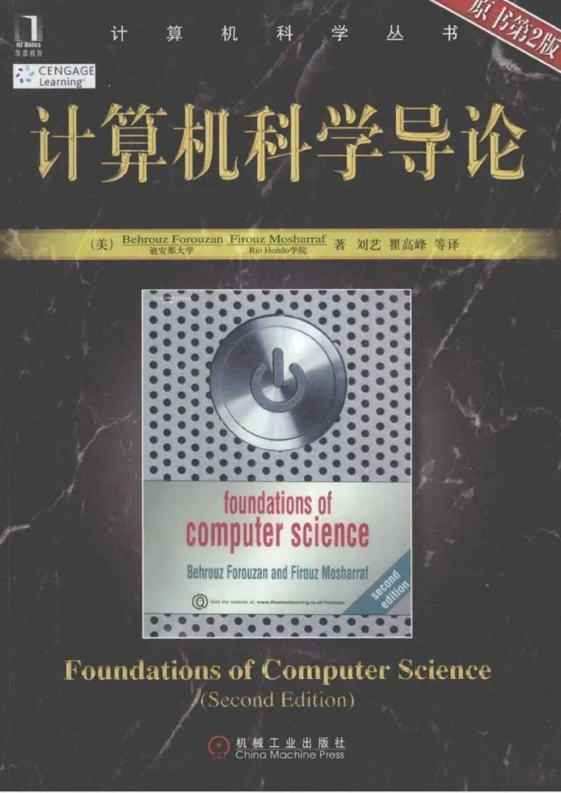

[TOC]

## 课程

最重要的就是下面五门：

1. 数据结构
2. 算法
3. 计算机操作系统
4. 计算机网络
5. 数据库系统。

外加**计算机组成原理**。

## 面试

面试就是算法面试，除了少部分公司，比如Amazon，特别注重behavior question （BQ）之外，其他公司基本一溜的需要你对算法和数据结构掌握得很好才行。

一定要重视**刷project，刷题**。

**有project才能过简历关，LeetCode熟练才能过面试关**。毕竟读CS或是转CS的大部分人，还是以读书找一份程序员的工作为导向的。

因为国外实习或是new grad找全职，面试主要考察**算法和数据结构**。

需要熟练掌握一门语言（Python，Java，或是C++），然后用你熟悉的语言来实现基本的算法和数据结构。

## 网课

**网课可以跟着这几门来学：**

网络课程的话，则是十二分强推UCB的CS61B。他们家的计算机系的CS61A，B，C课，简直制霸各种课程推荐列表。

1. CS61B的官网在这里：

    https://inst.eecs.berkeley.edu/~cs61b/fa19/ 

    这门课以Java为主。

2. MIT的算法课，教程用的算法导论，也是强推的网课：

    https://www.youtube.com/watch?v=HtSuA80QTyo&list=PLUl4u3cNGP61Oq3tWYp6V_F-5jb5L2iHb  

    这门算法则基本不涉及到语言层面，主要是算法层面，讲得很好。

3. 然后就是红宝书的网课以及配套官网：

    https://algs4.cs.princeton.edu/lectures/

    https://www.youtube.com/watch?v=1QZDe28peZk&list=PLRdD1c6QbAqJn0606RlOR6T3yUqFWKwmX

4. 斯坦福2018 Winter CS106B: Programming Abstractions，虽然从名字不太能看出来，但其实是用C++讲数据结构，想用C++的小伙伴不容错过，我看了一半了，特别有帮助，尤其是对递归和回溯的讲解，简直醍醐灌顶。咱们可以在B站直接看：

    https://www.bilibili.com/video/av21620553?p=1

## 练习平台

光学（看书）不练，算法和数据结构是学不会的。

所以推荐一些好的刷算法和数据结构平台，当然另一方面也是为了找工作面试做准备咯。

**如果你在北美的话，初级程序员面试基本就是考察数据结构和算法，所以大家一定要勤加训练！**

### 1. LeetCode

这是现在刷题找工作最热门的网站了。

但LeetCode现在题目也太多了，一共1300+了，而且一直在增加！！！

全刷完没必要，也不高效，所以推荐看下面的回答：

https://www.zhihu.com/question/32019460/answer/875114975

国外LeetCode大牛们是怎么刷LeetCode的：

https://zhuanlan.zhihu.com/p/98580817

### 2. Educative

https://www.educative.io/explore?aff=K7qB

他们家还给Github的学生账户提供半年的免费课程，满足条件的小伙伴，可以照着下面的文章流程申请一下，有更详细的课程和相关步骤介绍：

https://zhuanlan.zhihu.com/p/93374358

对算法最有帮助的课程是：

https://zhuanlan.zhihu.com/p/104983442

专门针对数据结构的课程有：

**C++:**

https://www.educative.io/courses/data-structures-in-cpp-an-interview-refresher?aff=K7qB

**JavaScript：**

https://www.educative.io/courses/data-structures-in-javascript-an-interview-refresher?aff=K7qB

**Java：**

https://www.educative.io/courses/data-structures-in-java-an-interview-refresher?aff=K7qB

**Python：**

https://www.educative.io/courses/data-structures-in-python-an-interview-refresher?aff=K7qB

我上过其中的Java版本，课程是把数据结构里面的基础数据结构都用java实现了一遍，对于用java的同学特别有帮助，java的基础在刷题的过程中，还是要必须掌握的。

课程从复杂度开始讲起，Arrays，LinkedLists, Stacks/Queues, Graphs, Trees, Trie, Heaps, Hash Tables等数据结构，全都实现了一遍。而且还有配套的基础LeetCode题。是一个入门的很棒的教程。选择其他语言的话，内容应该也是差不多的。

## 项目Project

看到评论区问项目推荐，特意更新一下我自己跟着刷项目的网站。下面这个网站是Java全栈，从Java的基础，前端三件套，以及Java的框架，应有尽有。最好的地方在于，用不同的技术栈实现天猫全栈。这样跟着一套学下来，技术方面就不会太差了。

https://www.zhihu.com/question/56476038/answer/1007722651

如果你想专门学前端，可以去Udemy找几个网课跟着练：

计算机的东西还是比较多，也比较杂的，但先从上面的六门课学起肯定没问题。

共勉。

## 理论

- 基础：数据结构+算法(二叉树，队列，栈，红黑树)
- 计算机网络：HTTPS，TSL，Routing Algorithms，TCP/IP，REST API等等。这部分主要研究如何安全、高效地在局域网/互联网节点之间传递信息
- 数据库/分布式：几种分布式处理的范式（比如数据同步和robustness），关系式/非关系式数据库
- 计算机架构：内核，内存，CPU/GPU结构，中断等。计算机底层工作原理和网络安全等等
- 计算机图形学：渲染管道，GPU shader，优化，并行计算，光照算法（个人认为这里数据结构用的非常多）。基本高效进行数据和图形/几何转换
- 机器学习（大泡沫）：线性回归，Multi-Layer Perceptron，梯度下降，深度神经网络，反向传播，卷积神经网络，生成式对抗网络等

## 实践

个人认为最常用的语言：C/C++（图形学和系统），Java（服务端和桌面程序），Python（机器学习，数据科学，后端等），C#（.NET和Unity），Ruby/Perl（网络/安全），Javascript/ECMAScript（前后端/全栈/网页游戏）

网络前端：Django，AngularJS，HTML5，JS/Canvas等

网络后端：Node.js，Django，Postgresql等

机器学习/数据科学：SciKit，Pytorch，Tensorflow（不推荐，比pytorch难用），Pandas，Numpy等

图形学：OpenGL，Unreal Engine，Unity。前两个C/C++后面的JS和C#

架构：汇编，好像分NASM和ARM结构；X86和X64会有寻址上的差别，然后不同厂家有不同标准。C和有很广泛的应用，可以内联汇编函数灵活编程

项目管理工具：Maven和gradle。个人感觉gradle更好用，但是基于Java的服务端项目Maven比较合适。

分类可能不是很合适，但大概就这样。我建议选择一两个方向先研究，然后最好先把基础打牢。

# 除了edx，coursera，网络还有哪些公开课资源？

https://www.zhihu.com/question/27952897