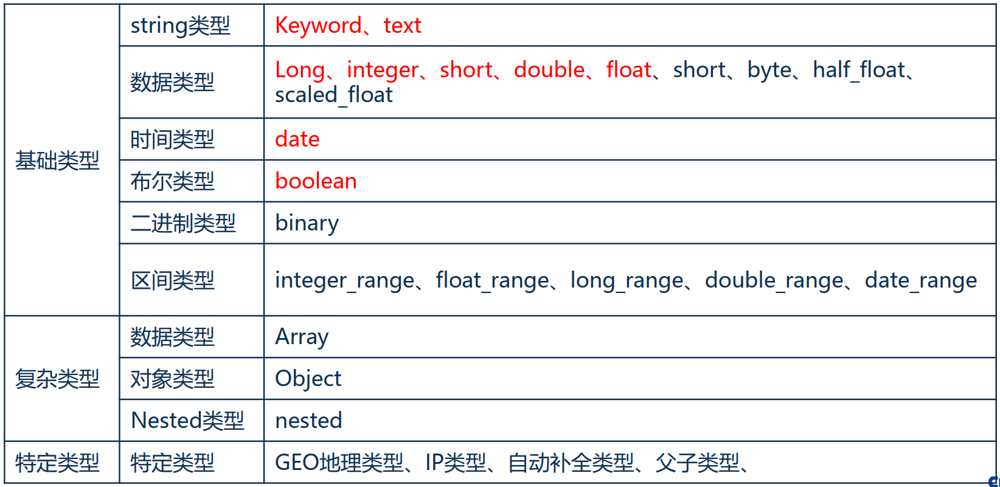
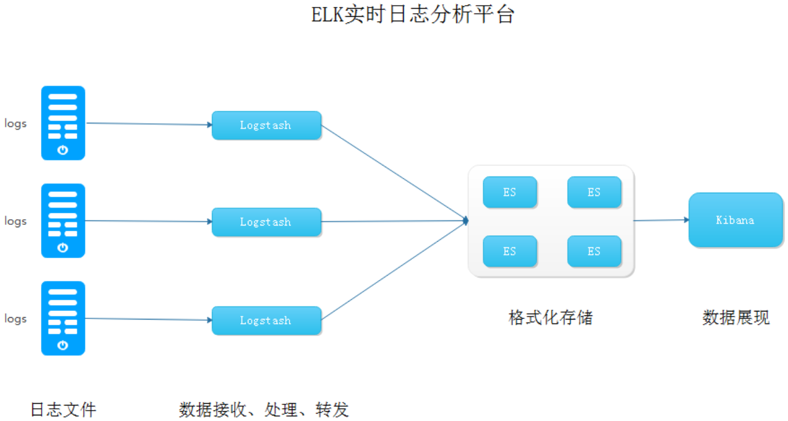

# 漫谈ElasticSearch

ES的介绍与应用

- 01    概念介绍
- 02    应用场景
- 03    提问与解答

## 1. 概念介绍

### ElasticSearch是什么  

ElasticSearch是一个基于Lucene的搜索服务器。它提供了一个分布式多用户能力的全文搜索引擎，基于RESTful web接口。 Elasticsearch是用Java开发的，并作为Apache许可条款下的开放源码发布，是当前流行的企业级搜索引擎。设计用于云计算中，能够达到近实时搜索，稳定，可靠，快速。  

**关键词：基于Lucene、开源、分布式、全文搜索、 RESTful、实时搜索**  

基于Lucene ，超越Lucene。 Elasticsearch是一个高度可扩展的开源全文搜索和分析引擎。它允许您快速、近实时地存储、搜索和分析大量数据。它通常用作底层引擎/技术，为具有复杂搜索功能和要求的应用程序提供支持， 并非只是一个全文检索系统，蜕变为一个完整的数据分析平台。  

### 基本概念

**集群：** ES可以作为一个独立的单个搜索服务器。不过，为了处理大型数据集，实现容错和高可用性， ES可以运行在许多互相合作的服务器上。这些服务器的集合称为集群。

**节点：** 形成集群的每个服务器称为节点

**索引：** 索引包含一堆有相似结果的文档数据，可以理解为传统数据库的表。

~~**类型：** 在索引中，我们可以定义一个或多个类型。~~

**分片：** 索引可以分为较小的分片。每个分片放到不同的服务器上。  

**副本：** 副本是一个分片的精确复制，每个分片可以有零个或多个副本。

**文档：** 一个文档是一个可被索引的基础信息单元。 —— 一条数据  

### 数据类型

### Mapping映射、索引模板、别名  

**Mapping映射**： 创建索引时，可以预先定义字段的类型以及相关属性。如果不预先设置映射，会自动识别输入的字段类型。

**索引模板**： 当新建一个 Elasticsearch 索引时，自动匹配模板，完成索引字段数据类型按照设置的类型映射。

**索引别名**： 可以指向一个或多个索引，也可以给任何一个需要查询的API来使用。别名 带给我们极大的灵活性。  

### 模糊匹配-性能比较  

搜索“XX信息”响应时间对比

| 搜索范围         | MySQL响应时间 | ES响应时间 |
| ---------------- | ------------- | ---------- |
| 10W+企业名录     | 0.2S          | 0.008S     |
| 100W+企业名录    | 2.2S          | 0.013S     |
| 1000W+企业名录   | 193.1S        | 0.028S     |
| 10000W+企业名录  | 不敢测试      | 0.066S     |
| 100000W+企业名录 | (⊙o⊙)…        | 0.*S       |

### ES为何这么优秀?  

核心技术： **倒排索引**

倒排索引是实现“单词-文档矩阵”的一种具体存储形式，通过倒排索引，可以根据单词快速获取包含这个单词的文档列表。倒排索引主要由两个部分组成：“单词词典”和“倒排列表”。  

### 举栗说明

- **文档1：中冶赛迪重庆信息技术有限公司**
- **文档2：中冶赛迪重庆环境咨询有限公司**

|   分词   | 文档1 | 文档2 |
| :------: | :---: | :---: |
|   中冶   |   X   |   X   |
|   赛迪   |   X   |   X   |
|   重庆   |   X   |   X   |
|   信息   |   X   |       |
|   环境   |       |   X   |
|   技术   |   X   |       |
|   咨询   |       |   X   |
| 有限公司 |   X   |   X   |

搜索“赛迪信息”，找到包含这两个词条的文档：

| 分词  | 文档1 | 文档2 |
| :---: | :---: | :---: |
| 赛迪  |   X   |   X   |
| 信息  |   X   |       |
| Total |   2   |   1   |

### 分词策略

|   分词   | 文档1 | 文档2 |
| :------: | :---: | :---: |
| 中冶赛迪 |   X   |   X   |
| 重庆信息 |   X   |       |
| 重庆环境 |       |   X   |
|   技术   |   X   |       |
|   咨询   |       |   X   |
| 有限公司 |   X   |   X   |

搜索“赛迪信息”，找到包含这两个词条的文档：

| 分词  | 文档1 | 文档2 |
| :---: | :---: | :---: |
| 赛迪  |       |       |
| 信息  |       |       |
| Total |   0   |   0   |

### 分词的选择

目前流行的中文分词器： IK分词、 ansj分词、 jieba分词、 hanLP分词等等。

选择什么样的分词，取决于实际应用的用途与领域。

为什么选择Ansj中文分词：

◼ 人名识别

◼ 新名词识别  

### TF-IDF算法  

TF意思是词频， IDF意思是逆文本频率指数，是一种用于信息检索与数据挖掘的常用打分算法。

用以评估一字词对于一个文档或者整个文档集合的重要程度。字词的重要性随着它在**文件中出现的次数成正比增加**，但同时会随着它在**集合中出现的频率成反比下降**。

除了TF-IDF以外，因特网上的搜索引擎还会使用基于**链接分析评级**方法，以确定文件在搜寻结果中出现的顺序。  

### 小结

## 2. 应用场景

### 场景一：  

boss：小明！！！用户投诉网站访问有问题，出了什么问题？

小明： 收到！马上排查！ OMG！ 20+台web服务器，要一台台查看！

1个小时过去了。。。。。。

boss：小明，定位到问题了吗？怎么这么慢？！

小明：快了，快了……（OMG！还有5台没查，前面15台没有问题啊！）

最后在 **第19台** 服务器的web service日志中找到了大量报错信息，经过确认后，发现是这台服务器 **代码发布失败** 导致的。

长此以往，必成背锅侠！
有没有办法不用登陆服务器就可以查看所有的日志？  

**当然有！ ---引入ELK!**  

#### 轻筑日志中心

#### 可视化的日志展示与搜索

#### 引入ELK  

**ELK实际上是三个工具的集合， Elasticsearch + Logstash + Kibana**  

- **Logstash**

  Logstash是一个用于管理日志和事件的工具，你可以用它去收集日志、转换日志、解析日志并将他们作为数据提供给其它模块调用，例如搜索、存储等。

- **Kibana**

  Kibana是一个优秀的前端日志展示框架，它可以非常详细的将日志转化为各种图表，为用户提供强大的数据可视化支持。  

#### ELK实时日志分析

#### 引入Beat+kafka

Beats是一系列采集器的总称，不同的日志源和日志格式使用不同的Beats

- Filebeat：轻量级的日志采集器，可用于收集文件数据。
- Topbeat ：收集系统、进程和文件系统级别 CPU 和内存使用情况等数据。
- Packetbeat：收集网络流数据，可以实时监控系统应用和服务，可以将延迟时间、错误、响应时间、 SLA性能等信息。
- Winlogbeat：收集Windows事件日志数据。
- Heartbeat：监控服务器运行状态。

相比Logstash， Beats所占系统的CPU和内存几乎可以忽略不计。

#### ELK+Beats+kafka  

**ELK日志中心还能用来做什么？**

个性化推荐  

### 场景二：  

- 什么是个性化推荐？
- 怎样实现个性化推荐？  

#### 1、基于统计学的推荐策略

#### 2、基于内容的推荐策略  

#### 3、基于用户协同的推荐策略

#### 4、基于项目协同的推荐策略  

#### 推荐策略-支撑

#### 制作画像-用户画像  

#### 制作画像-内容聚类  

唐诗内容聚类：

宋词内容聚类：

#### ES在推荐系统中扮演的角色

#### 让数据产生价值

#### ES在滴滴的架构实现  

#### ES在滴滴的发展历程  

#### 搜索引擎-文件/聊天记录  

### 场景三：全文检索实践思路  

一、梳理需求，写出需求文档、设计文档

二、创建索引、设置Mapping、创建模板

三、导入数据： logstash、程序写入等

四、检索实战：召回率检测、结果排序调优

五、聚合实战：海量数据统计分析，特征提取

六、数据可视化  

#### ES在美团的运用

#### ES在轻策中的运用  

#### ES在天眼查中的运用  

#### ES在百度中的运用  

#### 优秀案例  

1、百度

2、阿里-蚂蚁金服

3、 B站

4、斗鱼

5、转转

6、顺丰-利用ES对企业内部人员异常行为的分析

7、东南亚打车软件Grab的POI搜索平台

其他：京东、新浪、联想、饿了么、携程、美团、暴雪中国等等等  

### ES学习途径  

- 正确使用Google、等搜索引擎
- ES官方网站（目前只有2.X的中文文档， 6.X的中文文档正在翻译）
- Elastic中文社区-微信订阅号，人工精选，优中选优。
- 知识星球-死磕Elasticsearch（官方日报责任编辑，阿里，美团，小米，OPPO ，有赞等大佬在群里）
- 实操是最快的路径，听能记住20%，用能记住70%，讲能记住90%  

### ES优化建议  

- 写优化：（批量提交，优化存储设备，减少refresh的次数，减少副本的数量，选择合适的路由）
- 读优化（避免大结果集和深度分页，冷热数据处理）
- 集群优化（堆大小的设置，每个分片20~40GB最优，角色隔离，避免脑裂）
- 其他（生产机禁止模糊删除索引，安全防护）  

### 技术选择  

- 日志处理与分析中心
- 现有系统升级，需要支持全文检索服务
- 新系统开发，支持海量数据存储、检索与分析
- 其他非事务型搜索与可视化场景  

