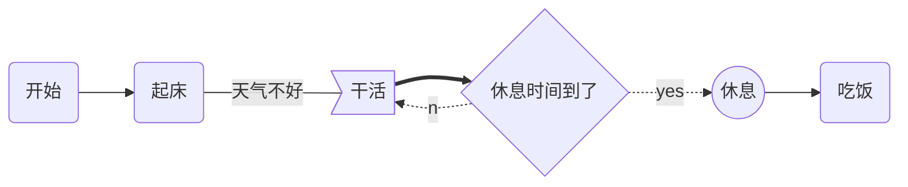
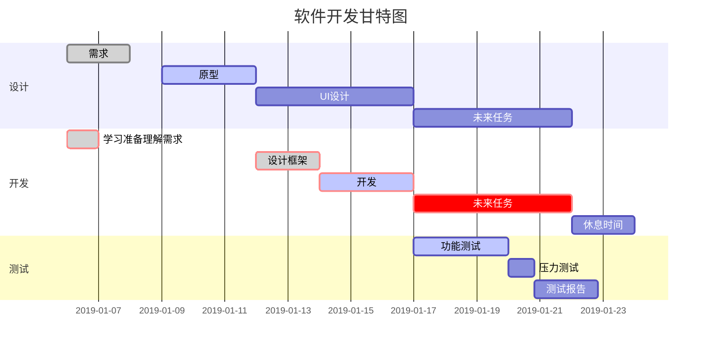
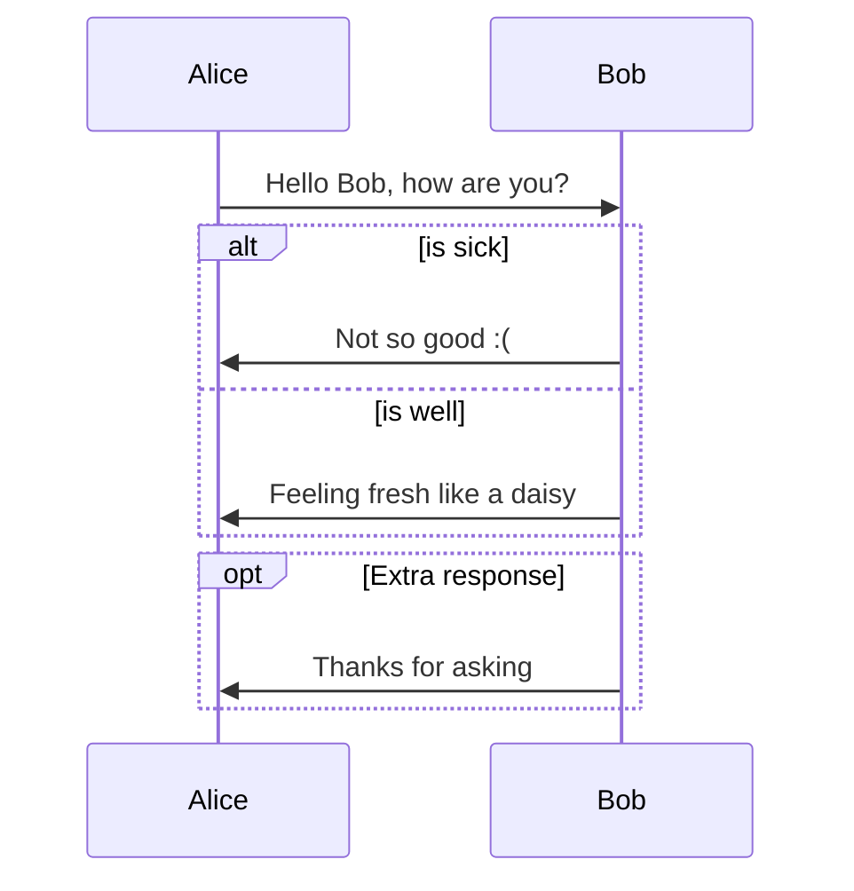
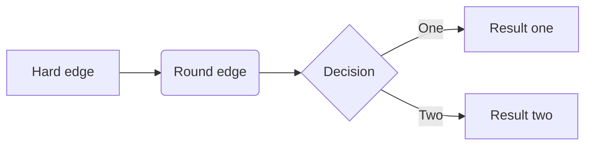
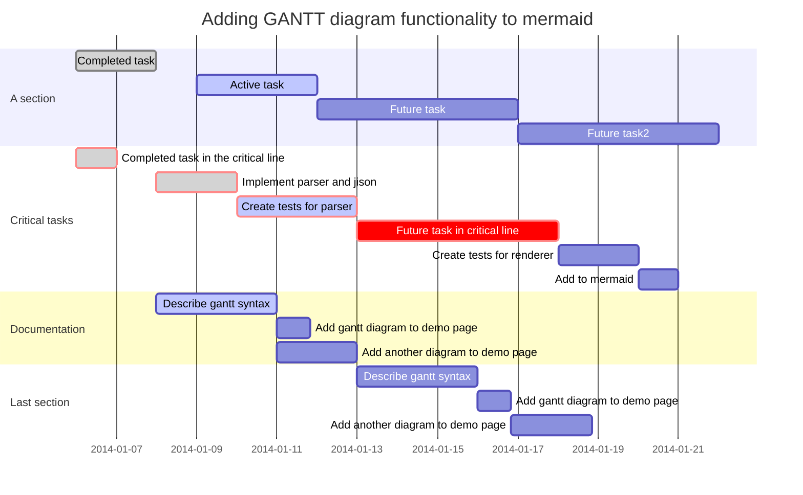

### 一、更改字体、大小、颜色

<font color=blue size=4>Markdown语法</font>

```markdown
<font face="黑体">我是黑体字</font>
<font face="微软雅黑">我是微软雅黑</font>
<font face="STCAIYUN">我是华文彩云</font>
<font color=red>我是红色</font>
<font color=#008000>我是绿色</font>
<font color=Blue>我是蓝色</font>
<font size=5>我是尺寸</font>
<font face="黑体" color=green size=5>我是黑体，绿色，尺寸为5</font>
```

<font color=blue size=4>效果如下：</font>

<font face="黑体">我是黑体字</font>
<font face="微软雅黑">我是微软雅黑</font>
<font face="STCAIYUN">我是华文彩云</font>
<font color=red>我是红色</font>
<font color=#008000>我是绿色</font>
<font color=Blue>我是蓝色</font>
<font size=5>我是尺寸</font>
<font face="黑体" color=green size=5>我是黑体，绿色，尺寸为5</font>


### 二、为文字添加背景色

由于 style 标签和标签的 style 属性不被支持，所以这里只能是借助 table, tr, td 等表格标签的 bgcolor 属性来实现背景色。故这里对于文字背景色的设置，只是将那一整行看作一个表格，更改了那个格子的背景色（bgcolor）。

<font color=blue size=4>Markdown语法</font>

```markdown
<table><tr><td bgcolor=yellow>背景色yellow</td></tr></table>
```

<font color=blue size=4>效果如下：</font>

<table><tr><td bgcolor=yellow>背景色yellow</td></tr></table>
### 三、设置图片大小

#### 1、设置设置图片百分比

<font color=blue size=4>Markdown语法</font>

```markdown

```

<font color=blue size=4>效果如下：</font>


#### 2、设置图片大小

<font color=blue size=4>Markdown语法</font>

```markdown

```

<font color=blue size=4>效果如下：</font>


#### 3、设置图片居左left、中center、右right

<font color=blue size=4>Markdown语法</font>

```markdown
<div align=right></div>
```

<font color=blue size=4>效果如下：</font>

<div align=right></div>
### 四、参考链接

#### 1、RGB颜色对照表

或者查看后面的[颜色列表](#4、颜色列表)或[颜色库](#5、颜色库)

|        颜色名        | 十六进制颜色值 |        颜色        |                     色块                      |
| :------------------: | :------------: | :----------------: | :-------------------------------------------: |
|      AliceBlue       |    #F0F8FF     | rgb(240, 248, 255) |      <font color=AliceBlue>█████</font>       |
|     AntiqueWhite     |    #FAEBD7     | rgb(250, 235, 215) |     <font color=AntiqueWhite>█████</font>     |
|         Aqua         |    #00FFFF     |  rgb(0, 255, 255)  |         <font color=Aqua>█████</font>         |
|      Aquamarine      |    #7FFFD4     | rgb(127, 255, 212) |      <font color=Aquamarine>█████</font>      |
|        Azure         |    #F0FFFF     | rgb(240, 255, 255) |        <font color=Azure>█████</font>         |
|        Beige         |    #F5F5DC     | rgb(245, 245, 220) |        <font color=Beige>█████</font>         |
|        Bisque        |    #FFE4C4     | rgb(255, 228, 196) |        <font color=Bisque>█████</font>        |
|        Black         |    #000000     |    rgb(0, 0, 0)    |        <font color=Black>█████</font>         |
|    BlanchedAlmond    |    #FFEBCD     | rgb(255, 235, 205) |    <font color=BlanchedAlmond>█████</font>    |
|         Blue         |    #0000FF     |   rgb(0, 0, 255)   |         <font color=Blue>█████</font>         |
|      BlueViolet      |    #8A2BE2     | rgb(138, 43, 226)  |      <font color=BlueViolet>█████</font>      |
|        Brown         |    #A52A2A     |  rgb(165, 42, 42)  |        <font color=Brown>█████</font>         |
|      BurlyWood       |    #DEB887     | rgb(222, 184, 135) |      <font color=BurlyWood>█████</font>       |
|      CadetBlue       |    #5F9EA0     | rgb(95, 158, 160)  |      <font color=CadetBlue>█████</font>       |
|      Chartreuse      |    #7FFF00     |  rgb(127, 255, 0)  |      <font color=Chartreuse>█████</font>      |
|      Chocolate       |    #D2691E     | rgb(210, 105, 30)  |      <font color=Chocolate>█████</font>       |
|        Coral         |    #FF7F50     | rgb(255, 127, 80)  |        <font color=Coral>█████</font>         |
|    CornflowerBlue    |    #6495ED     | rgb(100, 149, 237) |    <font color=CornflowerBlue>█████</font>    |
|       Cornsilk       |    #FFF8DC     | rgb(255, 248, 220) |       <font color=Cornsilk>█████</font>       |
|       Crimson        |    #DC143C     |  rgb(220, 20, 60)  |       <font color=Crimson>█████</font>        |
|         Cyan         |    #00FFFF     |  rgb(0, 255, 255)  |         <font color=Cyan>█████</font>         |
|       DarkBlue       |    #00008B     |   rgb(0, 0, 139)   |       <font color=DarkBlue>█████</font>       |
|       DarkCyan       |    #008B8B     |  rgb(0, 139, 139)  |       <font color=DarkCyan>█████</font>       |
|    DarkGoldenRod     |    #B8860B     | rgb(184, 134, 11)  |    <font color=DarkGoldenRod>█████</font>     |
|       DarkGray       |    #A9A9A9     | rgb(169, 169, 169) |       <font color=DarkGray>█████</font>       |
|      DarkGreen       |    #006400     |   rgb(0, 100, 0)   |      <font color=DarkGreen>█████</font>       |
|      DarkKhaki       |    #BDB76B     | rgb(189, 183, 107) |      <font color=DarkKhaki>█████</font>       |
|     DarkMagenta      |    #8B008B     |  rgb(139, 0, 139)  |     <font color=DarkMagenta>█████</font>      |
|    DarkOliveGreen    |    #556B2F     |  rgb(85, 107, 47)  |    <font color=DarkOliveGreen>█████</font>    |
|      Darkorange      |    #FF8C00     |  rgb(255, 140, 0)  |      <font color=Darkorange>█████</font>      |
|      DarkOrchid      |    #9932CC     | rgb(153, 50, 204)  |      <font color=DarkOrchid>█████</font>      |
|       DarkRed        |    #8B0000     |   rgb(139, 0, 0)   |       <font color=DarkRed>█████</font>        |
|      DarkSalmon      |    #E9967A     | rgb(233, 150, 122) |      <font color=DarkSalmon>█████</font>      |
|     DarkSeaGreen     |    #8FBC8F     | rgb(143, 188, 143) |     <font color=DarkSeaGreen>█████</font>     |
|    DarkSlateBlue     |    #483D8B     |  rgb(72, 61, 139)  |    <font color=DarkSlateBlue>█████</font>     |
|    DarkSlateGray     |    #2F4F4F     |  rgb(47, 79, 79)   |    <font color=DarkSlateGray>█████</font>     |
|    DarkTurquoise     |    #00CED1     |  rgb(0, 206, 209)  |    <font color=DarkTurquoise>█████</font>     |
|      DarkViolet      |    #9400D3     |  rgb(148, 0, 211)  |      <font color=DarkViolet>█████</font>      |
|       DeepPink       |    #FF1493     | rgb(255, 20, 147)  |       <font color=DeepPink>█████</font>       |
|     DeepSkyBlue      |    #00BFFF     |  rgb(0, 191, 255)  |     <font color=DeepSkyBlue>█████</font>      |
|       DimGray        |    #696969     | rgb(105, 105, 105) |       <font color=DimGray>█████</font>        |
|      DodgerBlue      |    #1E90FF     | rgb(30, 144, 255)  |      <font color=DodgerBlue>█████</font>      |
|       Feldspar       |    #D19275     | rgb(209, 146, 117) |       <font color=Feldspar>█████</font>       |
|      FireBrick       |    #B22222     |  rgb(178, 34, 34)  |      <font color=FireBrick>█████</font>       |
|     FloralWhite      |    #FFFAF0     | rgb(255, 250, 240) |     <font color=FloralWhite>█████</font>      |
|     ForestGreen      |    #228B22     |  rgb(34, 139, 34)  |     <font color=ForestGreen>█████</font>      |
|       Fuchsia        |    #FF00FF     |  rgb(255, 0, 255)  |       <font color=Fuchsia>█████</font>        |
|      Gainsboro       |    #DCDCDC     | rgb(220, 220, 220) |      <font color=Gainsboro>█████</font>       |
|      GhostWhite      |    #F8F8FF     | rgb(248, 248, 255) |      <font color=GhostWhite>█████</font>      |
|         Gold         |    #FFD700     |  rgb(255, 215, 0)  |         <font color=Gold>█████</font>         |
|      GoldenRod       |    #DAA520     | rgb(218, 165, 32)  |      <font color=GoldenRod>█████</font>       |
|         Gray         |    #808080     | rgb(128, 128, 128) |         <font color=Gray>█████</font>         |
|        Green         |    #008000     |   rgb(0, 128, 0)   |        <font color=Green>█████</font>         |
|     GreenYellow      |    #ADFF2F     | rgb(173, 255, 47)  |     <font color=GreenYellow>█████</font>      |
|       HoneyDew       |    #F0FFF0     | rgb(240, 255, 240) |       <font color=HoneyDew>█████</font>       |
|       HotPink        |    #FF69B4     | rgb(255, 105, 180) |       <font color=HoneyDew>█████</font>       |
|      IndianRed       |    #CD5C5C     |  rgb(205, 92, 92)  |      <font color=IndianRed>█████</font>       |
|        Indigo        |    #4B0082     |  rgb(75, 0, 130)   |        <font color=Indigo>█████</font>        |
|        Ivory         |    #FFFFF0     | rgb(255, 255, 240) |        <font color=Ivory>█████</font>         |
|        Khaki         |    #F0E68C     | rgb(240, 230, 140) |        <font color=Khaki>█████</font>         |
|       Lavender       |    #E6E6FA     | rgb(230, 230, 250) |       <font color=Lavender>█████</font>       |
|    LavenderBlush     |    #FFF0F5     | rgb(255, 240, 245) |    <font color=LavenderBlush>█████</font>     |
|      LawnGreen       |    #7CFC00     |  rgb(124, 252, 0)  |      <font color=LawnGreen>█████</font>       |
|     LemonChiffon     |    #FFFACD     | rgb(255, 250, 205) |     <font color=LemonChiffon>█████</font>     |
|      LightBlue       |    #ADD8E6     | rgb(173, 216, 230) |      <font color=LightBlue>█████</font>       |
|      LightCoral      |    #F08080     | rgb(240, 128, 128) |      <font color=LightCoral>█████</font>      |
|      LightCyan       |    #E0FFFF     | rgb(224, 255, 255) |      <font color=LightCyan>█████</font>       |
| LightGoldenRodYellow |    #FAFAD2     | rgb(250, 250, 210) | <font color=LightGoldenRodYellow>█████</font> |
|      LightGrey       |    #D3D3D3     | rgb(211, 211, 211) |      <font color=LightGrey>█████</font>       |
|      LightGreen      |    #90EE90     | rgb(144, 238, 144) |      <font color=LightGreen>█████</font>      |
|      LightPink       |    #FFB6C1     | rgb(255, 182, 193) |      <font color=LightPink>█████</font>       |
|     LightSalmon      |    #FFA07A     | rgb(255, 160, 122) |     <font color=LightSalmon>█████</font>      |
|    LightSeaGreen     |    #20B2AA     | rgb(32, 178, 170)  |    <font color=LightSeaGreen>█████</font>     |
|     LightSkyBlue     |    #87CEFA     | rgb(135, 206, 250) |     <font color=LightSkyBlue>█████</font>     |
|    LightSlateBlue    |    #8470FF     | rgb(132, 112, 255) |    <font color=LightSlateBlue>█████</font>    |
|    LightSlateGray    |    #778899     | rgb(119, 136, 153) |    <font color=LightSlateGray>█████</font>    |
|    LightSteelBlue    |    #B0C4DE     | rgb(176, 196, 222) |    <font color=LightSteelBlue>█████</font>    |
|     LightYellow      |    #FFFFE0     | rgb(255, 255, 224) |     <font color=LightYellow>█████</font>      |
|         Lime         |    #00FF00     |   rgb(0, 255, 0)   |         <font color=Lime>█████</font>         |
|      LimeGreen       |    #32CD32     |  rgb(50, 205, 50)  |      <font color=LimeGreen>█████</font>       |
|        Linen         |    #FAF0E6     | rgb(250, 240, 230) |        <font color=Linen>█████</font>         |
|       Magenta        |    #FF00FF     |  rgb(255, 0, 255)  |       <font color=Magenta>█████</font>        |
|        Maroon        |    #800000     |   rgb(128, 0, 0)   |        <font color=Maroon>█████</font>        |
|   MediumAquaMarine   |    #66CDAA     | rgb(102, 205, 170) |   <font color=MediumAquaMarine>█████</font>   |
|      MediumBlue      |    #0000CD     |   rgb(0, 0, 205)   |      <font color=MediumBlue>█████</font>      |
|     MediumOrchid     |    #BA55D3     | rgb(186, 85, 211)  |     <font color=MediumOrchid>█████</font>     |
|     MediumPurple     |    #9370D8     | rgb(147, 112, 216) |     <font color=MediumPurple>█████</font>     |
|    MediumSeaGreen    |    #3CB371     | rgb(60, 179, 113)  |    <font color=MediumSeaGreen>█████</font>    |
|   MediumSlateBlue    |    #7B68EE     | rgb(123, 104, 238) |   <font color=MediumSlateBlue>█████</font>    |
|  MediumSpringGreen   |    #00FA9A     |  rgb(0, 250, 154)  |  <font color=MediumSpringGreen>█████</font>   |
|   MediumTurquoise    |    #48D1CC     | rgb(72, 209, 204)  |   <font color=MediumTurquoise>█████</font>    |
|   MediumVioletRed    |    #C71585     | rgb(199, 21, 133)  |   <font color=MediumVioletRed>█████</font>    |
|     MidnightBlue     |    #191970     |  rgb(25, 25, 112)  |     <font color=MidnightBlue>█████</font>     |
|      MintCream       |    #F5FFFA     | rgb(245, 255, 250) |      <font color=MintCream>█████</font>       |
|      MistyRose       |    #FFE4E1     | rgb(255, 228, 225) |      <font color=MistyRose>█████</font>       |
|       Moccasin       |    #FFE4B5     | rgb(255, 228, 181) |       <font color=Moccasin>█████</font>       |
|     NavajoWhite      |    #FFDEAD     | rgb(255, 222, 173) |     <font color=NavajoWhite>█████</font>      |
|         Navy         |    #000080     |   rgb(0, 0, 128)   |         <font color=Navy>█████</font>         |
|       OldLace        |    #FDF5E6     | rgb(253, 245, 230) |       <font color=OldLace>█████</font>        |
|        Olive         |    #808000     |  rgb(128, 128, 0)  |        <font color=Olive>█████</font>         |
|      OliveDrab       |    #6B8E23     | rgb(107, 142, 35)  |      <font color=OliveDrab>█████</font>       |
|        Orange        |    #FFA500     |  rgb(255, 165, 0)  |        <font color=Orange>█████</font>        |
|      OrangeRed       |    #FF4500     |  rgb(255, 69, 0)   |      <font color=OrangeRed>█████</font>       |
|        Orchid        |    #DA70D6     | rgb(218, 112, 214) |        <font color=Orchid>█████</font>        |
|    PaleGoldenRod     |    #EEE8AA     | rgb(238, 232, 170) |    <font color=PaleGoldenRod>█████</font>     |
|      PaleGreen       |    #98FB98     | rgb(152, 251, 152) |      <font color=PaleGreen>█████</font>       |
|    PaleTurquoise     |    #AFEEEE     | rgb(175, 238, 238) |    <font color=PaleTurquoise>█████</font>     |
|    PaleVioletRed     |    #D87093     | rgb(216, 112, 147) |    <font color=PaleVioletRed>█████</font>     |
|      PapayaWhip      |    #FFEFD5     | rgb(255, 239, 213) |      <font color=PapayaWhip>█████</font>      |
|      PeachPuff       |    #FFDAB9     | rgb(255, 218, 185) |      <font color=PeachPuff>█████</font>       |
|         Peru         |    #CD853F     | rgb(205, 133, 63)  |         <font color=Peru>█████</font>         |
|         Pink         |    #FFC0CB     | rgb(255, 192, 203) |         <font color=Pink>█████</font>         |
|         Plum         |    #DDA0DD     | rgb(221, 160, 221) |         <font color=Plum>█████</font>         |
|      PowderBlue      |    #B0E0E6     | rgb(176, 224, 230) |      <font color=PowderBlue>█████</font>      |
|        Purple        |    #800080     |  rgb(128, 0, 128)  |        <font color=Purple>█████</font>        |
|         Red          |    #FF0000     |   rgb(255, 0, 0)   |         <font color=Red>█████</font>          |
|      RosyBrown       |    #BC8F8F     | rgb(188, 143, 143) |      <font color=RosyBrown>█████</font>       |
|      RoyalBlue       |    #4169E1     | rgb(65, 105, 225)  |      <font color=RoyalBlue>█████</font>       |
|     SaddleBrown      |    #8B4513     |  rgb(139, 69, 19)  |     <font color=SaddleBrown>█████</font>      |
|        Salmon        |    #FA8072     | rgb(250, 128, 114) |        <font color=Salmon>█████</font>        |
|      SandyBrown      |    #F4A460     | rgb(244, 164, 96)  |      <font color=SandyBrown>█████</font>      |
|       SeaGreen       |    #2E8B57     |  rgb(46, 139, 87)  |       <font color=SeaGreen>█████</font>       |
|       SeaShell       |    #FFF5EE     | rgb(255, 245, 238) |       <font color=SeaShell>█████</font>       |
|        Sienna        |    #A0522D     |  rgb(160, 82, 45)  |        <font color=Sienna>█████</font>        |
|        Silver        |    #C0C0C0     | rgb(192, 192, 192) |        <font color=Silver>█████</font>        |
|       SkyBlue        |    #87CEEB     | rgb(135, 206, 235) |       <font color=SkyBlue>█████</font>        |
|      SlateBlue       |    #6A5ACD     | rgb(106, 90, 205)  |      <font color=SlateBlue>█████</font>       |
|      SlateGray       |    #708090     | rgb(112, 128, 144) |      <font color=SlateGray>█████</font>       |
|         Snow         |    #FFFAFA     | rgb(255, 250, 250) |         <font color=Snow>█████</font>         |
|     SpringGreen      |    #00FF7F     |  rgb(0, 255, 127)  |     <font color=SpringGreen>█████</font>      |
|      SteelBlue       |    #4682B4     | rgb(70, 130, 180)  |      <font color=SteelBlue>█████</font>       |
|         Tan          |    #D2B48C     | rgb(210, 180, 140) |         <font color=Tan>█████</font>          |
|         Teal         |    #008080     |  rgb(0, 128, 128)  |         <font color=Teal>█████</font>         |
|       Thistle        |    #D8BFD8     | rgb(216, 191, 216) |       <font color=Thistle>█████</font>        |
|        Tomato        |    #FF6347     |  rgb(255, 99, 71)  |        <font color=Tomato>█████</font>        |
|      Turquoise       |    #40E0D0     | rgb(64, 224, 208)  |      <font color=Turquoise>█████</font>       |
|        Violet        |    #EE82EE     | rgb(238, 130, 238) |        <font color=Violet>█████</font>        |
|      VioletRed       |    #D02090     | rgb(208, 32, 144)  |      <font color=VioletRed>█████</font>       |
|        Wheat         |    #F5DEB3     | rgb(245, 222, 179) |        <font color=Wheat>█████</font>         |
|        White         |    #FFFFFF     | rgb(255, 255, 255) |        <font color=White>█████</font>         |
|      WhiteSmoke      |    #F5F5F5     | rgb(245, 245, 245) |      <font color=WhiteSmoke>█████</font>      |
|        Yellow        |    #FFFF00     |  rgb(255, 255, 0)  |        <font color=Yellow>█████</font>        |
|     YellowGreen      |    #9ACD32     | rgb(154, 205, 50)  |     <font color=YellowGreen>█████</font>      |


#### 2、Markdown 语法大全 包括设置字体 颜色

1. ##### 强调

   星号与下划线都可以，单是斜体，双是粗体，符号可跨行，符号可加空格

   ```markdown
   **一个人来到田纳西**
   __毫无疑问__
   
   *我做的馅饼
   是全天下*
   
   _最好吃的_
   ```

   **一个人来到田纳西**
   __毫无疑问__

   *我做的馅饼
   是全天下*

   _最好吃的_

2. ##### 分割线

   三个或更多-_*，必须单独一行，可含空格

   ```markdown
   ---
   ***
   ___
   ```

   ---
   ***
   ___


3. ##### 引用

   翻译成html就是

   ```markdown
   > 引用
   ```

   符号后的空格可不要

   > 引用

   内层符号前的空格必须要

   ```markdown
   >引用
    >>引用中的引用
   ```

   >引用
   >
   >>引用中的引用

   引用中的引用


4. ##### 标题：Setext方式

   三个或更多

   ```markdown
   大标题
   ===
   小标题
   ---
   ```

   大标题
   ===
   小标题
   ---

---
5. ##### 标题：Atx方式

   ```markdown
   # 一级标题
   ## 二级标题
   ### 三级标题
   #### 四级标题
   ##### 五级标题
   ###### 六级标题
   ```

   # 一级标题
   ## 二级标题
   ### 三级标题
   #### 四级标题
   ##### 五级标题
   ###### 六级标题


6. ##### 无序列表

   符号之后的空格不能少，-+*效果一样，但不能混合使用，因混合是嵌套列表，内容可超长

   ```markdown
   - 无序列表
   - 无序列表
   - 无序列表
   - 无序列表：我很长。我也很长！那比一比啊
   ```

   - 无序列表
   - 无序列表
   - 无序列表
   - 无序列表：我很长。我也很长！那比一比啊

   符号之后的空格不能少，-+*效果一样，但不能混合使用，因混合是嵌套列表

   ```markdown
   * 无序列表
   * 无序列表
   * 无序列表
   * 无序列表：我很长。我也很长！那比一比啊
   ```

   * 无序列表
   * 无序列表
   * 无序列表
   * 无序列表：我很长。我也很长！那比一比啊


7. ##### 有序列表

   数字不能省略但可无序，点号之后的空格不能少

   ```markdown
   1. 有序列表
   2. 有序列表
   3. 有序列表
   8. 有序列表
   ```

   1. 有序列表
   2. 有序列表
   3. 有序列表
   8. 有序列表


7. ##### 嵌套列表

   -+*可循环使用，但符号之后的空格不能少，符号之前的空格也不能少

   ```markdown
   - 嵌套列表1
    + 嵌套列表2
    + 嵌套列表3
     - 嵌套列表4
      * 嵌套列表5
   - 嵌套列表6
   ```


8. ##### 文字超链：Inline方式

   ```markdown
   [不如](http://bruce-sha.github.io "不如的博客")
   ```

   [不如](http://bruce-sha.github.io "不如的博客")

   **图片超链**
   多个感叹号，Tooltips可省略，要设置大小只能借助HTML标记

   ```markdown
   
   ```

   


9. ##### 索引超链：Reference方式

   索引，1 可以是任意字符

   ```markdown
   [不如][1]
   [1]:http://bruce-sha.github.io
   ```

   [不如][1]

   [1]:http://bruce-sha.github.io


10. ##### 自动链接

    尖括号

    ```markdown
    <http://ibruce.info>
    <bu.ru@qq.com>
    ```

    <http://ibruce.info>
    <bu.ru@qq.com>


11. ##### 代码：行内代码

    在第一行后指定编程语言，也可以不指定

    ~~~markdown
    ``` python
    @requires_authorization
    def somefunc(param1='', param2=0):
        '''A docstring'''
        if param1 > param2: # interesting
            print 'Greater'
        return (param2 - param1 + 1) or None
    class SomeClass:
        pass
    >>> message = '''interpreter
    ... prompt'''
     ```
    ~~~

    ```markdown
    可代码高亮
    ```

    ```python
    @requires_authorization
    def somefunc(param1='', param2=0):
        '''A docstring'''
        if param1 > param2: # interesting
            print 'Greater'
        return (param2 - param1 + 1) or None
    class SomeClass:
        pass
    >>> message = '''interpreter
    ... prompt'''
    ```


12. ##### 代码：段落代码

    每行文字前加4个空格或者1个Tab

    ```markdown
        val s = "hello Markdown"
        println( s )
        val s = "hello Markdown"
        println( s )
    ```

    ```markdown
    val s = "hello Markdown"
    println( s )
    val s = "hello Markdown"
    println( s )
    ```


13. ##### 注释

    用html的注释，好像只有这样？

    ```markdown
    <!-- 注释 -->
    ```

    


14. ##### 转义字符

    用html的注释，好像只有这样？

    Markdown中的转义字符为\，转义的有：

    ```markdown
    \\ 反斜杠
    
    \` 反引号
    
    \* 星号
    
    \_ 下划线
    
    \{\} 大括号
    
    \[\] 中括号
    
    \(\) 小括号
    
    \# 井号
    
    \+ 加号
    
    \- 减号
    
    \. 英文句号
    
    \! 感叹号
    ```

    \\ 反斜杠
    \` 反引号
    \* 星号
    \_ 下划线
    \{\} 大括号
    \[\] 中括号
    \(\) 小括号
    \# 井号
    \+ 加号
    \- 减号
    \. 英文句号
    \! 感叹号


15. ##### 表格

    ```markdown
    | Tables        | Are           | Cool  |
    | ------------- |:-------------:| -----:|
    | col 3 is      | right-aligned | $1600 |
    | col 2 is      | centered      |   $12 |
    | zebra stripes | are neat      |    $1 |
    ```

    | Tables        |      Are      |     Cool |
    | ------------- | :-----------: | -------: |
    | col 3 is      | right-aligned |    $1600 |
    | col 2 is      |   centered    |      $12 |
    | zebra stripes |   are neat    | $1Tables |

    或者

    ```markdown
    项目     | 价格
    -------- | ---
    Computer | $1600
    Phone    | $12
    Pipe     | $1
    ```

    | 项目     | 价格  |
    | -------- | ----- |
    | Computer | $1600 |
    | Phone    | $12   |
    | Pipe     | $1    |


16. ##### 其他

    **段落缩进（空格）**

    ```markdown
    半方大的空白&ensp;或&#8194;看，飞碟
    全方大的空白&emsp;或&#8195;看，飞碟
    不断行的空白格&nbsp;或&#160;看，飞碟
    &emsp;&emsp;段落从此开始。
    ```

    半方大的空白&ensp;或&#8194;看，飞碟
    全方大的空白&emsp;或&#8195;看，飞碟
    不断行的空白格&nbsp;或&#160;看，飞碟
    &emsp;&emsp;段落从此开始。

    

    **字体、字号、颜色**

    ```markdown
    <font face="黑体">我是黑体字</font>
    <font face="微软雅黑">我是微软雅黑</font>
    <font face="STCAIYUN">我是华文彩云</font>
    <font color=#0099ff size=12 face="黑体">黑体</font>
    <font color=#00ffff size=3>null</font>
    <font color=gray size=5>gray</font>
    ```

    <font face="黑体">我是黑体字</font>
    <font face="微软雅黑">我是微软雅黑</font>
    <font face="STCAIYUN">我是华文彩云</font>
    <font color=#0099ff size=12 face="黑体">黑体</font>
    <font color=#00ffff size=3>null</font>
    <font color=gray size=5>gray</font>

    

    **标签**
    行内标签`

    ```markdown
    快捷键 `Ctrl + D` 来收藏本页
    ```

    快捷键 `Ctrl + D` 来收藏本页


#### 3、[Markdown: Basics （快速入门）](https://www.appinn.com/markdown/basic.html）


#### 4、[CSDN-markdown 文字样式设置（字体, 大小, 颜色, 高亮底色）](https://blog.csdn.net/thither_shore/article/details/52181464#list)


### 五、表格样式设置

#### 1、表格背景色

**举例解释：**

```markdown
<table><tbody>
    <tr>
        <th>方法说明</th><th>颜色名称</th><th>颜色</th>
    </tr>
    <tr>
        <td><font color="Hotpink">此处实现方法利用 CSDN-markdown 内嵌 html 语言的优势</font></td><td><font color="Hotpink">Hotpink</font></td><td bgcolor="Hotpink">rgb(240, 248, 255)</td>
    </tr>
    <tr>
        <td><font color="Pink">借助 table, tr, td 等表格标签的 bgcolor 属性实现背景色设置</font></td><td><font color="pink">AntiqueWhite</font></td><td bgcolor="Pink">rgb(255, 192, 203)</td>
    </tr>
</table>
```

**实现方法**

<table><tbody>
    <tr>
        <th>方法说明</th><th>颜色名称</th><th>颜色</th>
    </tr>
    <tr>
        <td><font color="Hotpink">此处实现方法利用 CSDN-markdown 内嵌 html 语言的优势</font></td><td><font color="Hotpink">Hotpink</font></td><td bgcolor="Hotpink">rgb(240, 248, 255)</td>
    </tr>
    <tr>
        <td><font color="Pink">借助 table, tr, td 等表格标签的 bgcolor 属性实现背景色设置</font></td><td><font color="pink">AntiqueWhite</font></td><td bgcolor="Pink">rgb(255, 192, 203)</td>
    </tr>
</table>

#### 2、跨行表格

markdown绝大多数编辑器都是支持html语言的，markdown本身不支持复杂的表格，所以使用html来编辑即可。

**实现方法**

```markdown
<table><tbody>
    <tr>
        <th rowspan="3">我占了三行</th>
        <th>第一列</th>
        <th>第二列</th>
        <th>第三列</th>
    </tr>
    <tr>
        <td>第一列</td>
        <td>第二列</td>
        <td>第三列</td>
    </tr>
    <tr>
        <td>第一列</td>
        <td>第二列</td>
        <td>第三列</td>
    </tr>
</table>  
```

**实现效果**

<table><tbody>
    <tr>
        <th rowspan="3">我占了三行</th>
        <th>第一列</th>
        <th>第二列</th>
        <th>第三列</th>
    </tr>
    <tr>
        <td>第一列</td>
        <td>第二列</td>
        <td>第三列</td>
    </tr>
    <tr>
        <td>第一列</td>
        <td>第二列</td>
        <td>第三列</td>
    </tr>
</table>  

想要了解更多？推荐[学习 HTML 基础的语法](http://www.runoob.com/html/html-tutorial.html)，可试一试在 CSDN-markdown 中使用。注意部分 html 在这里是不被支持的。

**复杂表格：**

```markdown
<table>
    <tr>
        <th rowspan="2">真实情况</th>
        <th colspan="2">预测结果</th>
    </tr>
    <tr>
        <td>正例</td>
        <td>反例</td>
    </tr>
    <tr>
        <td>正例</td>
        <td>TP(真正例)</td>
        <td>FN(假反例)</td>
    </tr>
    <tr>
        <td>反例</td>
        <td>FP(假正例)</td>
        <td>TN(真反例)</td>
    </tr>
</table>
```

<table>
    <tr>
        <th rowspan="2">真实情况</th>
        <th colspan="2">预测结果</th>
    </tr>
    <tr>
        <td>正例</td>
        <td>反例</td>
    </tr>
    <tr>
        <td>正例</td>
        <td>TP(真正例)</td>
        <td>FN(假反例)</td>
    </tr>
    <tr>
        <td>反例</td>
        <td>FP(假正例)</td>
        <td>TN(真反例)</td>
    </tr>
</table>

- 使用跨行或者跨列时，使用`th`标签
- 跨行： `rowspan`的的参数就是要跨的行数
- 跨列： `colspan`的参数就是要跨的列数

#### 3、更多示例

<font face="微软雅黑" color=orange>可以使用[<font color=red>生成表格网站</font>](http://pressbin.com/tools/excel_to_html_table/index.html)轻松将Excel表格或者HTML表格转化成能轻松提取样式的HTML表格。</font>

**行合并示例：**

```markdown
<table>
<tr>                                       #<tr></tr>的个数为：行数
    <td rowspan="7"> 合并多行成一列：<br/>  #<td></td>的个数为：列数
        使用rowspan="n" <br/>
        跨 n 行合并<br/>
        </td>
    <td>文件标识：</td>
    <td>内容</td>
</tr>
<tr>
    <td>第一行：</td>
    <td>该写什么呢？</td>
</tr>
<tr>
    <td>第二行：</td>
    <td>随便写吧！</td>
</tr>
<tr>
    <td>第三行：</td>
    <td>OK了！</td>
</tr>
</table>
```

<table>
<tr>                                       
    <td rowspan="7"> 合并多行成一列：<br/>  
        使用rowspan="n" <br/>
        跨 n 行合并<br/>
        </td>
    <td>文件标识：</td>
    <td>内容</td>
</tr>
<tr>
    <td>第一行：</td>
    <td>该写什么呢？</td>
</tr>
<tr>
    <td>第二行：</td>
    <td>随便写吧！</td>
</tr>
<tr>
    <td>第三行：</td>
    <td bgcolor=blue>OK了！</td>
</tr>
</table>

**列合并示例：**

```markdown
<table>
    <tr>
        <td bgcolor=#FF69B4>第一列</td> 
        <td>第二列</td>
        <td>第三列</td> 
   </tr>
    <tr>
        <td colspan="2" bgcolor=#7B68EE>合并第1，2列</td>
        <td>第2行，第3列</td    
    </tr>
    <tr>
        <td colspan="2" bgcolor=#ADFF2F>合并第1，2列</td>
        <td>第3行，第3列</td    
    </tr>
</table>
```

<table>
    <tr>
        <td bgcolor=#FF69B4>第一列</td> 
        <td>第二列</td>
        <td>第三列</td> 
   </tr>
    <tr>
        <td colspan="2" bgcolor=#7B68EE>合并第1，2列</td>
        <td>第2行，第3列</td    
    </tr>
    <tr>
        <td colspan="2" bgcolor=#ADFF2F>合并第1，2列</td>
        <td>第3行，第3列</td    
    </tr>
</table>


#### 4、颜色列表

<table><tbody><tr><th>颜色名</th><th>十六进制颜色值</th><th>颜色</th></tr><tr><td><font color="AliceBlue">AliceBlue</font></td><td><font color="#F0F8FF">#F0F8FF</font></td><td bgcolor="#F0F8FF">rgb(240, 248, 255)</td></tr><tr><td><font color="AntiqueWhite">AntiqueWhite</font></td><td><font color="#FAEBD7">#FAEBD7</font></td><td bgcolor="#FAEBD7">rgb(250, 235, 215)</td></tr><tr><td><font color="Aqua">Aqua</font></td><td><font color="#00FFFF">#00FFFF</font></td><td bgcolor="#00FFFF">rgb(0, 255, 255)</td></tr><tr><td><font color="Aquamarine">Aquamarine</font></td><td><font color="#7FFFD4">#7FFFD4</font></td><td bgcolor="#7FFFD4">rgb(127, 255, 212)</td></tr><tr><td><font color="Azure">Azure</font></td><td><font color="#F0FFFF">#F0FFFF</font></td><td bgcolor="#F0FFFF">rgb(240, 255, 255)</td></tr><tr><td><font color="Beige">Beige</font></td><td><font color="#F5F5DC">#F5F5DC</font></td><td bgcolor="#F5F5DC">rgb(245, 245, 220)</td></tr><tr><td><font color="Bisque">Bisque</font></td><td><font color="#FFE4C4">#FFE4C4</font></td><td bgcolor="#FFE4C4">rgb(255, 228, 196)</td></tr><tr><td><font color="Black">Black</font></td><td><font color="#000000">#000000</font></td><td bgcolor="#000000">rgb(0, 0, 0)</td></tr><tr><td><font color="BlanchedAlmond">BlanchedAlmond</font></td><td><font color="#FFEBCD">#FFEBCD</font></td><td bgcolor="#FFEBCD">rgb(255, 235, 205)</td></tr><tr><td><font color="Blue">Blue</font></td><td><font color="#0000FF">#0000FF</font></td><td bgcolor="#0000FF">rgb(0, 0, 255)</td></tr><tr><td><font color="BlueViolet">BlueViolet</font></td><td><font color="#8A2BE2">#8A2BE2</font></td><td bgcolor="#8A2BE2">rgb(138, 43, 226)</td></tr><tr><td><font color="Brown">Brown</font></td><td><font color="#A52A2A">#A52A2A</font></td><td bgcolor="#A52A2A">rgb(165, 42, 42)</td></tr><tr><td><font color="BurlyWood">BurlyWood</font></td><td><font color="#DEB887">#DEB887</font></td><td bgcolor="#DEB887">rgb(222, 184, 135)</td></tr><tr><td><font color="CadetBlue">CadetBlue</font></td><td><font color="#5F9EA0">#5F9EA0</font></td><td bgcolor="#5F9EA0">rgb(95, 158, 160)</td></tr><tr><td><font color="Chartreuse">Chartreuse</font></td><td><font color="#7FFF00">#7FFF00</font></td><td bgcolor="#7FFF00">rgb(127, 255, 0)</td></tr><tr><td><font color="Chocolate">Chocolate</font></td><td><font color="#D2691E">#D2691E</font></td><td bgcolor="#D2691E">rgb(210, 105, 30)</td></tr><tr><td><font color="Coral">Coral</font></td><td><font color="#FF7F50">#FF7F50</font></td><td bgcolor="#FF7F50">rgb(255, 127, 80)</td></tr><tr><td><font color="CornflowerBlue">CornflowerBlue</font></td><td><font color="#6495ED">#6495ED</font></td><td bgcolor="#6495ED">rgb(100, 149, 237)</td></tr><tr><td><font color="Cornsilk">Cornsilk</font></td><td><font color="#FFF8DC">#FFF8DC</font></td><td bgcolor="#FFF8DC">rgb(255, 248, 220)</td></tr><tr><td><font color="Crimson">Crimson</font></td><td><font color="#DC143C">#DC143C</font></td><td bgcolor="#DC143C">rgb(220, 20, 60)</td></tr><tr><td><font color="Cyan">Cyan</font></td><td><font color="#00FFFF">#00FFFF</font></td><td bgcolor="#00FFFF">rgb(0, 255, 255)</td></tr><tr><td><font color="DarkBlue">DarkBlue</font></td><td><font color="#00008B">#00008B</font></td><td bgcolor="#00008B">rgb(0, 0, 139)</td></tr><tr><td><font color="DarkCyan">DarkCyan</font></td><td><font color="#008B8B">#008B8B</font></td><td bgcolor="#008B8B">rgb(0, 139, 139)</td></tr><tr><td><font color="DarkGoldenRod">DarkGoldenRod</font></td><td><font color="#B8860B">#B8860B</font></td><td bgcolor="#B8860B">rgb(184, 134, 11)</td></tr><tr><td><font color="DarkGray">DarkGray</font></td><td><font color="#A9A9A9">#A9A9A9</font></td><td bgcolor="#A9A9A9">rgb(169, 169, 169)</td></tr><tr><td><font color="DarkGreen">DarkGreen</font></td><td><font color="#006400">#006400</font></td><td bgcolor="#006400">rgb(0, 100, 0)</td></tr><tr><td><font color="DarkKhaki">DarkKhaki</font></td><td><font color="#BDB76B">#BDB76B</font></td><td bgcolor="#BDB76B">rgb(189, 183, 107)</td></tr><tr><td><font color="DarkMagenta">DarkMagenta</font></td><td><font color="#8B008B">#8B008B</font></td><td bgcolor="#8B008B">rgb(139, 0, 139)</td></tr><tr><td><font color="DarkOliveGreen">DarkOliveGreen</font></td><td><font color="#556B2F">#556B2F</font></td><td bgcolor="#556B2F">rgb(85, 107, 47)</td></tr><tr><td><font color="Darkorange">Darkorange</font></td><td><font color="#FF8C00">#FF8C00</font></td><td bgcolor="#FF8C00">rgb(255, 140, 0)</td></tr><tr><td><font color="DarkOrchid">DarkOrchid</font></td><td><font color="#9932CC">#9932CC</font></td><td bgcolor="#9932CC">rgb(153, 50, 204)</td></tr><tr><td><font color="DarkRed">DarkRed</font></td><td><font color="#8B0000">#8B0000</font></td><td bgcolor="#8B0000">rgb(139, 0, 0)</td></tr><tr><td><font color="DarkSalmon">DarkSalmon</font></td><td><font color="#E9967A">#E9967A</font></td><td bgcolor="#E9967A">rgb(233, 150, 122)</td></tr><tr><td><font color="DarkSeaGreen">DarkSeaGreen</font></td><td><font color="#8FBC8F">#8FBC8F</font></td><td bgcolor="#8FBC8F">rgb(143, 188, 143)</td></tr><tr><td><font color="DarkSlateBlue">DarkSlateBlue</font></td><td><font color="#483D8B">#483D8B</font></td><td bgcolor="#483D8B">rgb(72, 61, 139)</td></tr><tr><td><font color="DarkSlateGray">DarkSlateGray</font></td><td><font color="#2F4F4F">#2F4F4F</font></td><td bgcolor="#2F4F4F">rgb(47, 79, 79)</td></tr><tr><td><font color="DarkTurquoise">DarkTurquoise</font></td><td><font color="#00CED1">#00CED1</font></td><td bgcolor="#00CED1">rgb(0, 206, 209)</td></tr><tr><td><font color="DarkViolet">DarkViolet</font></td><td><font color="#9400D3">#9400D3</font></td><td bgcolor="#9400D3">rgb(148, 0, 211)</td></tr><tr><td><font color="DeepPink">DeepPink</font></td><td><font color="#FF1493">#FF1493</font></td><td bgcolor="#FF1493">rgb(255, 20, 147)</td></tr><tr><td><font color="DeepSkyBlue">DeepSkyBlue</font></td><td><font color="#00BFFF">#00BFFF</font></td><td bgcolor="#00BFFF">rgb(0, 191, 255)</td></tr><tr><td><font color="DimGray">DimGray</font></td><td><font color="#696969">#696969</font></td><td bgcolor="#696969">rgb(105, 105, 105)</td></tr><tr><td><font color="DodgerBlue">DodgerBlue</font></td><td><font color="#1E90FF">#1E90FF</font></td><td bgcolor="#1E90FF">rgb(30, 144, 255)</td></tr><tr><td><font color="Feldspar">Feldspar</font></td><td><font color="#D19275">#D19275</font></td><td bgcolor="#D19275">rgb(209, 146, 117)</td></tr><tr><td><font color="FireBrick">FireBrick</font></td><td><font color="#B22222">#B22222</font></td><td bgcolor="#B22222">rgb(178, 34, 34)</td></tr><tr><td><font color="FloralWhite">FloralWhite</font></td><td><font color="#FFFAF0">#FFFAF0</font></td><td bgcolor="#FFFAF0">rgb(255, 250, 240)</td></tr><tr><td><font color="ForestGreen">ForestGreen</font></td><td><font color="#228B22">#228B22</font></td><td bgcolor="#228B22">rgb(34, 139, 34)</td></tr><tr><td><font color="Fuchsia">Fuchsia</font></td><td><font color="#FF00FF">#FF00FF</font></td><td bgcolor="#FF00FF">rgb(255, 0, 255)</td></tr><tr><td><font color="Gainsboro">Gainsboro</font></td><td><font color="#DCDCDC">#DCDCDC</font></td><td bgcolor="#DCDCDC">rgb(220, 220, 220)</td></tr><tr><td><font color="GhostWhite">GhostWhite</font></td><td><font color="#F8F8FF">#F8F8FF</font></td><td bgcolor="#F8F8FF">rgb(248, 248, 255)</td></tr><tr><td><font color="Gold">Gold</font></td><td><font color="#FFD700">#FFD700</font></td><td bgcolor="#FFD700">rgb(255, 215, 0)</td></tr><tr><td><font color="GoldenRod">GoldenRod</font></td><td><font color="#DAA520">#DAA520</font></td><td bgcolor="#DAA520">rgb(218, 165, 32)</td></tr><tr><td><font color="Gray">Gray</font></td><td><font color="#808080">#808080</font></td><td bgcolor="#808080">rgb(128, 128, 128)</td></tr><tr><td><font color="Green">Green</font></td><td><font color="#008000">#008000</font></td><td bgcolor="#008000">rgb(0, 128, 0)</td></tr><tr><td><font color="GreenYellow">GreenYellow</font></td><td><font color="#ADFF2F">#ADFF2F</font></td><td bgcolor="#ADFF2F">rgb(173, 255, 47)</td></tr><tr><td><font color="HoneyDew">HoneyDew</font></td><td><font color="#F0FFF0">#F0FFF0</font></td><td bgcolor="#F0FFF0">rgb(240, 255, 240)</td></tr><tr><td><font color="HotPink">HotPink</font></td><td><font color="#FF69B4">#FF69B4</font></td><td bgcolor="#FF69B4">rgb(255, 105, 180)</td></tr><tr><td><font color="IndianRed">IndianRed</font></td><td><font color="#CD5C5C">#CD5C5C</font></td><td bgcolor="#CD5C5C">rgb(205, 92, 92)</td></tr><tr><td><font color="Indigo">Indigo</font></td><td><font color="#4B0082">#4B0082</font></td><td bgcolor="#4B0082">rgb(75, 0, 130)</td></tr><tr><td><font color="Ivory">Ivory</font></td><td><font color="#FFFFF0">#FFFFF0</font></td><td bgcolor="#FFFFF0">rgb(255, 255, 240)</td></tr><tr><td><font color="Khaki">Khaki</font></td><td><font color="#F0E68C">#F0E68C</font></td><td bgcolor="#F0E68C">rgb(240, 230, 140)</td></tr><tr><td><font color="Lavender">Lavender</font></td><td><font color="#E6E6FA">#E6E6FA</font></td><td bgcolor="#E6E6FA">rgb(230, 230, 250)</td></tr><tr><td><font color="LavenderBlush">LavenderBlush</font></td><td><font color="#FFF0F5">#FFF0F5</font></td><td bgcolor="#FFF0F5">rgb(255, 240, 245)</td></tr><tr><td><font color="LawnGreen">LawnGreen</font></td><td><font color="#7CFC00">#7CFC00</font></td><td bgcolor="#7CFC00">rgb(124, 252, 0)</td></tr><tr><td><font color="LemonChiffon">LemonChiffon</font></td><td><font color="#FFFACD">#FFFACD</font></td><td bgcolor="#FFFACD">rgb(255, 250, 205)</td></tr><tr><td><font color="LightBlue">LightBlue</font></td><td><font color="#ADD8E6">#ADD8E6</font></td><td bgcolor="#ADD8E6">rgb(173, 216, 230)</td></tr><tr><td><font color="LightCoral">LightCoral</font></td><td><font color="#F08080">#F08080</font></td><td bgcolor="#F08080">rgb(240, 128, 128)</td></tr><tr><td><font color="LightCyan">LightCyan</font></td><td><font color="#E0FFFF">#E0FFFF</font></td><td bgcolor="#E0FFFF">rgb(224, 255, 255)</td></tr><tr><td><font color="LightGoldenRodYellow">LightGoldenRodYellow</font></td><td><font color="#FAFAD2">#FAFAD2</font></td><td bgcolor="#FAFAD2">rgb(250, 250, 210)</td></tr><tr><td><font color="LightGrey">LightGrey</font></td><td><font color="#D3D3D3">#D3D3D3</font></td><td bgcolor="#D3D3D3">rgb(211, 211, 211)</td></tr><tr><td><font color="LightGreen">LightGreen</font></td><td><font color="#90EE90">#90EE90</font></td><td bgcolor="#90EE90">rgb(144, 238, 144)</td></tr><tr><td><font color="LightPink">LightPink</font></td><td><font color="#FFB6C1">#FFB6C1</font></td><td bgcolor="#FFB6C1">rgb(255, 182, 193)</td></tr><tr><td><font color="LightSalmon">LightSalmon</font></td><td><font color="#FFA07A">#FFA07A</font></td><td bgcolor="#FFA07A">rgb(255, 160, 122)</td></tr><tr><td><font color="LightSeaGreen">LightSeaGreen</font></td><td><font color="#20B2AA">#20B2AA</font></td><td bgcolor="#20B2AA">rgb(32, 178, 170)</td></tr><tr><td><font color="LightSkyBlue">LightSkyBlue</font></td><td><font color="#87CEFA">#87CEFA</font></td><td bgcolor="#87CEFA">rgb(135, 206, 250)</td></tr><tr><td><font color="LightSlateBlue">LightSlateBlue</font></td><td><font color="#8470FF">#8470FF</font></td><td bgcolor="#8470FF">rgb(132, 112, 255)</td></tr><tr><td><font color="LightSlateGray">LightSlateGray</font></td><td><font color="#778899">#778899</font></td><td bgcolor="#778899">rgb(119, 136, 153)</td></tr><tr><td><font color="LightSteelBlue">LightSteelBlue</font></td><td><font color="#B0C4DE">#B0C4DE</font></td><td bgcolor="#B0C4DE">rgb(176, 196, 222)</td></tr><tr><td><font color="LightYellow">LightYellow</font></td><td><font color="#FFFFE0">#FFFFE0</font></td><td bgcolor="#FFFFE0">rgb(255, 255, 224)</td></tr><tr><td><font color="Lime">Lime</font></td><td><font color="#00FF00">#00FF00</font></td><td bgcolor="#00FF00">rgb(0, 255, 0)</td></tr><tr><td><font color="LimeGreen">LimeGreen</font></td><td><font color="#32CD32">#32CD32</font></td><td bgcolor="#32CD32">rgb(50, 205, 50)</td></tr><tr><td><font color="Linen">Linen</font></td><td><font color="#FAF0E6">#FAF0E6</font></td><td bgcolor="#FAF0E6">rgb(250, 240, 230)</td></tr><tr><td><font color="Magenta">Magenta</font></td><td><font color="#FF00FF">#FF00FF</font></td><td bgcolor="#FF00FF">rgb(255, 0, 255)</td></tr><tr><td><font color="Maroon">Maroon</font></td><td><font color="#800000">#800000</font></td><td bgcolor="#800000">rgb(128, 0, 0)</td></tr><tr><td><font color="MediumAquaMarine">MediumAquaMarine</font></td><td><font color="#66CDAA">#66CDAA</font></td><td bgcolor="#66CDAA">rgb(102, 205, 170)</td></tr><tr><td><font color="MediumBlue">MediumBlue</font></td><td><font color="#0000CD">#0000CD</font></td><td bgcolor="#0000CD">rgb(0, 0, 205)</td></tr><tr><td><font color="MediumOrchid">MediumOrchid</font></td><td><font color="#BA55D3">#BA55D3</font></td><td bgcolor="#BA55D3">rgb(186, 85, 211)</td></tr><tr><td><font color="MediumPurple">MediumPurple</font></td><td><font color="#9370D8">#9370D8</font></td><td bgcolor="#9370D8">rgb(147, 112, 216)</td></tr><tr><td><font color="MediumSeaGreen">MediumSeaGreen</font></td><td><font color="#3CB371">#3CB371</font></td><td bgcolor="#3CB371">rgb(60, 179, 113)</td></tr><tr><td><font color="MediumSlateBlue">MediumSlateBlue</font></td><td><font color="#7B68EE">#7B68EE</font></td><td bgcolor="#7B68EE">rgb(123, 104, 238)</td></tr><tr><td><font color="MediumSpringGreen">MediumSpringGreen</font></td><td><font color="#00FA9A">#00FA9A</font></td><td bgcolor="#00FA9A">rgb(0, 250, 154)</td></tr><tr><td><font color="MediumTurquoise">MediumTurquoise</font></td><td><font color="#48D1CC">#48D1CC</font></td><td bgcolor="#48D1CC">rgb(72, 209, 204)</td></tr><tr><td><font color="MediumVioletRed">MediumVioletRed</font></td><td><font color="#C71585">#C71585</font></td><td bgcolor="#C71585">rgb(199, 21, 133)</td></tr><tr><td><font color="MidnightBlue">MidnightBlue</font></td><td><font color="#191970">#191970</font></td><td bgcolor="#191970">rgb(25, 25, 112)</td></tr><tr><td><font color="MintCream">MintCream</font></td><td><font color="#F5FFFA">#F5FFFA</font></td><td bgcolor="#F5FFFA">rgb(245, 255, 250)</td></tr><tr><td><font color="MistyRose">MistyRose</font></td><td><font color="#FFE4E1">#FFE4E1</font></td><td bgcolor="#FFE4E1">rgb(255, 228, 225)</td></tr><tr><td><font color="Moccasin">Moccasin</font></td><td><font color="#FFE4B5">#FFE4B5</font></td><td bgcolor="#FFE4B5">rgb(255, 228, 181)</td></tr><tr><td><font color="NavajoWhite">NavajoWhite</font></td><td><font color="#FFDEAD">#FFDEAD</font></td><td bgcolor="#FFDEAD">rgb(255, 222, 173)</td></tr><tr><td><font color="Navy">Navy</font></td><td><font color="#000080">#000080</font></td><td bgcolor="#000080">rgb(0, 0, 128)</td></tr><tr><td><font color="OldLace">OldLace</font></td><td><font color="#FDF5E6">#FDF5E6</font></td><td bgcolor="#FDF5E6">rgb(253, 245, 230)</td></tr><tr><td><font color="Olive">Olive</font></td><td><font color="#808000">#808000</font></td><td bgcolor="#808000">rgb(128, 128, 0)</td></tr><tr><td><font color="OliveDrab">OliveDrab</font></td><td><font color="#6B8E23">#6B8E23</font></td><td bgcolor="#6B8E23">rgb(107, 142, 35)</td></tr><tr><td><font color="Orange">Orange</font></td><td><font color="#FFA500">#FFA500</font></td><td bgcolor="#FFA500">rgb(255, 165, 0)</td></tr><tr><td><font color="OrangeRed">OrangeRed</font></td><td><font color="#FF4500">#FF4500</font></td><td bgcolor="#FF4500">rgb(255, 69, 0)</td></tr><tr><td><font color="Orchid">Orchid</font></td><td><font color="#DA70D6">#DA70D6</font></td><td bgcolor="#DA70D6">rgb(218, 112, 214)</td></tr><tr><td><font color="PaleGoldenRod">PaleGoldenRod</font></td><td><font color="#EEE8AA">#EEE8AA</font></td><td bgcolor="#EEE8AA">rgb(238, 232, 170)</td></tr><tr><td><font color="PaleGreen">PaleGreen</font></td><td><font color="#98FB98">#98FB98</font></td><td bgcolor="#98FB98">rgb(152, 251, 152)</td></tr><tr><td><font color="PaleTurquoise">PaleTurquoise</font></td><td><font color="#AFEEEE">#AFEEEE</font></td><td bgcolor="#AFEEEE">rgb(175, 238, 238)</td></tr><tr><td><font color="PaleVioletRed">PaleVioletRed</font></td><td><font color="#D87093">#D87093</font></td><td bgcolor="#D87093">rgb(216, 112, 147)</td></tr><tr><td><font color="PapayaWhip">PapayaWhip</font></td><td><font color="#FFEFD5">#FFEFD5</font></td><td bgcolor="#FFEFD5">rgb(255, 239, 213)</td></tr><tr><td><font color="PeachPuff">PeachPuff</font></td><td><font color="#FFDAB9">#FFDAB9</font></td><td bgcolor="#FFDAB9">rgb(255, 218, 185)</td></tr><tr><td><font color="Peru">Peru</font></td><td><font color="#CD853F">#CD853F</font></td><td bgcolor="#CD853F">rgb(205, 133, 63)</td></tr><tr><td><font color="Pink">Pink</font></td><td><font color="#FFC0CB">#FFC0CB</font></td><td bgcolor="#FFC0CB">rgb(255, 192, 203)</td></tr><tr><td><font color="Plum">Plum</font></td><td><font color="#DDA0DD">#DDA0DD</font></td><td bgcolor="#DDA0DD">rgb(221, 160, 221)</td></tr><tr><td><font color="PowderBlue">PowderBlue</font></td><td><font color="#B0E0E6">#B0E0E6</font></td><td bgcolor="#B0E0E6">rgb(176, 224, 230)</td></tr><tr><td><font color="Purple">Purple</font></td><td><font color="#800080">#800080</font></td><td bgcolor="#800080">rgb(128, 0, 128)</td></tr><tr><td><font color="Red">Red</font></td><td><font color="#FF0000">#FF0000</font></td><td bgcolor="#FF0000">rgb(255, 0, 0)</td></tr><tr><td><font color="RosyBrown">RosyBrown</font></td><td><font color="#BC8F8F">#BC8F8F</font></td><td bgcolor="#BC8F8F">rgb(188, 143, 143)</td></tr><tr><td><font color="RoyalBlue">RoyalBlue</font></td><td><font color="#4169E1">#4169E1</font></td><td bgcolor="#4169E1">rgb(65, 105, 225)</td></tr><tr><td><font color="SaddleBrown">SaddleBrown</font></td><td><font color="#8B4513">#8B4513</font></td><td bgcolor="#8B4513">rgb(139, 69, 19)</td></tr><tr><td><font color="Salmon">Salmon</font></td><td><font color="#FA8072">#FA8072</font></td><td bgcolor="#FA8072">rgb(250, 128, 114)</td></tr><tr><td><font color="SandyBrown">SandyBrown</font></td><td><font color="#F4A460">#F4A460</font></td><td bgcolor="#F4A460">rgb(244, 164, 96)</td></tr><tr><td><font color="SeaGreen">SeaGreen</font></td><td><font color="#2E8B57">#2E8B57</font></td><td bgcolor="#2E8B57">rgb(46, 139, 87)</td></tr><tr><td><font color="SeaShell">SeaShell</font></td><td><font color="#FFF5EE">#FFF5EE</font></td><td bgcolor="#FFF5EE">rgb(255, 245, 238)</td></tr><tr><td><font color="Sienna">Sienna</font></td><td><font color="#A0522D">#A0522D</font></td><td bgcolor="#A0522D">rgb(160, 82, 45)</td></tr><tr><td><font color="Silver">Silver</font></td><td><font color="#C0C0C0">#C0C0C0</font></td><td bgcolor="#C0C0C0">rgb(192, 192, 192)</td></tr><tr><td><font color="SkyBlue">SkyBlue</font></td><td><font color="#87CEEB">#87CEEB</font></td><td bgcolor="#87CEEB">rgb(135, 206, 235)</td></tr><tr><td><font color="SlateBlue">SlateBlue</font></td><td><font color="#6A5ACD">#6A5ACD</font></td><td bgcolor="#6A5ACD">rgb(106, 90, 205)</td></tr><tr><td><font color="SlateGray">SlateGray</font></td><td><font color="#708090">#708090</font></td><td bgcolor="#708090">rgb(112, 128, 144)</td></tr><tr><td><font color="Snow">Snow</font></td><td><font color="#FFFAFA">#FFFAFA</font></td><td bgcolor="#FFFAFA">rgb(255, 250, 250)</td></tr><tr><td><font color="SpringGreen">SpringGreen</font></td><td><font color="#00FF7F">#00FF7F</font></td><td bgcolor="#00FF7F">rgb(0, 255, 127)</td></tr><tr><td><font color="SteelBlue">SteelBlue</font></td><td><font color="#4682B4">#4682B4</font></td><td bgcolor="#4682B4">rgb(70, 130, 180)</td></tr><tr><td><font color="Tan">Tan</font></td><td><font color="#D2B48C">#D2B48C</font></td><td bgcolor="#D2B48C">rgb(210, 180, 140)</td></tr><tr><td><font color="Teal">Teal</font></td><td><font color="#008080">#008080</font></td><td bgcolor="#008080">rgb(0, 128, 128)</td></tr><tr><td><font color="Thistle">Thistle</font></td><td><font color="#D8BFD8">#D8BFD8</font></td><td bgcolor="#D8BFD8">rgb(216, 191, 216)</td></tr><tr><td><font color="Tomato">Tomato</font></td><td><font color="#FF6347">#FF6347</font></td><td bgcolor="#FF6347">rgb(255, 99, 71)</td></tr><tr><td><font color="Turquoise">Turquoise</font></td><td><font color="#40E0D0">#40E0D0</font></td><td bgcolor="#40E0D0">rgb(64, 224, 208)</td></tr><tr><td><font color="Violet">Violet</font></td><td><font color="#EE82EE">#EE82EE</font></td><td bgcolor="#EE82EE">rgb(238, 130, 238)</td></tr><tr><td><font color="VioletRed">VioletRed</font></td><td><font color="#D02090">#D02090</font></td><td bgcolor="#D02090">rgb(208, 32, 144)</td></tr><tr><td><font color="Wheat">Wheat</font></td><td><font color="#F5DEB3">#F5DEB3</font></td><td bgcolor="#F5DEB3">rgb(245, 222, 179)</td></tr><tr><td><font color="White">White</font></td><td><font color="#FFFFFF">#FFFFFF</font></td><td bgcolor="#FFFFFF">rgb(255, 255, 255)</td></tr><tr><td><font color="WhiteSmoke">WhiteSmoke</font></td><td><font color="#F5F5F5">#F5F5F5</font></td><td bgcolor="#F5F5F5">rgb(245, 245, 245)</td></tr><tr><td><font color="Yellow">Yellow</font></td><td><font color="#FFFF00">#FFFF00</font></td><td bgcolor="#FFFF00">rgb(255, 255, 0)</td></tr><tr><td><font color="YellowGreen">YellowGreen</font></td><td><font color="#9ACD32">#9ACD32</font></td><td bgcolor="#9ACD32">rgb(154, 205, 50)</td></tr></tbody></table>
#### 5、颜色库

<table>
  <tbody><tr>
    <td width="30" bgcolor="#ffffff" height="30"></td>
    <td>#FFFFFF</td>
    <td width="30" bgcolor="#fffff0" height="30"></td>
    <td>#FFFFF0</td>
    <td width="30" bgcolor="#ffffe0" height="30"></td>
    <td>#FFFFE0</td>
    <td width="30" bgcolor="#ffff00" height="30"></td>
    <td>#FFFF00</td>
  </tr>
  <tr>
    <td width="30" bgcolor="#fffafa" height="30"></td>
    <td>#FFFAFA</td>
    <td width="30" bgcolor="#fffaf0" height="30"></td>
    <td>#FFFAF0</td>
    <td width="30" bgcolor="#fffacd" height="30"></td>
    <td>#FFFACD</td>
    <td width="30" bgcolor="#fff8dc" height="30"></td>
    <td>#FFF8DC</td>
  </tr>
  <tr>
    <td width="30" bgcolor="#fff68f" height="30"></td>
    <td>#FFF68F</td>
    <td width="30" bgcolor="#fff5ee" height="30"></td>
    <td>#FFF5EE</td>
    <td width="30" bgcolor="#fff0f5" height="30"></td>
    <td>#FFF0F5</td>
    <td width="30" bgcolor="#ffefdb" height="30"></td>
    <td>#FFEFDB</td>
  </tr>
  <tr>
    <td width="30" bgcolor="#ffefd5" height="30"></td>
    <td>#FFEFD5</td>
    <td width="30" bgcolor="#ffec8b" height="30"></td>
    <td>#FFEC8B</td>
    <td width="30" bgcolor="#ffebcd" height="30"></td>
    <td>#FFEBCD</td>
    <td width="30" bgcolor="#ffe7ba" height="30"></td>
    <td>#FFE7BA</td>
  </tr>
  <tr>
    <td width="30" bgcolor="#ffe4e1" height="30"></td>
    <td>#FFE4E1</td>
    <td width="30" bgcolor="#ffe4c4" height="30"></td>
    <td>#FFE4C4</td>
    <td width="30" bgcolor="#ffe4b5" height="30"></td>
    <td>#FFE4B5</td>
    <td width="30" bgcolor="#ffe1ff" height="30"></td>
    <td>#FFE1FF</td>
  </tr>
  <tr>
    <td width="30" bgcolor="#ffdead" height="30"></td>
    <td>#FFDEAD</td>
    <td width="30" bgcolor="#ffdab9" height="30"></td>
    <td>#FFDAB9</td>
    <td width="30" bgcolor="#ffd700" height="30"></td>
    <td>#FFD700</td>
    <td width="30" bgcolor="#ffd39b" height="30"></td>
    <td>#FFD39B</td>
  </tr>
  <tr>
    <td width="30" bgcolor="#ffc1c1" height="30"></td>
    <td>#FFC1C1</td>
    <td width="30" bgcolor="#ffc125" height="30"></td>
    <td>#FFC125</td>
    <td width="30" bgcolor="#ffc0cb" height="30"></td>
    <td>#FFC0CB</td>
    <td width="30" bgcolor="#ffbbff" height="30"></td>
    <td>#FFBBFF</td>
  </tr>
  <tr>
    <td width="30" bgcolor="#ffb90f" height="30"></td>
    <td>#FFB90F</td>
    <td width="30" bgcolor="#ffb6c1" height="30"></td>
    <td>#FFB6C1</td>
    <td width="30" bgcolor="#ffb5c5" height="30"></td>
    <td>#FFB5C5</td>
    <td width="30" bgcolor="#ffaeb9" height="30"></td>
    <td>#FFAEB9</td>
  </tr>
  <tr>
    <td width="30" bgcolor="#ffa54f" height="30"></td>
    <td>#FFA54F</td>
    <td width="30" bgcolor="#ffa500" height="30"></td>
    <td>#FFA500</td>
    <td width="30" bgcolor="#ffa07a" height="30"></td>
    <td>#FFA07A</td>
    <td width="30" bgcolor="#ff8c69" height="30"></td>
    <td>#FF8C69</td>
  </tr>
  <tr>
    <td width="30" bgcolor="#ff8c00" height="30"></td>
    <td>#FF8C00</td>
    <td width="30" bgcolor="#ff83fa" height="30"></td>
    <td>#FF83FA</td>
    <td width="30" bgcolor="#ff82ab" height="30"></td>
    <td>#FF82AB</td>
    <td width="30" bgcolor="#ff8247" height="30"></td>
    <td>#FF8247</td>
  </tr>
  <tr>
    <td width="30" bgcolor="#ff7f50" height="30"></td>
    <td>#FF7F50</td>
    <td width="30" bgcolor="#ff7f24" height="30"></td>
    <td>#FF7F24</td>
    <td width="30" bgcolor="#ff7f00" height="30"></td>
    <td>#FF7F00</td>
    <td width="30" bgcolor="#ff7256" height="30"></td>
    <td>#FF7256</td>
  </tr>
  <tr>
    <td width="30" bgcolor="#ff6eb4" height="30"></td>
    <td>#FF6EB4</td>
    <td width="30" bgcolor="#ff6a6a" height="30"></td>
    <td>#FF6A6A</td>
    <td width="30" bgcolor="#ff69b4" height="30"></td>
    <td>#FF69B4</td>
    <td width="30" bgcolor="#ff6347" height="30"></td>
    <td>#FF6347</td>
  </tr>
  <tr>
    <td width="30" bgcolor="#ff4500" height="30"></td>
    <td>#FF4500</td>
    <td width="30" bgcolor="#ff4040" height="30"></td>
    <td>#FF4040</td>
    <td width="30" bgcolor="#ff3e96" height="30"></td>
    <td>#FF3E96</td>
    <td width="30" bgcolor="#ff34b3" height="30"></td>
    <td>#FF34B3</td>
  </tr>
  <tr>
    <td width="30" bgcolor="#ff3030" height="30"></td>
    <td>#FF3030</td>
    <td width="30" bgcolor="#ff1493" height="30"></td>
    <td>#FF1493</td>
    <td width="30" bgcolor="#ff00ff" height="30"></td>
    <td>#FF00FF</td>
    <td width="30" bgcolor="#ff0000" height="30"></td>
    <td>#FF0000</td>
  </tr>
  <tr>
    <td width="30" bgcolor="#fdf5e6" height="30"></td>
    <td>#FDF5E6</td>
    <td width="30" bgcolor="#fcfcfc" height="30"></td>
    <td>#FCFCFC</td>
    <td width="30" bgcolor="#fafafa" height="30"></td>
    <td>#FAFAFA</td>
    <td width="30" bgcolor="#fafad2" height="30"></td>
    <td>#FAFAD2</td>
  </tr>
  <tr>
    <td width="30" bgcolor="#faf0e6" height="30"></td>
    <td>#FAF0E6</td>
    <td width="30" bgcolor="#faebd7" height="30"></td>
    <td>#FAEBD7</td>
    <td width="30" bgcolor="#fa8072" height="30"></td>
    <td>#FA8072</td>
    <td width="30" bgcolor="#f8f8ff" height="30"></td>
    <td>#F8F8FF</td>
  </tr>
  <tr>
    <td width="30" bgcolor="#f7f7f7" height="30"></td>
    <td>#F7F7F7</td>
    <td width="30" bgcolor="#f5fffa" height="30"></td>
    <td>#F5FFFA</td>
    <td width="30" bgcolor="#f5f5f5" height="30"></td>
    <td>#F5F5F5</td>
    <td width="30" bgcolor="#f5f5dc" height="30"></td>
    <td>#F5F5DC</td>
  </tr>
  <tr>
    <td width="30" bgcolor="#f5deb3" height="30"></td>
    <td>#F5DEB3</td>
    <td width="30" bgcolor="#f4f4f4" height="30"></td>
    <td>#F4F4F4</td>
    <td width="30" bgcolor="#f4a460" height="30"></td>
    <td>#F4A460</td>
    <td width="30" bgcolor="#f2f2f2" height="30"></td>
    <td>#F2F2F2</td>
  </tr>
  <tr>
    <td width="30" bgcolor="#f0ffff" height="30"></td>
    <td>#F0FFFF</td>
    <td width="30" bgcolor="#f0fff0" height="30"></td>
    <td>#F0FFF0</td>
    <td width="30" bgcolor="#f0f8ff" height="30"></td>
    <td>#F0F8FF</td>
    <td width="30" bgcolor="#f0f0f0" height="30"></td>
    <td>#F0F0F0</td>
  </tr>
  <tr>
    <td width="30" bgcolor="#f0e68c" height="30"></td>
    <td>#F0E68C</td>
    <td width="30" bgcolor="#f08080" height="30"></td>
    <td>#F08080</td>
    <td width="30" bgcolor="#eeeee0" height="30"></td>
    <td>#EEEEE0</td>
    <td width="30" bgcolor="#eeeed1" height="30"></td>
    <td>#EEEED1</td>
  </tr>
  <tr>
    <td width="30" bgcolor="#eeee00" height="30"></td>
    <td>#EEEE00</td>
    <td width="30" bgcolor="#eee9e9" height="30"></td>
    <td>#EEE9E9</td>
    <td width="30" bgcolor="#eee9bf" height="30"></td>
    <td>#EEE9BF</td>
    <td width="30" bgcolor="#eee8cd" height="30"></td>
    <td>#EEE8CD</td>
  </tr>
  <tr>
    <td width="30" bgcolor="#eee8aa" height="30"></td>
    <td>#EEE8AA</td>
    <td width="30" bgcolor="#eee685" height="30"></td>
    <td>#EEE685</td>
    <td width="30" bgcolor="#eee5de" height="30"></td>
    <td>#EEE5DE</td>
    <td width="30" bgcolor="#eee0e5" height="30"></td>
    <td>#EEE0E5</td>
  </tr>
  <tr>
    <td width="30" bgcolor="#eedfcc" height="30"></td>
    <td>#EEDFCC</td>
    <td width="30" bgcolor="#eedc82" height="30"></td>
    <td>#EEDC82</td>
    <td width="30" bgcolor="#eed8ae" height="30"></td>
    <td>#EED8AE</td>
    <td width="30" bgcolor="#eed5d2" height="30"></td>
    <td>#EED5D2</td>
  </tr>
  <tr>
    <td width="30" bgcolor="#eed5b7" height="30"></td>
    <td>#EED5B7</td>
    <td width="30" bgcolor="#eed2ee" height="30"></td>
    <td>#EED2EE</td>
    <td width="30" bgcolor="#eecfa1" height="30"></td>
    <td>#EECFA1</td>
    <td width="30" bgcolor="#eecbad" height="30"></td>
    <td>#EECBAD</td>
  </tr>
  <tr>
    <td width="30" bgcolor="#eec900" height="30"></td>
    <td>#EEC900</td>
    <td width="30" bgcolor="#eec591" height="30"></td>
    <td>#EEC591</td>
    <td width="30" bgcolor="#eeb4b4" height="30"></td>
    <td>#EEB4B4</td>
    <td width="30" bgcolor="#eeb422" height="30"></td>
    <td>#EEB422</td>
  </tr>
  <tr>
    <td width="30" bgcolor="#eeaeee" height="30"></td>
    <td>#EEAEEE</td>
    <td width="30" bgcolor="#eead0e" height="30"></td>
    <td>#EEAD0E</td>
    <td width="30" bgcolor="#eea9b8" height="30"></td>
    <td>#EEA9B8</td>
    <td width="30" bgcolor="#eea2ad" height="30"></td>
    <td>#EEA2AD</td>
  </tr>
  <tr>
    <td width="30" bgcolor="#ee9a49" height="30"></td>
    <td>#EE9A49</td>
    <td width="30" bgcolor="#ee9a00" height="30"></td>
    <td>#EE9A00</td>
    <td width="30" bgcolor="#ee9572" height="30"></td>
    <td>#EE9572</td>
    <td width="30" bgcolor="#ee82ee" height="30"></td>
    <td>#EE82EE</td>
  </tr>
  <tr>
    <td width="30" bgcolor="#ee8262" height="30"></td>
    <td>#EE8262</td>
    <td width="30" bgcolor="#ee7ae9" height="30"></td>
    <td>#EE7AE9</td>
    <td width="30" bgcolor="#ee799f" height="30"></td>
    <td>#EE799F</td>
    <td width="30" bgcolor="#ee7942" height="30"></td>
    <td>#EE7942</td>
  </tr>
  <tr>
    <td width="30" bgcolor="#ee7621" height="30"></td>
    <td>#EE7621</td>
    <td width="30" bgcolor="#ee7600" height="30"></td>
    <td>#EE7600</td>
    <td width="30" bgcolor="#ee6aa7" height="30"></td>
    <td>#EE6AA7</td>
    <td width="30" bgcolor="#ee6a50" height="30"></td>
    <td>#EE6A50</td>
  </tr>
  <tr>
    <td width="30" bgcolor="#ee6363" height="30"></td>
    <td>#EE6363</td>
    <td width="30" bgcolor="#ee5c42" height="30"></td>
    <td>#EE5C42</td>
    <td width="30" bgcolor="#ee4000" height="30"></td>
    <td>#EE4000</td>
    <td width="30" bgcolor="#ee3b3b" height="30"></td>
    <td>#EE3B3B</td>
  </tr>
  <tr>
    <td width="30" bgcolor="#ee3a8c" height="30"></td>
    <td>#EE3A8C</td>
    <td width="30" bgcolor="#ee30a7" height="30"></td>
    <td>#EE30A7</td>
    <td width="30" bgcolor="#ee2c2c" height="30"></td>
    <td>#EE2C2C</td>
    <td width="30" bgcolor="#ee1289" height="30"></td>
    <td>#EE1289</td>
  </tr>
  <tr>
    <td width="30" bgcolor="#ee00ee" height="30"></td>
    <td>#EE00EE</td>
    <td width="30" bgcolor="#ee0000" height="30"></td>
    <td>#EE0000</td>
    <td width="30" bgcolor="#ededed" height="30"></td>
    <td>#EDEDED</td>
    <td width="30" bgcolor="#ebebeb" height="30"></td>
    <td>#EBEBEB</td>
  </tr>
  <tr>
    <td width="30" bgcolor="#eaeaea" height="30"></td>
    <td>#EAEAEA</td>
    <td width="30" bgcolor="#e9967a" height="30"></td>
    <td>#E9967A</td>
    <td width="30" bgcolor="#e8e8e8" height="30"></td>
    <td>#E8E8E8</td>
    <td width="30" bgcolor="#e6e6fa" height="30"></td>
    <td>#E6E6FA</td>
  </tr>
  <tr>
    <td width="30" bgcolor="#e5e5e5" height="30"></td>
    <td>#E5E5E5</td>
    <td width="30" bgcolor="#e3e3e3" height="30"></td>
    <td>#E3E3E3</td>
    <td width="30" bgcolor="#e0ffff" height="30"></td>
    <td>#E0FFFF</td>
    <td width="30" bgcolor="#e0eeee" height="30"></td>
    <td>#E0EEEE</td>
  </tr>
  <tr>
    <td width="30" bgcolor="#e0eee0" height="30"></td>
    <td>#E0EEE0</td>
    <td width="30" bgcolor="#e0e0e0" height="30"></td>
    <td>#E0E0E0</td>
    <td width="30" bgcolor="#e066ff" height="30"></td>
    <td>#E066FF</td>
    <td width="30" bgcolor="#dedede" height="30"></td>
    <td>#DEDEDE</td>
  </tr>
  <tr>
    <td width="30" bgcolor="#deb887" height="30"></td>
    <td>#DEB887</td>
    <td width="30" bgcolor="#dda0dd" height="30"></td>
    <td>#DDA0DD</td>
    <td width="30" bgcolor="#dcdcdc" height="30"></td>
    <td>#DCDCDC</td>
    <td width="30" bgcolor="#dc143c" height="30"></td>
    <td>#DC143C</td>
  </tr>
  <tr>
    <td width="30" bgcolor="#dbdbdb" height="30"></td>
    <td>#DBDBDB</td>
    <td width="30" bgcolor="#db7093" height="30"></td>
    <td>#DB7093</td>
    <td width="30" bgcolor="#daa520" height="30"></td>
    <td>#DAA520</td>
    <td width="30" bgcolor="#da70d6" height="30"></td>
    <td>#DA70D6</td>
  </tr>
  <tr>
    <td width="30" bgcolor="#d9d9d9" height="30"></td>
    <td>#D9D9D9</td>
    <td width="30" bgcolor="#d8bfd8" height="30"></td>
    <td>#D8BFD8</td>
    <td width="30" bgcolor="#d6d6d6" height="30"></td>
    <td>#D6D6D6</td>
    <td width="30" bgcolor="#d4d4d4" height="30"></td>
    <td>#D4D4D4</td>
  </tr>
  <tr>
    <td width="30" bgcolor="#d3d3d3" height="30"></td>
    <td>#D3D3D3</td>
    <td width="30" bgcolor="#d2b48c" height="30"></td>
    <td>#D2B48C</td>
    <td width="30" bgcolor="#d2691e" height="30"></td>
    <td>#D2691E</td>
    <td width="30" bgcolor="#d1eeee" height="30"></td>
    <td>#D1EEEE</td>
  </tr>
  <tr>
    <td width="30" bgcolor="#d1d1d1" height="30"></td>
    <td>#D1D1D1</td>
    <td width="30" bgcolor="#d15fee" height="30"></td>
    <td>#D15FEE</td>
    <td width="30" bgcolor="#d02090" height="30"></td>
    <td>#D02090</td>
    <td width="30" bgcolor="#cfcfcf" height="30"></td>
    <td>#CFCFCF</td>
  </tr>
  <tr>
    <td width="30" bgcolor="#cdcdc1" height="30"></td>
    <td>#CDCDC1</td>
    <td width="30" bgcolor="#cdcdb4" height="30"></td>
    <td>#CDCDB4</td>
    <td width="30" bgcolor="#cdcd00" height="30"></td>
    <td>#CDCD00</td>
    <td width="30" bgcolor="#cdc9c9" height="30"></td>
    <td>#CDC9C9</td>
  </tr>
  <tr>
    <td width="30" bgcolor="#cdc9a5" height="30"></td>
    <td>#CDC9A5</td>
    <td width="30" bgcolor="#cdc8b1" height="30"></td>
    <td>#CDC8B1</td>
    <td width="30" bgcolor="#cdc673" height="30"></td>
    <td>#CDC673</td>
    <td width="30" bgcolor="#cdc5bf" height="30"></td>
    <td>#CDC5BF</td>
  </tr>
  <tr>
    <td width="30" bgcolor="#cdc1c5" height="30"></td>
    <td>#CDC1C5</td>
    <td width="30" bgcolor="#cdc0b0" height="30"></td>
    <td>#CDC0B0</td>
    <td width="30" bgcolor="#cdbe70" height="30"></td>
    <td>#CDBE70</td>
    <td width="30" bgcolor="#cdba96" height="30"></td>
    <td>#CDBA96</td>
  </tr>
  <tr>
    <td width="30" bgcolor="#cdb7b5" height="30"></td>
    <td>#CDB7B5</td>
    <td width="30" bgcolor="#cdb79e" height="30"></td>
    <td>#CDB79E</td>
    <td width="30" bgcolor="#cdb5cd" height="30"></td>
    <td>#CDB5CD</td>
    <td width="30" bgcolor="#cdb38b" height="30"></td>
    <td>#CDB38B</td>
  </tr>
  <tr>
    <td width="30" bgcolor="#cdaf95" height="30"></td>
    <td>#CDAF95</td>
    <td width="30" bgcolor="#cdad00" height="30"></td>
    <td>#CDAD00</td>
    <td width="30" bgcolor="#cdaa7d" height="30"></td>
    <td>#CDAA7D</td>
    <td width="30" bgcolor="#cd9b9b" height="30"></td>
    <td>#CD9B9B</td>
  </tr>
  <tr>
    <td width="30" bgcolor="#cd9b1d" height="30"></td>
    <td>#CD9B1D</td>
    <td width="30" bgcolor="#cd96cd" height="30"></td>
    <td>#CD96CD</td>
    <td width="30" bgcolor="#cd950c" height="30"></td>
    <td>#CD950C</td>
    <td width="30" bgcolor="#cd919e" height="30"></td>
    <td>#CD919E</td>
  </tr>
  <tr>
    <td width="30" bgcolor="#cd8c95" height="30"></td>
    <td>#CD8C95</td>
    <td width="30" bgcolor="#cd853f" height="30"></td>
    <td>#CD853F</td>
    <td width="30" bgcolor="#cd8500" height="30"></td>
    <td>#CD8500</td>
    <td width="30" bgcolor="#cd8162" height="30"></td>
    <td>#CD8162</td>
  </tr>
  <tr>
    <td width="30" bgcolor="#cd7054" height="30"></td>
    <td>#CD7054</td>
    <td width="30" bgcolor="#cd69c9" height="30"></td>
    <td>#CD69C9</td>
    <td width="30" bgcolor="#cd6889" height="30"></td>
    <td>#CD6889</td>
    <td width="30" bgcolor="#cd6839" height="30"></td>
    <td>#CD6839</td>
  </tr>
  <tr>
    <td width="30" bgcolor="#cd661d" height="30"></td>
    <td>#CD661D</td>
    <td width="30" bgcolor="#cd6600" height="30"></td>
    <td>#CD6600</td>
    <td width="30" bgcolor="#cd6090" height="30"></td>
    <td>#CD6090</td>
    <td width="30" bgcolor="#cd5c5c" height="30"></td>
    <td>#CD5C5C</td>
  </tr>
  <tr>
    <td width="30" bgcolor="#cd5b45" height="30"></td>
    <td>#CD5B45</td>
    <td width="30" bgcolor="#cd5555" height="30"></td>
    <td>#CD5555</td>
    <td width="30" bgcolor="#cd4f39" height="30"></td>
    <td>#CD4F39</td>
    <td width="30" bgcolor="#cd3700" height="30"></td>
    <td>#CD3700</td>
  </tr>
  <tr>
    <td width="30" bgcolor="#cd3333" height="30"></td>
    <td>#CD3333</td>
    <td width="30" bgcolor="#cd3278" height="30"></td>
    <td>#CD3278</td>
    <td width="30" bgcolor="#cd2990" height="30"></td>
    <td>#CD2990</td>
    <td width="30" bgcolor="#cd2626" height="30"></td>
    <td>#CD2626</td>
  </tr>
  <tr>
    <td width="30" bgcolor="#cd1076" height="30"></td>
    <td>#CD1076</td>
    <td width="30" bgcolor="#cd00cd" height="30"></td>
    <td>#CD00CD</td>
    <td width="30" bgcolor="#cd0000" height="30"></td>
    <td>#CD0000</td>
    <td width="30" bgcolor="#cccccc" height="30"></td>
    <td>#CCCCCC</td>
  </tr>
  <tr>
    <td width="30" bgcolor="#caff70" height="30"></td>
    <td>#CAFF70</td>
    <td width="30" bgcolor="#cae1ff" height="30"></td>
    <td>#CAE1FF</td>
    <td width="30" bgcolor="#c9c9c9" height="30"></td>
    <td>#C9C9C9</td>
    <td width="30" bgcolor="#c7c7c7" height="30"></td>
    <td>#C7C7C7</td>
  </tr>
  <tr>
    <td width="30" bgcolor="#c71585" height="30"></td>
    <td>#C71585</td>
    <td width="30" bgcolor="#c6e2ff" height="30"></td>
    <td>#C6E2FF</td>
    <td width="30" bgcolor="#c67171" height="30"></td>
    <td>#C67171</td>
    <td width="30" bgcolor="#c5c1aa" height="30"></td>
    <td>#C5C1AA</td>
  </tr>
  <tr>
    <td width="30" bgcolor="#c4c4c4" height="30"></td>
    <td>#C4C4C4</td>
    <td width="30" bgcolor="#c2c2c2" height="30"></td>
    <td>#C2C2C2</td>
    <td width="30" bgcolor="#c1ffc1" height="30"></td>
    <td>#C1FFC1</td>
    <td width="30" bgcolor="#c1cdcd" height="30"></td>
    <td>#C1CDCD</td>
  </tr>
  <tr>
    <td width="30" bgcolor="#c1cdc1" height="30"></td>
    <td>#C1CDC1</td>
    <td width="30" bgcolor="#c1c1c1" height="30"></td>
    <td>#C1C1C1</td>
    <td width="30" bgcolor="#c0ff3e" height="30"></td>
    <td>#C0FF3E</td>
    <td width="30" bgcolor="#bfefff" height="30"></td>
    <td>#BFEFFF</td>
  </tr>
  <tr>
    <td width="30" bgcolor="#bfbfbf" height="30"></td>
    <td>#BFBFBF</td>
    <td width="30" bgcolor="#bf3eff" height="30"></td>
    <td>#BF3EFF</td>
    <td width="30" bgcolor="#bebebe" height="30"></td>
    <td>#BEBEBE</td>
    <td width="30" bgcolor="#bdbdbd" height="30"></td>
    <td>#BDBDBD</td>
  </tr>
  <tr>
    <td width="30" bgcolor="#bdb76b" height="30"></td>
    <td>#BDB76B</td>
    <td width="30" bgcolor="#bcee68" height="30"></td>
    <td>#BCEE68</td>
    <td width="30" bgcolor="#bcd2ee" height="30"></td>
    <td>#BCD2EE</td>
    <td width="30" bgcolor="#bc8f8f" height="30"></td>
    <td>#BC8F8F</td>
  </tr>
  <tr>
    <td width="30" bgcolor="#bbffff" height="30"></td>
    <td>#BBFFFF</td>
    <td width="30" bgcolor="#bababa" height="30"></td>
    <td>#BABABA</td>
    <td width="30" bgcolor="#ba55d3" height="30"></td>
    <td>#BA55D3</td>
    <td width="30" bgcolor="#b9d3ee" height="30"></td>
    <td>#B9D3EE</td>
  </tr>
  <tr>
    <td width="30" bgcolor="#b8b8b8" height="30"></td>
    <td>#B8B8B8</td>
    <td width="30" bgcolor="#b8860b" height="30"></td>
    <td>#B8860B</td>
    <td width="30" bgcolor="#b7b7b7" height="30"></td>
    <td>#B7B7B7</td>
    <td width="30" bgcolor="#b5b5b5" height="30"></td>
    <td>#B5B5B5</td>
  </tr>
  <tr>
    <td width="30" bgcolor="#b4eeb4" height="30"></td>
    <td>#B4EEB4</td>
    <td width="30" bgcolor="#b4cdcd" height="30"></td>
    <td>#B4CDCD</td>
    <td width="30" bgcolor="#b452cd" height="30"></td>
    <td>#B452CD</td>
    <td width="30" bgcolor="#b3ee3a" height="30"></td>
    <td>#B3EE3A</td>
  </tr>
  <tr>
    <td width="30" bgcolor="#b3b3b3" height="30"></td>
    <td>#B3B3B3</td>
    <td width="30" bgcolor="#b2dfee" height="30"></td>
    <td>#B2DFEE</td>
    <td width="30" bgcolor="#b23aee" height="30"></td>
    <td>#B23AEE</td>
    <td width="30" bgcolor="#b22222" height="30"></td>
    <td>#B22222</td>
  </tr>
  <tr>
    <td width="30" bgcolor="#b0e2ff" height="30"></td>
    <td>#B0E2FF</td>
    <td width="30" bgcolor="#b0e0e6" height="30"></td>
    <td>#B0E0E6</td>
    <td width="30" bgcolor="#b0c4de" height="30"></td>
    <td>#B0C4DE</td>
    <td width="30" bgcolor="#b0b0b0" height="30"></td>
    <td>#B0B0B0</td>
  </tr>
  <tr>
    <td width="30" bgcolor="#b03060" height="30"></td>
    <td>#B03060</td>
    <td width="30" bgcolor="#aeeeee" height="30"></td>
    <td>#AEEEEE</td>
    <td width="30" bgcolor="#adff2f" height="30"></td>
    <td>#ADFF2F</td>
    <td width="30" bgcolor="#add8e6" height="30"></td>
    <td>#ADD8E6</td>
  </tr>
  <tr>
    <td width="30" bgcolor="#adadad" height="30"></td>
    <td>#ADADAD</td>
    <td width="30" bgcolor="#ababab" height="30"></td>
    <td>#ABABAB</td>
    <td width="30" bgcolor="#ab82ff" height="30"></td>
    <td>#AB82FF</td>
    <td width="30" bgcolor="#aaaaaa" height="30"></td>
    <td>#AAAAAA</td>
  </tr>
  <tr>
    <td width="30" bgcolor="#a9a9a9" height="30"></td>
    <td>#A9A9A9</td>
    <td width="30" bgcolor="#a8a8a8" height="30"></td>
    <td>#A8A8A8</td>
    <td width="30" bgcolor="#a6a6a6" height="30"></td>
    <td>#A6A6A6</td>
    <td width="30" bgcolor="#a52a2a" height="30"></td>
    <td>#A52A2A</td>
  </tr>
  <tr>
    <td width="30" bgcolor="#a4d3ee" height="30"></td>
    <td>#A4D3EE</td>
    <td width="30" bgcolor="#a3a3a3" height="30"></td>
    <td>#A3A3A3</td>
    <td width="30" bgcolor="#a2cd5a" height="30"></td>
    <td>#A2CD5A</td>
    <td width="30" bgcolor="#a2b5cd" height="30"></td>
    <td>#A2B5CD</td>
  </tr>
  <tr>
    <td width="30" bgcolor="#a1a1a1" height="30"></td>
    <td>#A1A1A1</td>
    <td width="30" bgcolor="#a0522d" height="30"></td>
    <td>#A0522D</td>
    <td width="30" bgcolor="#a020f0" height="30"></td>
    <td>#A020F0</td>
    <td width="30" bgcolor="#9fb6cd" height="30"></td>
    <td>#9FB6CD</td>
  </tr>
  <tr>
    <td width="30" bgcolor="#9f79ee" height="30"></td>
    <td>#9F79EE</td>
    <td width="30" bgcolor="#9e9e9e" height="30"></td>
    <td>#9E9E9E</td>
    <td width="30" bgcolor="#9c9c9c" height="30"></td>
    <td>#9C9C9C</td>
    <td width="30" bgcolor="#9bcd9b" height="30"></td>
    <td>#9BCD9B</td>
  </tr>
  <tr>
    <td width="30" bgcolor="#9b30ff" height="30"></td>
    <td>#9B30FF</td>
    <td width="30" bgcolor="#9aff9a" height="30"></td>
    <td>#9AFF9A</td>
    <td width="30" bgcolor="#9acd32" height="30"></td>
    <td>#9ACD32</td>
    <td width="30" bgcolor="#9ac0cd" height="30"></td>
    <td>#9AC0CD</td>
  </tr>
  <tr>
    <td width="30" bgcolor="#9a32cd" height="30"></td>
    <td>#9A32CD</td>
    <td width="30" bgcolor="#999999" height="30"></td>
    <td>#999999</td>
    <td width="30" bgcolor="#9932cc" height="30"></td>
    <td>#9932CC</td>
    <td width="30" bgcolor="#98fb98" height="30"></td>
    <td>#98FB98</td>
  </tr>
  <tr>
    <td width="30" bgcolor="#98f5ff" height="30"></td>
    <td>#98F5FF</td>
    <td width="30" bgcolor="#97ffff" height="30"></td>
    <td>#97FFFF</td>
    <td width="30" bgcolor="#96cdcd" height="30"></td>
    <td>#96CDCD</td>
    <td width="30" bgcolor="#969696" height="30"></td>
    <td>#969696</td>
  </tr>
  <tr>
    <td width="30" bgcolor="#949494" height="30"></td>
    <td>#949494</td>
    <td width="30" bgcolor="#9400d3" height="30"></td>
    <td>#9400D3</td>
    <td width="30" bgcolor="#9370db" height="30"></td>
    <td>#9370DB</td>
    <td width="30" bgcolor="#919191" height="30"></td>
    <td>#919191</td>
  </tr>
  <tr>
    <td width="30" bgcolor="#912cee" height="30"></td>
    <td>#912CEE</td>
    <td width="30" bgcolor="#90ee90" height="30"></td>
    <td>#90EE90</td>
    <td width="30" bgcolor="#8fbc8f" height="30"></td>
    <td>#8FBC8F</td>
    <td width="30" bgcolor="#8f8f8f" height="30"></td>
    <td>#8F8F8F</td>
  </tr>
  <tr>
    <td width="30" bgcolor="#8ee5ee" height="30"></td>
    <td>#8EE5EE</td>
    <td width="30" bgcolor="#8e8e8e" height="30"></td>
    <td>#8E8E8E</td>
    <td width="30" bgcolor="#8e8e38" height="30"></td>
    <td>#8E8E38</td>
    <td width="30" bgcolor="#8e388e" height="30"></td>
    <td>#8E388E</td>
  </tr>
  <tr>
    <td width="30" bgcolor="#8deeee" height="30"></td>
    <td>#8DEEEE</td>
    <td width="30" bgcolor="#8db6cd" height="30"></td>
    <td>#8DB6CD</td>
    <td width="30" bgcolor="#8c8c8c" height="30"></td>
    <td>#8C8C8C</td>
    <td width="30" bgcolor="#8b8b83" height="30"></td>
    <td>#8B8B83</td>
  </tr>
  <tr>
    <td width="30" bgcolor="#8b8b7a" height="30"></td>
    <td>#8B8B7A</td>
    <td width="30" bgcolor="#8b8b00" height="30"></td>
    <td>#8B8B00</td>
    <td width="30" bgcolor="#8b8989" height="30"></td>
    <td>#8B8989</td>
    <td width="30" bgcolor="#8b8970" height="30"></td>
    <td>#8B8970</td>
  </tr>
  <tr>
    <td width="30" bgcolor="#8b8878" height="30"></td>
    <td>#8B8878</td>
    <td width="30" bgcolor="#8b8682" height="30"></td>
    <td>#8B8682</td>
    <td width="30" bgcolor="#8b864e" height="30"></td>
    <td>#8B864E</td>
    <td width="30" bgcolor="#8b8386" height="30"></td>
    <td>#8B8386</td>
  </tr>
  <tr>
    <td width="30" bgcolor="#8b8378" height="30"></td>
    <td>#8B8378</td>
    <td width="30" bgcolor="#8b814c" height="30"></td>
    <td>#8B814C</td>
    <td width="30" bgcolor="#8b7e66" height="30"></td>
    <td>#8B7E66</td>
    <td width="30" bgcolor="#8b7d7b" height="30"></td>
    <td>#8B7D7B</td>
  </tr>
  <tr>
    <td width="30" bgcolor="#8b7d6b" height="30"></td>
    <td>#8B7D6B</td>
    <td width="30" bgcolor="#8b7b8b" height="30"></td>
    <td>#8B7B8B</td>
    <td width="30" bgcolor="#8b795e" height="30"></td>
    <td>#8B795E</td>
    <td width="30" bgcolor="#8b7765" height="30"></td>
    <td>#8B7765</td>
  </tr>
  <tr>
    <td width="30" bgcolor="#8b7500" height="30"></td>
    <td>#8B7500</td>
    <td width="30" bgcolor="#8b7355" height="30"></td>
    <td>#8B7355</td>
    <td width="30" bgcolor="#8b6969" height="30"></td>
    <td>#8B6969</td>
    <td width="30" bgcolor="#8b6914" height="30"></td>
    <td>#8B6914</td>
  </tr>
  <tr>
    <td width="30" bgcolor="#8b668b" height="30"></td>
    <td>#8B668B</td>
    <td width="30" bgcolor="#8b6508" height="30"></td>
    <td>#8B6508</td>
    <td width="30" bgcolor="#8b636c" height="30"></td>
    <td>#8B636C</td>
    <td width="30" bgcolor="#8b5f65" height="30"></td>
    <td>#8B5F65</td>
  </tr>
  <tr>
    <td width="30" bgcolor="#8b5a2b" height="30"></td>
    <td>#8B5A2B</td>
    <td width="30" bgcolor="#8b5a00" height="30"></td>
    <td>#8B5A00</td>
    <td width="30" bgcolor="#8b5742" height="30"></td>
    <td>#8B5742</td>
    <td width="30" bgcolor="#8b4c39" height="30"></td>
    <td>#8B4C39</td>
  </tr>
  <tr>
    <td width="30" bgcolor="#8b4789" height="30"></td>
    <td>#8B4789</td>
    <td width="30" bgcolor="#8b475d" height="30"></td>
    <td>#8B475D</td>
    <td width="30" bgcolor="#8b4726" height="30"></td>
    <td>#8B4726</td>
    <td width="30" bgcolor="#8b4513" height="30"></td>
    <td>#8B4513</td>
  </tr>
  <tr>
    <td width="30" bgcolor="#8b4500" height="30"></td>
    <td>#8B4500</td>
    <td width="30" bgcolor="#8b3e2f" height="30"></td>
    <td>#8B3E2F</td>
    <td width="30" bgcolor="#8b3a62" height="30"></td>
    <td>#8B3A62</td>
    <td width="30" bgcolor="#8b3a3a" height="30"></td>
    <td>#8B3A3A</td>
  </tr>
  <tr>
    <td width="30" bgcolor="#8b3626" height="30"></td>
    <td>#8B3626</td>
    <td width="30" bgcolor="#8b2500" height="30"></td>
    <td>#8B2500</td>
    <td width="30" bgcolor="#8b2323" height="30"></td>
    <td>#8B2323</td>
    <td width="30" bgcolor="#8b2252" height="30"></td>
    <td>#8B2252</td>
  </tr>
  <tr>
    <td width="30" bgcolor="#8b1c62" height="30"></td>
    <td>#8B1C62</td>
    <td width="30" bgcolor="#8b1a1a" height="30"></td>
    <td>#8B1A1A</td>
    <td width="30" bgcolor="#8b0a50" height="30"></td>
    <td>#8B0A50</td>
    <td width="30" bgcolor="#8b008b" height="30"></td>
    <td>#8B008B</td>
  </tr>
  <tr>
    <td width="30" bgcolor="#8b0000" height="30"></td>
    <td>#8B0000</td>
    <td width="30" bgcolor="#8a8a8a" height="30"></td>
    <td>#8A8A8A</td>
    <td width="30" bgcolor="#8a2be2" height="30"></td>
    <td>#8A2BE2</td>
    <td width="30" bgcolor="#8968cd" height="30"></td>
    <td>#8968CD</td>
  </tr>
  <tr>
    <td width="30" bgcolor="#87ceff" height="30"></td>
    <td>#87CEFF</td>
    <td width="30" bgcolor="#87cefa" height="30"></td>
    <td>#87CEFA</td>
    <td width="30" bgcolor="#87ceeb" height="30"></td>
    <td>#87CEEB</td>
    <td width="30" bgcolor="#878787" height="30"></td>
    <td>#878787</td>
  </tr>
  <tr>
    <td width="30" bgcolor="#858585" height="30"></td>
    <td>#858585</td>
    <td width="30" bgcolor="#848484" height="30"></td>
    <td>#848484</td>
    <td width="30" bgcolor="#8470ff" height="30"></td>
    <td>#8470FF</td>
    <td width="30" bgcolor="#838b8b" height="30"></td>
    <td>#838B8B</td>
  </tr>
  <tr>
    <td width="30" bgcolor="#838b83" height="30"></td>
    <td>#838B83</td>
    <td width="30" bgcolor="#836fff" height="30"></td>
    <td>#836FFF</td>
    <td width="30" bgcolor="#828282" height="30"></td>
    <td>#828282</td>
    <td width="30" bgcolor="#7fffd4" height="30"></td>
    <td>#7FFFD4</td>
  </tr>
  <tr>
    <td width="30" bgcolor="#7fff00" height="30"></td>
    <td>#7FFF00</td>
    <td width="30" bgcolor="#7f7f7f" height="30"></td>
    <td>#7F7F7F</td>
    <td width="30" bgcolor="#7ec0ee" height="30"></td>
    <td>#7EC0EE</td>
    <td width="30" bgcolor="#7d9ec0" height="30"></td>
    <td>#7D9EC0</td>
  </tr>
  <tr>
    <td width="30" bgcolor="#7d7d7d" height="30"></td>
    <td>#7D7D7D</td>
    <td width="30" bgcolor="#7d26cd" height="30"></td>
    <td>#7D26CD</td>
    <td width="30" bgcolor="#7cfc00" height="30"></td>
    <td>#7CFC00</td>
    <td width="30" bgcolor="#7ccd7c" height="30"></td>
    <td>#7CCD7C</td>
  </tr>
  <tr>
    <td width="30" bgcolor="#7b68ee" height="30"></td>
    <td>#7B68EE</td>
    <td width="30" bgcolor="#7ac5cd" height="30"></td>
    <td>#7AC5CD</td>
    <td width="30" bgcolor="#7a8b8b" height="30"></td>
    <td>#7A8B8B</td>
    <td width="30" bgcolor="#7a7a7a" height="30"></td>
    <td>#7A7A7A</td>
  </tr>
  <tr>
    <td width="30" bgcolor="#7a67ee" height="30"></td>
    <td>#7A67EE</td>
    <td width="30" bgcolor="#7a378b" height="30"></td>
    <td>#7A378B</td>
    <td width="30" bgcolor="#79cdcd" height="30"></td>
    <td>#79CDCD</td>
    <td width="30" bgcolor="#787878" height="30"></td>
    <td>#787878</td>
  </tr>
  <tr>
    <td width="30" bgcolor="#778899" height="30"></td>
    <td>#778899</td>
    <td width="30" bgcolor="#76eec6" height="30"></td>
    <td>#76EEC6</td>
    <td width="30" bgcolor="#76ee00" height="30"></td>
    <td>#76EE00</td>
    <td width="30" bgcolor="#757575" height="30"></td>
    <td>#757575</td>
  </tr>
  <tr>
    <td width="30" bgcolor="#737373" height="30"></td>
    <td>#737373</td>
    <td width="30" bgcolor="#71c671" height="30"></td>
    <td>#71C671</td>
    <td width="30" bgcolor="#7171c6" height="30"></td>
    <td>#7171C6</td>
    <td width="30" bgcolor="#708090" height="30"></td>
    <td>#708090</td>
  </tr>
  <tr>
    <td width="30" bgcolor="#707070" height="30"></td>
    <td>#707070</td>
    <td width="30" bgcolor="#6e8b3d" height="30"></td>
    <td>#6E8B3D</td>
    <td width="30" bgcolor="#6e7b8b" height="30"></td>
    <td>#6E7B8B</td>
    <td width="30" bgcolor="#6e6e6e" height="30"></td>
    <td>#6E6E6E</td>
  </tr>
  <tr>
    <td width="30" bgcolor="#6ca6cd" height="30"></td>
    <td>#6CA6CD</td>
    <td width="30" bgcolor="#6c7b8b" height="30"></td>
    <td>#6C7B8B</td>
    <td width="30" bgcolor="#6b8e23" height="30"></td>
    <td>#6B8E23</td>
    <td width="30" bgcolor="#6b6b6b" height="30"></td>
    <td>#6B6B6B</td>
  </tr>
  <tr>
    <td width="30" bgcolor="#6a5acd" height="30"></td>
    <td>#6A5ACD</td>
    <td width="30" bgcolor="#698b69" height="30"></td>
    <td>#698B69</td>
    <td width="30" bgcolor="#698b22" height="30"></td>
    <td>#698B22</td>
    <td width="30" bgcolor="#696969" height="30"></td>
    <td>#696969</td>
  </tr>
  <tr>
    <td width="30" bgcolor="#6959cd" height="30"></td>
    <td>#6959CD</td>
    <td width="30" bgcolor="#68838b" height="30"></td>
    <td>#68838B</td>
    <td width="30" bgcolor="#68228b" height="30"></td>
    <td>#68228B</td>
    <td width="30" bgcolor="#66cdaa" height="30"></td>
    <td>#66CDAA</td>
  </tr>
  <tr>
    <td width="30" bgcolor="#66cd00" height="30"></td>
    <td>#66CD00</td>
    <td width="30" bgcolor="#668b8b" height="30"></td>
    <td>#668B8B</td>
    <td width="30" bgcolor="#666666" height="30"></td>
    <td>#666666</td>
    <td width="30" bgcolor="#6495ed" height="30"></td>
    <td>#6495ED</td>
  </tr>
  <tr>
    <td width="30" bgcolor="#63b8ff" height="30"></td>
    <td>#63B8FF</td>
    <td width="30" bgcolor="#636363" height="30"></td>
    <td>#636363</td>
    <td width="30" bgcolor="#616161" height="30"></td>
    <td>#616161</td>
    <td width="30" bgcolor="#607b8b" height="30"></td>
    <td>#607B8B</td>
  </tr>
  <tr>
    <td width="30" bgcolor="#5f9ea0" height="30"></td>
    <td>#5F9EA0</td>
    <td width="30" bgcolor="#5e5e5e" height="30"></td>
    <td>#5E5E5E</td>
    <td width="30" bgcolor="#5d478b" height="30"></td>
    <td>#5D478B</td>
    <td width="30" bgcolor="#5cacee" height="30"></td>
    <td>#5CACEE</td>
  </tr>
  <tr>
    <td width="30" bgcolor="#5c5c5c" height="30"></td>
    <td>#5C5C5C</td>
    <td width="30" bgcolor="#5b5b5b" height="30"></td>
    <td>#5B5B5B</td>
    <td width="30" bgcolor="#595959" height="30"></td>
    <td>#595959</td>
    <td width="30" bgcolor="#575757" height="30"></td>
    <td>#575757</td>
  </tr>
  <tr>
    <td width="30" bgcolor="#556b2f" height="30"></td>
    <td>#556B2F</td>
    <td width="30" bgcolor="#555555" height="30"></td>
    <td>#555555</td>
    <td width="30" bgcolor="#551a8b" height="30"></td>
    <td>#551A8B</td>
    <td width="30" bgcolor="#54ff9f" height="30"></td>
    <td>#54FF9F</td>
  </tr>
  <tr>
    <td width="30" bgcolor="#548b54" height="30"></td>
    <td>#548B54</td>
    <td width="30" bgcolor="#545454" height="30"></td>
    <td>#545454</td>
    <td width="30" bgcolor="#53868b" height="30"></td>
    <td>#53868B</td>
    <td width="30" bgcolor="#528b8b" height="30"></td>
    <td>#528B8B</td>
  </tr>
  <tr>
    <td width="30" bgcolor="#525252" height="30"></td>
    <td>#525252</td>
    <td width="30" bgcolor="#515151" height="30"></td>
    <td>#515151</td>
    <td width="30" bgcolor="#4f94cd" height="30"></td>
    <td>#4F94CD</td>
    <td width="30" bgcolor="#4f4f4f" height="30"></td>
    <td>#4F4F4F</td>
  </tr>
  <tr>
    <td width="30" bgcolor="#4eee94" height="30"></td>
    <td>#4EEE94</td>
    <td width="30" bgcolor="#4d4d4d" height="30"></td>
    <td>#4D4D4D</td>
    <td width="30" bgcolor="#4b0082" height="30"></td>
    <td>#4B0082</td>
    <td width="30" bgcolor="#4a708b" height="30"></td>
    <td>#4A708B</td>
  </tr>
  <tr>
    <td width="30" bgcolor="#4a4a4a" height="30"></td>
    <td>#4A4A4A</td>
    <td width="30" bgcolor="#48d1cc" height="30"></td>
    <td>#48D1CC</td>
    <td width="30" bgcolor="#4876ff" height="30"></td>
    <td>#4876FF</td>
    <td width="30" bgcolor="#483d8b" height="30"></td>
    <td>#483D8B</td>
  </tr>
  <tr>
    <td width="30" bgcolor="#474747" height="30"></td>
    <td>#474747</td>
    <td width="30" bgcolor="#473c8b" height="30"></td>
    <td>#473C8B</td>
    <td width="30" bgcolor="#4682b4" height="30"></td>
    <td>#4682B4</td>
    <td width="30" bgcolor="#458b74" height="30"></td>
    <td>#458B74</td>
  </tr>
  <tr>
    <td width="30" bgcolor="#458b00" height="30"></td>
    <td>#458B00</td>
    <td width="30" bgcolor="#454545" height="30"></td>
    <td>#454545</td>
    <td width="30" bgcolor="#43cd80" height="30"></td>
    <td>#43CD80</td>
    <td width="30" bgcolor="#436eee" height="30"></td>
    <td>#436EEE</td>
  </tr>
  <tr>
    <td width="30" bgcolor="#424242" height="30"></td>
    <td>#424242</td>
    <td width="30" bgcolor="#4169e1" height="30"></td>
    <td>#4169E1</td>
    <td width="30" bgcolor="#40e0d0" height="30"></td>
    <td>#40E0D0</td>
    <td width="30" bgcolor="#404040" height="30"></td>
    <td>#404040</td>
  </tr>
  <tr>
    <td width="30" bgcolor="#3d3d3d" height="30"></td>
    <td>#3D3D3D</td>
    <td width="30" bgcolor="#3cb371" height="30"></td>
    <td>#3CB371</td>
    <td width="30" bgcolor="#3b3b3b" height="30"></td>
    <td>#3B3B3B</td>
    <td width="30" bgcolor="#3a5fcd" height="30"></td>
    <td>#3A5FCD</td>
  </tr>
  <tr>
    <td width="30" bgcolor="#388e8e" height="30"></td>
    <td>#388E8E</td>
    <td width="30" bgcolor="#383838" height="30"></td>
    <td>#383838</td>
    <td width="30" bgcolor="#36648b" height="30"></td>
    <td>#36648B</td>
    <td width="30" bgcolor="#363636" height="30"></td>
    <td>#363636</td>
  </tr>
  <tr>
    <td width="30" bgcolor="#333333" height="30"></td>
    <td>#333333</td>
    <td width="30" bgcolor="#32cd32" height="30"></td>
    <td>#32CD32</td>
    <td width="30" bgcolor="#303030" height="30"></td>
    <td>#303030</td>
    <td width="30" bgcolor="#2f4f4f" height="30"></td>
    <td>#2F4F4F</td>
  </tr>
  <tr>
    <td width="30" bgcolor="#2e8b57" height="30"></td>
    <td>#2E8B57</td>
    <td width="30" bgcolor="#2e2e2e" height="30"></td>
    <td>#2E2E2E</td>
    <td width="30" bgcolor="#2b2b2b" height="30"></td>
    <td>#2B2B2B</td>
    <td width="30" bgcolor="#292929" height="30"></td>
    <td>#292929</td>
  </tr>
  <tr>
    <td width="30" bgcolor="#282828" height="30"></td>
    <td>#282828</td>
    <td width="30" bgcolor="#27408b" height="30"></td>
    <td>#27408B</td>
    <td width="30" bgcolor="#262626" height="30"></td>
    <td>#262626</td>
    <td width="30" bgcolor="#242424" height="30"></td>
    <td>#242424</td>
  </tr>
  <tr>
    <td width="30" bgcolor="#228b22" height="30"></td>
    <td>#228B22</td>
    <td width="30" bgcolor="#218868" height="30"></td>
    <td>#218868</td>
    <td width="30" bgcolor="#212121" height="30"></td>
    <td>#212121</td>
    <td width="30" bgcolor="#20b2aa" height="30"></td>
    <td>#20B2AA</td>
  </tr>
  <tr>
    <td width="30" bgcolor="#1f1f1f" height="30"></td>
    <td>#1F1F1F</td>
    <td width="30" bgcolor="#1e90ff" height="30"></td>
    <td>#1E90FF</td>
    <td width="30" bgcolor="#1e1e1e" height="30"></td>
    <td>#1E1E1E</td>
    <td width="30" bgcolor="#1c86ee" height="30"></td>
    <td>#1C86EE</td>
  </tr>
  <tr>
    <td width="30" bgcolor="#1c1c1c" height="30"></td>
    <td>#1C1C1C</td>
    <td width="30" bgcolor="#1a1a1a" height="30"></td>
    <td>#1A1A1A</td>
    <td width="30" bgcolor="#191970" height="30"></td>
    <td>#191970</td>
    <td width="30" bgcolor="#1874cd" height="30"></td>
    <td>#1874CD</td>
  </tr>
  <tr>
    <td width="30" bgcolor="#171717" height="30"></td>
    <td>#171717</td>
    <td width="30" bgcolor="#141414" height="30"></td>
    <td>#141414</td>
    <td width="30" bgcolor="#121212" height="30"></td>
    <td>#121212</td>
    <td width="30" bgcolor="#104e8b" height="30"></td>
    <td>#104E8B</td>
  </tr>
  <tr>
    <td width="30" bgcolor="#0f0f0f" height="30"></td>
    <td>#0F0F0F</td>
    <td width="30" bgcolor="#0d0d0d" height="30"></td>
    <td>#0D0D0D</td>
    <td width="30" bgcolor="#0a0a0a" height="30"></td>
    <td>#0A0A0A</td>
    <td width="30" bgcolor="#080808" height="30"></td>
    <td>#080808</td>
  </tr>
  <tr>
    <td width="30" bgcolor="#050505" height="30"></td>
    <td>#050505</td>
    <td width="30" bgcolor="#030303" height="30"></td>
    <td>#030303</td>
    <td width="30" bgcolor="#00ffff" height="30"></td>
    <td>#00FFFF</td>
    <td width="30" bgcolor="#00ff7f" height="30"></td>
    <td>#00FF7F</td>
  </tr>
  <tr>
    <td width="30" bgcolor="#00ff00" height="30"></td>
    <td>#00FF00</td>
    <td width="30" bgcolor="#00fa9a" height="30"></td>
    <td>#00FA9A</td>
    <td width="30" bgcolor="#00f5ff" height="30"></td>
    <td>#00F5FF</td>
    <td width="30" bgcolor="#00eeee" height="30"></td>
    <td>#00EEEE</td>
  </tr>
  <tr>
    <td width="30" bgcolor="#00ee76" height="30"></td>
    <td>#00EE76</td>
    <td width="30" bgcolor="#00ee00" height="30"></td>
    <td>#00EE00</td>
    <td width="30" bgcolor="#00e5ee" height="30"></td>
    <td>#00E5EE</td>
    <td width="30" bgcolor="#00ced1" height="30"></td>
    <td>#00CED1</td>
  </tr>
  <tr>
    <td width="30" bgcolor="#00cdcd" height="30"></td>
    <td>#00CDCD</td>
    <td width="30" bgcolor="#00cd66" height="30"></td>
    <td>#00CD66</td>
    <td width="30" bgcolor="#00cd00" height="30"></td>
    <td>#00CD00</td>
    <td width="30" bgcolor="#00c5cd" height="30"></td>
    <td>#00C5CD</td>
  </tr>
  <tr>
    <td width="30" bgcolor="#00bfff" height="30"></td>
    <td>#00BFFF</td>
    <td width="30" bgcolor="#00b2ee" height="30"></td>
    <td>#00B2EE</td>
    <td width="30" bgcolor="#009acd" height="30"></td>
    <td>#009ACD</td>
    <td width="30" bgcolor="#008b8b" height="30"></td>
    <td>#008B8B</td>
  </tr>
  <tr>
    <td width="30" bgcolor="#008b45" height="30"></td>
    <td>#008B45</td>
    <td width="30" bgcolor="#008b00" height="30"></td>
    <td>#008B00</td>
    <td width="30" bgcolor="#00868b" height="30"></td>
    <td>#00868B</td>
    <td width="30" bgcolor="#00688b" height="30"></td>
    <td>#00688B</td>
  </tr>
  <tr>
    <td width="30" bgcolor="#006400" height="30"></td>
    <td>#006400</td>
    <td width="30" bgcolor="#0000ff" height="30"></td>
    <td>#0000FF</td>
    <td width="30" bgcolor="#0000ee" height="30"></td>
    <td>#0000EE</td>
    <td width="30" bgcolor="#0000cd" height="30"></td>
    <td>#0000CD</td>
  </tr>
  <tr>
    <td width="30" bgcolor="#0000aa" height="30"></td>
    <td>#0000AA</td>
    <td width="30" bgcolor="#00008b" height="30"></td>
    <td>#00008B</td>
    <td width="30" bgcolor="#000080" height="30"></td>
    <td>#000080</td>
    <td width="30" bgcolor="#000000" height="30"></td>
    <td>#000000</td>
  </tr></tbody>
</table>


#### 6、特殊符号

以下来自于[符号库网站](http://www.fuhaoku.com/)

<table>
   <tr>
      <td><li>特殊符号</td>
   </tr>
   <tr>
       <td><font size=6>✽✾✿❁❃❋❀☜☞☝✍☚☛☟✌™℠℗©®Ⓐ☮✌☪✡☭✯卐<br/></br/>✐✎✏✑✒✍✉✁✂✃✄✆✉☎☏†☨✞✝☥☦☓☩☯☧☬<br/><br/>☸✡♁✙♆✠‡☃☬☣☤</font></td>
   </tr>
   <tr>
      <td><li>心形符号</td>
   </tr>
   <tr>
       <td><font size=6>♥❤❥❣♠♣♧♡❦❧ღ۵ஐ</font></td>
   </tr>
   <tr>
      <td><li>星星符号</td>
   </tr>
   <tr>
       <td><font size=6>★✰☆✩✡✪✫✬✭✮✯✢⋆✢✣✤✥❋✦✧<br/></br/>❂✱✲✳✴✵✶✷✸✹✺✻✼❄❅❆❇❈❉❊</font></td>
   </tr>
   <tr>
      <td><li>皇冠符号</td>
   </tr>
   <tr>
       <td><font size=6>♔♕♖♗♘♙♚♛♜♝♞♟</font></td>
   </tr>
   <tr>
      <td><li>笑脸符号</td>
   </tr>
   <tr>
       <td><font size=6>☺☻☹〠㋡㋛シッツヅ〲〴ϡتﭢ</font></td>
   </tr>
   <tr>
      <td><li>箭头符号</td>
   </tr>
   <tr>
       <td><font size=6>↖↑↗↥⇡↴←↕→↤↨↦⇠⇢↔↙↓↘↧⇣↵↱↰↿↾⇀↼↝↜↞↠<br/></br/>↳↲⇃⇂⇁↽↬↫↪↩⇟↡↣↢⇝↭⇜↛↮↚⇞↟⇥⇤↶↷↺↻↯⇖⇑⇗⇈⇧<br/></br/>⇄⇐⇕⇒⇇⇅⇉⇦⇪⇨↹⇙⇓⇘⇊⇩⇆⇛⇔⇚⇍⇎⇏⇋⇌↸<br/></br/>➟➡➢➣➤➥➦➧➨➚➘➙➛➜➝➞➸♐➲➳⏎<br/></br/>➴➵➶➷➸➹➺➻➼➽➫➬➩➪➭➮➯➱</font></td>
   </tr>
   <tr>
      <td><li>星座符号</td>
   </tr>
   <tr>
      <td>♈♉♊♋♌♍♎♏♐♑♒♓</td>
   </tr>
   <tr>
      <td><li>特殊汉字</td>
   </tr>
   <tr>
       <td><font size=6>㊣㊎㊍㊌㊋㊏㊐㊊㊚㊛<br/></br/>㊤㊥㊦㊧㊨㊒㊞㊑㊒㊓㊔㊕㊖㊗㊘㊜㊝<br/></br/>㊟㊠㊡㊢㊩㊪㊫㊬㊭㊮㊯㊰㊙<br/></br/>㉿囍㊀㊁㊂㊃㊄㊅㊆㊇㊈㊉<br/></br/>㈠㈡㈢㈣㈤㈥㈦㈧㈨㈩</font></td>
   </tr>
   <tr>
      <td><li>天气符号</td>
   </tr>
   <tr>
       <td><font size=6>☼☀☁☂☄☾☽❄☃⊙℃℉❅✺↯</font></td>
   </tr>
   <tr>
      <td><li>数字符号</td>
   </tr>
   <tr>
       <td><font size=6>①②③④⑤⑥⑦⑧⑨⑩⑪⑫⑬⑭⑮⑯⑰⑱⑲⑳<br/></br/>㉑㉒㉓㉔㉕㉖㉗㉘㉙㉚㉛㉜㉝㉞㉟㊱㊲㊳㊴㊵㊶㊷㊸㊹㊺㊻㊼㊽㊾㊿<br/></br/>⓪ⓞ⓵⓶⓷⓸⓹⓺⓻⓼⓽⓾<br/></br/>⑴⑵⑶⑷⑸⑹⑺⑻⑼⑽⑾⑿⒀⒁⒂⒃⒄⒅⒆⒇<br/></br/>➊➋➌➍➎➏➐➑➒➓⓫⓬⓭⓮⓯⓰⓱⓲⓳⓴<br/></br/>⒈⒉⒊⒋⒌⒍⒎⒏⒐⒑⒒⒓⒔⒕⒖⒗⒘⒙⒚⒛<br/></br/>º¹²³⁴⁵⁶⁷⁸⁹₀₁₂₃₄₅₆₇₈₉</font></td>
   </tr>
   <tr>
      <td><li>货币符号</td>
   </tr>
   <tr>
       <td><font size=6>€£Ұ₴$₰¢₤¥₳₲₪₵₣₱฿¤₡₮<br/></br/>₭₩ރ円₢₥₫₦zł﷼₠₧₯₨Kčर</font></td>
   </tr>
   <tr>
      <td><li>方块符号</td>
   </tr>
   <tr>
       <td><font size=6>▪▫■□▢⊡▣❏❑❐❒◙◘▤▥▧▨▦▩⊟◫⊞⊠◧◨◩◪▬▭<br/></br/>▮▯░▒▓♦⋄▱▰◆◇◈۞▁▂▃▄▅▆▇█▏▎▍▌▋▊▉✚✜</font></td>
   </tr>
   <tr>
      <td><li>圆圈符号</td>
   </tr>
   <tr>
       <td><font size=6>°ºoO·•◎○●❍◉◌◍⊙☉Θ⊖⊘<br/></br/>⊕⊗⊜◍◐◑◒◓◔◕◖◗❂☢☼¤☪☺☻◘◙</font></td>
   </tr>
   <tr>
      <td><li>三角形符号</td>
   </tr>
   <tr>
       <td><font size=6>◤◥◄►▶◀◣◢▲▼◥▸◂▴▾△▽<br/></br/>▷◁⊿▻◅▵▿▹◃◩◪∆∇◬◭◮</font></td>
   </tr>
   <tr>
      <td><li>打叉打钩符号</td>
   </tr>
   <tr>
       <td><font size=6>✔☑✓√☒✗✘ㄨ✕✖╳メンх×</font></td>
   </tr>
   <tr>
      <td><li>时间日期符号</td>
   </tr>
   <tr>
       <td><font size=6>㍙㍚㍛㍜㍝㍞㍟㍠㍡㍢㍣㍤㍥㍦㍧㍨㍩㍪㍫㍬㍭㍮㍯㍰㍘<br/></br/>㏠㏡㏢㏣㏤㏥㏦㏧㏨㏩㏪㏫㏬㏭㏮㏯㏰㏱㏲㏳㏴㏵㏶㏷㏸<br/></br/>㏹㏺㏻㏼㏽㏾㋀㋁㋂㋃㋄㋅㋆㋇㋈㋉㋊㋋</font></td>
   </tr>
   <tr>
      <td><li>数学符号</td>
   </tr>
   <tr>
       <td><font size=6>+-×÷=≠≈≥≮^∽≌≯＜＞≥≤‖∠≡＋<br/></br/>－±/≤㏑∨⊙㏒‖∑∈∠⌒℅%‰∶∪∴∵∝∞∏∫∮∟⊿∷⊥<br/></br/>∧∩√℃℉㎎㎏㎜㎝㎞㎡㏄㏎㏑㏒㏕‱∫∬∭∮∯∰∱∲∳</font></td>
   </tr>
      <td><li>制表符</td>
   </tr>
   <tr>
       <td><font size=6>┌┬┐┌─┐┍┯┑┄├┼┤││┝┿┥┈└┴┘└─┘┕┷┙<br/></br/>┉┏┳┓┏━┓┎┰┒┅┣╋┫┃┃┠╂┨┇┗┻┛┗━┛┖┸┚<br/></br/>┋╔╦╗╔═╗╓╥╖ㅐ╠╬╣║║╟╫╢ㅒ╚╩╝╚═╝╙╨╜ㅖ╒╤╕╞╪╡╘╧╛┏┱┐┌┲┓┌┬┐┊┡╃┤├╄┩┟╁┧<br/></br/>┆└┴┘└┴┘┗┻┛ㅔ┏┳┓╭─╮╱─╲ㅕ┞╀┦│╳│││ㅛ└┴┘╰─╯╲─╱≒</font></td>
   </tr>
   <tr>
      <td><li>单位符号</td>
   </tr>
   <tr>
       <td><font size=6>＄％￦Ｆ′″℃Å￠￡￥¤℉‰€㎕㎖㎗ℓ㎘<br/></br/>㏄㎣㎤㎥㎦㎙㎚㎛㎜㎝㎞㎟㎠㎡㎢㏊㎍㎎㎏㏏㎈㎉㏈㎧㎨㎰㎱㎲㎳<br/></br/>㎴㎵㎶㎷㎸㎹㎀㎁㎂㎃㎄㎺㎻㎼㎽㎾㎿㎐㎑㎒㎓㎔Ω㏀㏁㎊<br/></br/>㎋㎌㏖㏅㎭㎮㎯㏛㎩㎪㎫㎬㏝㏐㏓㏃㏉㏜</font></td>
   </tr>
   <tr>
      <td><li>标点符号</td>
   </tr>
   <tr>
       <td><font size=6>。，、＇：∶；?‘’“”〝〞ˆ<br/></br/>ˇ﹕︰﹔﹖﹑·¨….¸;！´？！～<br/></br/>—ˉ｜‖＂〃｀@﹫¡¿﹏﹋﹌︴<br/></br/>々﹟#﹩$﹠&﹪%*﹡﹢﹦﹤‐￣¯―﹨ˆ˜﹍﹎+=<<br/></br/>＿_-\ˇ~﹉﹊（）〈〉‹›﹛﹜『』〖〗［］《》〔〕{}「」【】<br/></br/>︵︷︿︹︽_﹁﹃︻︶︸﹀︺︾ˉ﹂﹄︼</font></td>
   </tr>
   <tr>
      <td><li>偏旁符号</td>
   </tr>
   <tr>
       <td><font size=6>丨亅丿乛一乙乚丶勹冫卜厂刂匚阝丷几卩冂冖凵人亻入十厶亠匸讠廴</font></td>
   </tr>
   <tr>
      <td><font size=6>艹屮彳巛辶廾彐彑宀犭彡饣扌氵纟<br/></br/>囗兀忄尢灬卝旡耂肀牜爿攴攵礻殳尣毋爻爫癶钅疒罒疋衤></td>
   </tr>
   <tr>
      <td><li>韩文符号</td>
   </tr>
   <tr>
       <td><font size=6>ㄱㄲㄳㄴㄵㄶㄷㄸㄹㄺㄻㄼㄽㄾㄿㅀㅁㅂㅃㅄㅅㅆㅇㅈㅉㅊㅋㅌㅍㅎ<br/></br/>ㅏㅐㅑㅒㅓㅔㅕㅖㅗㅘㅙㅚㅛㅜㅝㅞㅟㅠㅡㅢ<br/></br/>ㅥㅦㅧㅨㅩㅪㅫㅬㅭㅮㅯㅰㅱㅲㅳㅴㅵㅶㅷㅸㅹ<br/></br/>ㅺㅻㅼㅽㅾㅿㆀㆁㆂㆃㆄㆅㆆㆇㆈㆉㆊ</font></td>
   </tr>
   <tr>
      <td><li>日文符号</td>
   </tr>
   <tr>
       <td><font size=6>ぁあぃいぅうぇえぉおかがきぎ<br/></br/>くぐけげこごさざしじすずせぜそぞただちぢっつづてで<br/></br/>とどなにぬねのはばぱひびぴふぶぷ<br/></br/>へべぺほぼぽまみむめもゃやゅゆょよらりるれろゎわゐゑをんゔゕゖ゚゛゜ゝゞゟ゠<br/></br/>ァアィイゥウェエォオカガキギクグケゲコゴサザ<br/></br/>シジスズセゼソゾタダチヂッツヅテデトドナニヌネノハバパ<br/></br/>ヒビピフブプヘベペホボポマミムメモャヤュ<br/></br/>ユョヨラリルレロヮワヰヱヲンヴヵヶヷヸヹヺ・ーヽヾヿ㍿</font></td>
   </tr>
   <tr>
      <td><li>希腊符号</td>
   </tr>
   <tr>
       <td><font size=6>ΑΒΓΓΔΕΖΘΗΚΛΜΝΞΟΠΡ΢ΣΤΦΥΦ<br/></br/>Χαβγδεδεζηθικλμνπξζηυθχψω</font></td>
   </tr>
   <tr>
      <td><li>俄文符号</td>
   </tr>
   <tr>
       <td><font size=6>АБВГДЕЁЖЗИЙКЛМНОПРСТУФХЦЧШ<br/></br/>ЩЪЫЬЭЮЯабвгдеёжзийклмнопрстуфхцчшщъыьэюя</font></td>
   </tr>
   <tr>
      <td><li>拼音符号</td>
   </tr>
   <tr>
       <td><font size=6>āáǎàōóǒòēéěèīíǐìūúǔùǖǘǚǜüêɑńňɡ<br/></br/>ㄅㄆㄇㄈㄉㄊㄋㄌㄍㄎㄏㄐㄑㄒㄓㄔㄕㄖㄗㄘㄙㄚㄛㄜㄝㄞㄟㄠㄡㄢㄣㄤㄥㄦㄧㄨㄩ</font></td>
   </tr>
   <tr>
      <td><li>英文字母符号</td>
   </tr>
   <tr>
       <td><font size=6>ⓐⓑⓒⓓⓔⓕⓖⓗⓘⓙⓚⓛⓜⓝⓞⓟⓠⓡⓢⓣⓤⓥⓦⓧⓨⓩ<br/></br/>ⒶⒷⒸⒹⒺⒻⒼⒽⒾⒿⓀⓁⓂⓃⓄⓅⓆⓇⓈⓉⓊⓋⓌⓍⓎⓏ<br/></br/>⒜⒝⒞⒟⒠⒡⒢⒣⒤⒥⒦⒧⒨⒩⒪⒫⒬⒭⒮⒯⒰⒱⒲⒳⒴⒵</font></td>
   </tr>
</table>


### 六、绘图

这些复杂图形的绘制都是使用代码块实现的，指定代码块的解析语言，按照响应的绘制语法即可实现。

- 流程图——指定 <font color=red>`mermaid`</font>（样式流程图） 或 <font color=red>`flow`</font> （标准流程图）解析语言
- 时序图——指定 `sequence`（标准时序图） 或 `mermaid`（样式时序图） 解析语言
- 甘特图——指定 `mermaid` 解析语言

#### 1、流程图

##### 样式流程图

基本语法：

- `graph` 指定流程图方向：`graph LR` 横向，`graph TD` 纵向
- 元素的形状定义：
  - `id[描述]` 以直角矩形绘制
  - `id(描述)` 以圆角矩形绘制
  - `id{描述}` 以菱形绘制
  - `id>描述]` 以不对称矩形绘制
  - `id((描述))` 以圆形绘制
- 线条定义：
  - `A-->B` 带箭头指向
  - `A---B` 不带箭头连接
  - `A-.-B` 虚线连接
  - `A-.->B` 虚线指向
  - `A==>B` 加粗箭头指向
  - `A--描述---B` 不带箭头指向并在线段中间添加描述
  - `A--描述-->B` 带描述的箭头指向
  - `A-.描述.->B` 带描述的虚线连指向
  - `A==描述==>B` 带描述的加粗箭头指向
- 子流程图定义：

```
subgraph title
    graph direction
end
```

示例：

```
​```mermaid
graph LR
    A(开始) -->B(起床)
    B --天气不好--- C>干活]
    C ==> D{休息时间到了}
    D -.yes.-> E((休息))
    D -.no.-> C
    E --> F(吃饭)
```



<center>样式流程图</center>
##### 标准流程图

基本语法：

- 定义模块 `id=>关键字: 描述` （“描述”的前面必须有空格，“=>” 两端不能有空格）
- 关键字：
  - `start` 流程开始，以圆角矩形绘制
  - `opearation` 操作，以直角矩形绘制
  - `condition` 判断，以菱形绘制
  - `subroutine` 子流程，以左右带空白框的矩形绘制
  - `inputoutput` 输入输出，以平行四边形绘制
  - `end` 流程结束，以圆角矩形绘制
- 定义模块间的流向：
  - `模块1 id->模块2 id` ：一般的箭头指向
  - `条件模块id (描述)->模块id(direction)` ：条件模块跳转到对应的执行模块，并指定对应分支的布局方向

示例：

```
​```mermaid
flowchat
st=>start: 开始
ipt=>inputoutput: 输入一个x
op=>operation: 处理加工x+1
cond=>condition: 溢出（是或否？）
sub=>subroutine: 子流程
io=>inputoutput: 输出x
ed=>end: 结束
```

st->ipt->op->cond
cond(yes)->io->ed
cond(no)->sub->io->ed


<center>标准流程图</center>
##### yes和no的位置控制

在连接流程图的时候，对于condition类型，有yes和no两个分支，markdown中默认的是：将yes放在下面，no放在右面。并且condition的两个分支也只有下和右这两个方向。前者用left表示，后者用right表示。
1个condition不具有普遍性，要求至少2个才有研究价值。下面以2个condition为例。

如下图所示，只标出yes和no，但不标记left和right，默认是yes在下面，no在右面。

```flow
st=>start: 开始
e=>end: 结束
cond1=>condition: Yes or No?
op1=>operation: My operation1
cond2=>condition: Yes or No?
op2=>operation: My operation2

st->cond1(no)->cond2(no)->e
cond1(yes)->op1->e
cond2(yes)->op2->e
```

**如果同时限制left和right，那么将按照默认的位置显示。** 
例如：尝试将yes在右面显示，no在下面显示。在代码中标记出left和right。具体如下：

```flow
st=>start: 开始
e=>end: 结束
cond1=>condition: Yes or No?
op1=>operation: My operation1
cond2=>condition: Yes or No?
op2=>operation: My operation2

st->cond1(no,left)->cond2(no,left)->e
cond1(yes,right)->op1->e
cond2(yes,right)->op2->e
```


```flow
st=>start: 开始
e=>end: 结束
cond1=>condition: Yes or No?
op1=>operation: My operation1
cond2=>condition: Yes or No?
op2=>operation: My operation2

st->cond1(no,left)->cond2(no,left)->e
cond1(yes)->op1->e
cond2(yes)->op2->e
```

总结：在连接流程图的时候，对于condition类型，有yes和no两个分支，默认情况下，yes在下面显示，right在右面显示。如果同时限制left和right，那么将按照默认的位置显示；如果只限制其中一个，那么另一个也自动限定，则可以按照设定的进行显示。  

It is powered by [flowchart.js](http://flowchart.js.org/), which would turn following code block into rendered diagrams:

~~~flow
```flow
st=>start: Start
op=>operation: Your Operation
cond=>condition: Yes or No?
e=>end

st->op->cond
cond(yes)->e
cond(no)->op
```
~~~


#### 2、 时序图

##### 标准时序图

基本语法：

- `Title:标题` ：指定时序图的标题
- `Note direction of 对象:描述` ： 在对象的某一侧添加描述，`direction` 可以为 `right/left/over` ， `对象` 可以是多个对象，以 `,` 作为分隔符
- `participant 对象` ：创建一个对象
- `loop...end` ：创建一个循环体
- `对象A->对象B:描述` ： 绘制A与B之间的对话，以实线连接
  - `->` 实线实心箭头指向
  - `-->` 虚线实心箭头指向
  - `->>` 实线小箭头指向
  - `-->>` 虚线小箭头指向

**示例：**

```
​```sequence
Title:时序图示例
客户端->服务端: 我想找你拿下数据 SYN
服务端-->客户端: 我收到你的请求啦 ACK+SYN
客户端->>服务端: 我收到你的确认啦，我们开始通信吧 ACK
Note right of 服务端: 我是一个服务端
Note left of 客户端: 我是一个客户端
Note over 服务端,客户端: TCP 三次握手
participant 观察者
```

```sequence
Title:时序图示例
客户端->服务端: 我想找你拿下数据 SYN
服务端-->客户端: 我收到你的请求啦 ACK+SYN
客户端->>服务端: 我收到你的确认啦，我们开始通信吧 ACK
Note right of 服务端: 我是一个服务端
Note left of 客户端: 我是一个客户端
Note over 服务端,客户端: TCP 三次握手
participant 观察者
```

<center>标准时序图</center>
It is powered by [js-sequence](https://bramp.github.io/js-sequence-diagrams/), which would turn following code block into rendered diagrams:

```
​```sequence
Alice->Bob: Hello Bob, how are you?
Note right of Bob: Bob thinks
Bob-->Alice: I am good thanks!
​```
```


##### 带样式时序图

基本语法同标准时序图，不同的是

- 需要使用 `mermaid` 解析，并在开头使用关键字 `sequenceDiagram` 指明

- 线段的样式遵循`mermaid`的解析方式

  - `->` ： 实线连接
- `-->` ：虚线连接
  - `->>` ：实线箭头指向
  - `-->>` ：虚线箭头指向

示例：

~~~
```mermaid
sequenceDiagram
对象A->对象B:中午吃什么？
对象B->>对象A: 随便
loop 思考
    对象A->对象A: 努力搜索
end
对象A-->>对象B: 火锅？
对象B->>对象A: 可以
Note left of 对象A: 我是一个对象A
Note right of 对象B: 我是一个对象B
participant 对象C
Note over 对象C: 我自己说了算
~~~

```mermaid
sequenceDiagram
对象A->对象B:中午吃什么？
对象B->>对象A: 随便
loop 思考
    对象A->对象A: 努力搜索
end
对象A-->>对象B: 火锅？
对象B->>对象A: 可以
Note left of 对象A: 我是一个对象A
Note right of 对象B: 我是一个对象B
participant 对象C
Note over 对象C: 我自己说了算
```

<center>样式时序图</center>
#### 3、甘特图

基本语法：

- 使用 `mermaid` 解析语言，在开头使用关键字 `gantt` 指明

- `deteFormat 格式` 指明日期的显示格式

- `title 标题` 设置图标的标题

- `section 描述` 定义纵向上的一个环节

- 定义步骤：每个步骤有两种状态`done` （已完成）/ `active`（执行中）
  - `描述: 状态,id,开始日期,结束日期/持续时间`
  - `描述: 状态[,id],after id2,持续时间`
  - `crit` ：可用于标记该步骤需要被修正，将高亮显示
  - 如果不指定具体的开始时间或在某个步骤之后，将默认依次顺序排列

示例：

```
​```mermaid
gantt
        dateFormat  YYYY-MM-DD

        title 软件开发甘特图

        section 设计
        需求:done,des1, 2019-01-06,2019-01-08
        原型:active,des2, 2019-01-09, 3d
        UI设计:des3, after des2, 5d
        未来任务:des4, after des3, 5d

        section 开发
        学习准备理解需求:crit, done, 2019-01-06,24h
        设计框架:crit, done, after des2, 2d
        开发:crit, active, 3d
        未来任务:crit, 5d
        休息时间:2d

        section 测试
        功能测试:active, a1, after des3, 3d
        压力测试:after a1, 20h
        测试报告: 48h
```



Typora also has integration with [mermaid](https://knsv.github.io/mermaid/#mermaid), which supports sequence, flowchart and Gantt.








### 七、添加数学公式

#### 1、打开Typora选择数学模块

- 点击“段落”—>“公式块”
- 快捷键Ctrl+Shift+m
- “$$”+回车

$$

$$


#### 2、添加数学公式

输出美观规范的数学公式，要清楚它们的格式和代码，在编辑栏中输入代码，对应的公式会在下面实时显示，如：


#### 3、常用公式的代码

**上/下标**

|  算式  | Markdown |
| :----: | :------: |
| $x^2 $ |   x^2    |
| $y_1 $ |   y_1    |

注意：上下标如果多于一个字母或者符号，需要用一对{}括起来 eg：$x_{i1}$，$x^{at}$


**分式**

|     算式      |  Markdown   |
| :-----------: | :---------: |
|      1/2      |     1/2     |
| $\frac{1}{2}$ | \frac{1}{2} |

**省略号**

| 省略号 | Markdown |
| :----: | :------: |
|   ⋯    |  \cdots  |

**开根号**

|    算式    | Markdown |
| :--------: | :------: |
| $\sqrt{2}$ | \sqrt{2} |

**矢量**

|   算式    | Markdown |
| :-------: | :------: |
| $\vec{a}$ | \vec{a}  |

**积分**

|        算式         |     Markdown      |
| :-----------------: | :---------------: |
|     $\int{x}dx$     |     \int{x}dx     |
| $\int_{1}^{2}{x}dx$ | \int_{1}^{2}{x}dx |

**极限**

|             算式             |          Markdown          |
| :--------------------------: | :------------------------: |
|         $\lim{a+b}$          |         \lim{a+b}          |
| $\lim_{n\rightarrow+\infty}$ | \lim_{n\rightarrow+\infty} |

**累加**

|          算式           |       Markdown        |
| :---------------------: | :-------------------: |
|        $\sum{a}$        |        \sum{a}        |
| $\sum_{n=1}^{100}{a_n}$ | \sum_{n=1}^{100}{a_n} |

**累乘**

|          算式           |       Markdown        |
| :---------------------: | :-------------------: |
|       $\prod{x}$        |       \prod{x}        |
| $\prod_{n=1}^{99}{x_n}$ | \prod_{n=1}^{99}{x_n} |

**集合**

|     算式      |        Markdown         |     算式     |    Markdown    |
| :-----------: | :---------------------: | :----------: | :------------: |
| $\mathbb {R}$ | \mathbb{R} 或 \mathbb R | $\mathbb{z}$ |   \mathbb{z}   |
| $\mathbb{N}$  |       \mathbb{N}        |              |                |
|   $\subset$   |     真包含 \subset      | $\subseteq$  | 包含 \subseteq |
|   $\supset$   |         \supset         |    $\in$     |      \in       |
|    $\cap$     |          \cap           |    $\cup$    |      \cup      |
|    $\mid$     |          \mid           |   $\notin$   |     \notin     |

**字体转换**

若要对公式的某一部分字符进行字体转换，可以用`{\字体 {需转换的部分字符}}` 命令，其中 `\字体` 部分可以参照下表选择合适的字体。一般情况下，公式默认为意大利体.

|     输入      |    说明    |             显示实例             |
| :-----------: | :--------: | :------------------------------: |
|     `\rm`     |   罗马体   |             $\rm{D}$             |
|    `\cal`     |    花体    |            $\cal{D}$             |
|     `\it`     |  意大利体  |             $\it{D}$             |
|    `\Bbb`     |  黑板粗体  |            $\Bbb{D}$             |
|     `\bf`     |    粗体    |             $\bf{D}$             |
|    `\mit`     |  数学斜体  |            $\mit{D}$             |
|     `\sf`     |   等线体   |             $\sf{D}$             |
|    `\scr`     |   手写体   |            $\scr{D}$             |
|     `\tt`     |  打字机体  |             $\tt{D}$             |
|    `\frak`    | 旧德式字体 |            $\frak{D}$            |
| `\boldsymbol` |    黑体    | $\boldsymbol{X}, \boldsymbol{x}$ |

**矩阵与行列式**

矩阵：`$$\begin{matrix}...\end{matrix}$$` ,使用&分隔同行元素，\ 换行。eg:
$$
\begin{matrix}
1 & x & x^2\\
1 & y & y^2\\
1 & z & z^2\\
\end{matrix}
$$
行列式：
$$
X=\left|
	\begin{matrix}
		x_{11} & x_{12} & \cdots & x_{1d}\\
		x_{21} & x_{22} & \cdots & x_{2d}\\
		\vdots & \vdots & \ddots & \vdots \\
		x_{11} & x_{12} & \cdots & x_{1d}\\
	\end{matrix}
\right|
$$
**分隔符**

各种括号用 () [] { } \langle\rangle 等命令表示,注意花括号通常用来输入命令和环境的参数,所以在数学公式中它们前面要加 \。可以在上述分隔符前面加 \big \Big \bigg \Bigg 等命令来调整大小。

**箭头**

|         箭头         |      Markdown      |          箭头          |       Markdown       |
| :------------------: | :----------------: | :--------------------: | :------------------: |
|     $\leftarrow$     |     \leftarrow     |    $\longleftarrow$    |    \longleftarrow    |
|    $\rightarrow$     |    \rightarrow     |   $\longrightarrow$    |   \longrightarrow    |
|  $\leftrightarrow$   |  \leftrightarrow   | $\longleftrightarrow$  | \Longleftrightarrow  |
|    $\Rightarrow$     |    \Rightarrow     |   $\Longrightarrow$    |   \Longrightarrow    |
|  $\Leftrightarrow$   |  \Leftrightarrow   | $\Longleftrightarrow$  | \Longleftrightarrow  |
|      $\uparrow$      |      \uparrow      |       $\Uparrow$       |       \Uparrow       |
|     $\downarrow$     |     \downarrow     |      $\Downarrow$      |      \Downarrow      |
|    $\updownarrow$    |    \updownarrow    |     $\Updownarrow$     |     \Updownarrow     |
| $\twoheadrightarrow$ | \twoheadrightarrow |   $\rightarrowtail$    |   \rightarrowtail    |
|  $\looparrowright$   |  \looparrowright   |   $\curvearrowright$   |   \curvearrowright   |
| $\circlearrowright$  | \circlearrowright  |         $\Rsh$         |         \Rsh         |
|     $\multimap$      |     \multimap      | $\leftrightsquigarrow$ | \leftrightsquigarrow |
|  $\rightsquigarrow$  |  \rightsquigarrow  |       $\leadsto$       |       \leadsto       |
|      $\nearrow$      |      \nearrow      |       $\searrow$       |       \searrow       |
|      $\swarrow$      |      \swarrow      |       $\nwarrow$       |       \nwarrow       |
|    $\nleftarrow$     |    \nleftarrow     |     $\nrightarrow$     |     \nrightarrow     |
|    $\nLeftarrow$     |    \nLeftarrow     |     $\nRightarrow$     |     \nRightarrow     |
|  $\nleftrightarrow$  |  \nleftrightarrow  |   $\nLeftrightarrow$   |   \nLeftrightarrow   |
|  $\dashrightarrow$   |  \dashrightarrow   |    $\dashleftarrow$    |    \dashleftarrow    |
|  $\leftleftarrows$   |  \leftleftarrows   |   $\leftrightarrows$   |   \leftrightarrows   |
|    $\Lleftarrow$     |    \Lleftarrow     |  $\twoheadleftarrow$   |  \twoheadleftarrow   |
|   $\leftarrowtail$   |   \leftarrowtail   |    $\looparrowleft$    |    \looparrowleft    |
|  $\curvearrowleft$   |  \curvearrowleft   |   $\circlearrowleft$   |   \circlearrowleft   |
|        $\Lsh$        |        \Lsh        |       $\mapsto$        |       \mapsto        |
|   $\hookleftarrow$   |   \hookleftarrow   |   $\hookrightarrow$    |   \hookrightarrow    |
|  $\upharpoonright$   |  \upharpoonright   |    $\upharpoonleft$    |    \upharpoonleft    |
| $\downharpoonright$  | \downharpoonright  |   $\downharpoonleft$   |   \downharpoonleft   |
|   $\leftharpoonup$   |   \leftharpoonup   |   $\rightharpoonup$    |   \rightharpoonup    |
|  $\leftharpoondown$  |  \leftharpoondown  |  $\rightharpoondown$   |  \rightharpoondown   |
|    $\upuparrows$     |    \upuparrows     |   $\downdownarrows$    |   \downdownarrows    |
| $\rightrightarrows$  | \rightrightarrows  |   $\rightleftarrows$   |   \rightleftarrows   |
| $\rightrightarrows$  | \rightrightarrows  |   $\rightleftarrows$   |   \rightleftarrows   |
| $\rightleftharpoons$ | \rightleftharpoons |  $\leftrightharpoons$  |  \leftrightharpoons  |

**方程式**
$$
E=mc^2
$$
**分段函数**
$$
f(n)=
\begin{cases}
n/2, & \text{if $n$ is even}\\
3n+1,& \text{if $n$ is odd}
\end{cases}
$$
**方程组**
$$
\left\{
\begin{array}{c}
a_1x+b_1y+c_1z=d_1\\
a_2x+b_2y+c_2z=d_2\\
a_3x+b_3y+c_3z=d_3
\end{array}
\right.
$$
**线性模型**
$$
h(\theta) = \sum_{j=0} ^n \theta_j x_j
$$
**均方误差**
$$
J(\theta) = \frac{1}{2m}\sum_{i=0}^m(y^i - h_\theta(x^i))^2
$$
**求积公式**
$$
H_c=\sum_{l_1+\dots +l_p}\prod^p_{i=1} \binom{n_i}{l_i}
$$
**批量梯度下降**
$$
\frac{\partial J(\theta)}{\partial\theta_j} = -\frac1m\sum_{i=0}^m(y^i - 	h_\theta(x^i))x^i_j
$$
**推导过程**
$$
\begin{align}
	\frac{\partial J(\theta)}{\partial\theta_j}
	& = -\frac1m\sum_{i=0}^m(y^i - h_\theta(x^i)) \frac{\partial}{\partial\theta_j}(y^i-h_\theta(x^i))\\
	& = -\frac1m\sum_{i=0}^m(y^i-h_\theta(x^i)) \frac{\partial}{\partial\theta_j}(\sum_{j=0}^n\theta_j x^i_j-y^i)\\
	&=-\frac1m\sum_{i=0}^m(y^i -h_\theta(x^i)) x^i_j
\end{align}
$$
**字符下标**
$$
\max \limits_{a<x<b}\{f(x)\}
$$
**线形代数**
$$
X=\left(
        \begin{matrix}
            x_{11} & x_{12} & \cdots & x_{1d}\\
            x_{21} & x_{22} & \cdots & x_{2d}\\
            \vdots & \vdots & \ddots & \vdots\\
            x_{m1} & x_{m2} & \cdots & x_{md}\\
        \end{matrix}
    \right)
    =\left(
         \begin{matrix}
                x_1^T \\
                x_2^T \\
                \vdots\\
                x_m^T \\
            \end{matrix}
    \right)
$$
**希腊字母**

| 大写 | Markdown | 小写 |  Markdown   |
| :--: | :------: | :--: | :---------: |
| *A*  |    A     | *α*  |   \alpha    |
| *B*  |    B     | *β*  |    \beta    |
|  Γ   |  \Gamma  | *γ*  |   \gamma    |
|  Δ   |  \Delta  | *δ*  |   \delta    |
| *E*  |    E     | *ϵ*  |  \epsilon   |
|      |          | *ε*  | \varepsilon |
| *Z*  |    Z     | *ζ*  |    \zeta    |
| *H*  |    H     | *η*  |    \eta     |
|  Θ   |  \Theta  | *θ*  |   \theta    |
| *I*  |    I     | *ι*  |    \iota    |
| *K*  |    K     | *κ*  |   \kappa    |
|  Λ   | \Lambda  | *λ*  |   \lambda   |
| *M*  |    M     | *μ*  |     \mu     |
| *N*  |    N     | *ν*  |     \nu     |
|  Ξ   |   \Xi    | *ξ*  |     \xi     |
| *O*  |    O     | *ο*  |  \omicron   |
|  Π   |   \Pi    | *π*  |     \pi     |
| *P*  |    P     | *ρ*  |    \rho     |
|  Σ   |  \Sigma  | *σ*  |   \sigma    |
| *T*  |    T     | *τ*  |    \tau     |
|  Υ   | \Upsilon | *υ*  |  \upsilon   |
|  Φ   |   \Phi   | *ϕ*  |    \phi     |
|      |          | *φ*  |   \varphi   |
| *X*  |    X     | *χ*  |    \chi     |
|  Ψ   |   \Psi   | *ψ*  |    \psi     |
|  Ω   |  \Omega  | *ω*  |   \omega    |

**三角函数**

| 三角函数 | Markdown |
| :------: | :------: |
|   sin    |   \sin   |

**对数函数**

|   算式    | Markdown |
| :-------: | :------: |
|  $\ln2$   |   \ln2   |
| $\log_28$ | \log_28  |
|  $\lg10$  |  \lg10   |

**关系运算符**

| 运算符 | Markdown |
| :----: | :------: |
|   ±    |   \pm    |
| \times |  \times  |
|   ⋅    |  \cdot   |
|   ÷    |   \div   |
|  \neq  |   \neq   |
|   ≡    |  \equiv  |
|   ≤    |   \leq   |
|   ≥    |   \geq   |

**其它特殊字符**

| 符号 |  Markdown  |
| :--: | :--------: |
|  ∀   |  \forall   |
|  ∞   |   \infty   |
|  ∅   | \emptyset  |
|  ∃   |  \exists   |
|  ∇   |   \nabla   |
|  ⊥   |    \bot    |
|  ∠   |   \angle   |
|  ∵   |  \because  |
|  ∴   | \therefore |

**特殊字母**

|      字母      |   Markdown   |      字母       |   Markdown    |
| :------------: | :----------: | :-------------: | :-----------: |
| $\overline{3}$ | \overline{3} | $\underline{3}$ | \underline{3} |
|   $\hat{a}$    |   \hat{a}    |   $\acute{a}$   |   \acute{a}   |
|  $\grave{a}$   |  \grave{a}   |   $\breve{a}$   |   \breve{a}   |
|   $\bar{a}$    |   \bar{a}    | $\widetilde{A}$ | \widetilde{A} |
|  $\check{a}$   |  \check{a}   |   $\tilde{a}$   |   \tilde{a}   |
|   $\dot{a}$    |   \dot{a}    |   $\ddot{a}$    |   \ddot{a}    |
|   $\vec{a}$    |   \vec{a}    |  $\widehat{A}$  |  \widehat{A}  |


#### 4、行间公式与行内公式

数学公式有两种形式： inline 和 display

- `**inline`（行内公式）：在正文插入数学公式，用`$...$` 将公式括起来
- `display`(行间公式) ：独立排列的公式，用 $$...$$将公式括起来，默认显示在行中间

**花括号**

```latex
c(u)=\begin{cases} \sqrt\frac{1}{N}，u=0\\ \sqrt\frac{2}{N}， u\neq0\end{cases}  
```

$$
c(u)=\begin{cases} \sqrt\frac{1}{N}，u=0\\ \sqrt\frac{2}{N}， u\neq0\end{cases}  
$$

**空格**

```latex
a \quad b
```

$$
a \quad b
$$


#### 5、LaTeX大括号公式和一般括号总结

**大括号显示**
$$
\begin{equation} 
\left\{ 
             \begin{array}{**lr**} 
             x=\dfrac{3\pi}{2}(1+2t)\cos(\dfrac{3\pi}{2}(1+2t)), &  \\ 
             y=s, & 0\leq s\leq L,|t|\leq1.\\ 
             z=\dfrac{3\pi}{2}(1+2t)\sin(\dfrac{3\pi}{2}(1+2t)), & 
             \end{array} 
\right. 
\end{equation}
$$
**对比括号**
$$
\begin{equation}  
\left\{  
\begin{array}{**rcl**}
    IF_{k}(\hat{t}_{k,m})=IF_{m}(\hat{t}_{k,m}), & \\
    IF_{k}(\hat{t}_{k,m}) \pm h= IF_{m}(\hat{t}_{k,m}) \pm h  , &\\
    \left |IF'_{k}(\hat{t}_{k,m} - IF'_{m}(\hat{t}_{k,m} \right |\geq d , &   
\end{array}
\right.  
\end{equation} 
$$
**常用的三种大括号写法**
$$
f(x)=\left\{
\begin{aligned}
x & = & \cos(t) \\
y & = & \sin(t) \\
z & = & \frac xy
\end{aligned}
\right.
$$

$$
F^{HLLC}=\left\{
\begin{array}{rcl}
F_L       &      & {0      <      S_L}\\
F^*_L     &      & {S_L \leq 0 < S_M}\\
F^*_R     &      & {S_M \leq 0 < S_R}\\
F_R       &      & {S_R \leq 0}
\end{array} \right.
$$

$$
f(x)=
\begin{cases}
0& \text{x=0}\\
1& \text{x!=0}
\end{cases}$$
$$

#### 6、汇总

| 关系运算符 |             markdown语言              |                     集合运算符                     |                     markdown语言                     | 对数运算符 | markdown语言 | 戴帽符号 | markdown语言  |
| :--------: | :-----------------------------------: | :------------------------------------------------: | :--------------------------------------------------: | :--------: | :----------: | :------: | :-----------: |
|     ±      |                `$\pm$`                |                         ∅                          |                    `$\emptyset$`                     |    log     |   `$\log$`   |    y^    |  `$\hat{y}$`  |
|     ×      |              `$\times$`               |                         ∈                          |                       `$\in$`                        |     lg     |   `$\lg$`    |    yˇ    | `$\check{y}$` |
|     ÷      |               `$\div$`                |                         ∉                          |                      `$\notin$`                      |     ln     |   `$\ln$`    |    y˘    | `$\breve{y}$` |
|     ∣      |               `$\mid$`                |                         ⊂                          |                     `$\subset$`                      |            |              |          |               |
|     ∤      |               `$\nmid$`               |                         ⊃                          |                     `$\supset$`                      |            |              |          |               |
|     ⋅      |               `$\cdot$`               |                         ⊆                          |                    `$\subseteq$`                     |            |              |          |               |
|     ∘      |               `$\circ$`               |                         ⊇                          |                    `$\supseteq$`                     |            |              |          |               |
|     ∗      |               `$\ast$`                |                         ⋂                          |                     `$\bigcap$`                      |            |              |          |               |
|     ⨀      |             `$\bigodot$`              |                         ⋃                          |                     `$\bigcup$`                      |            |              |          |               |
|     ⨂      |            `$\bigotimes$`             |                         ⋁                          |                     `$\bigvee$`                      |            |              |          |               |
|     ⨁      |             `$\bigoplus$`             |                         ⋁                          |                     `$\bigvee$`                      |            |              |          |               |
|     ≤      |               `$\leq$`                |                         ⋀                          |                    `$\bigwedge$`                     |            |              |          |               |
|     ≥      |               `$\geq$`                |                         ⨄                          |                    `$\biguplus$`                     |            |              |          |               |
|     ≠      |               `$\neq$`                |                         ⨆                          |                    `$\bigsqcup$`                     |            |              |          |               |
|     ≈      |              `$\approx$`              |                                                    |                                                      |            |              |          |               |
|     ≡      |              `$\equiv$`               |                         ≪                          |                       `$\ll$`                        |     ≫      |   `$\gg$`    |          |               |
|     ∑      |               `$\sum$`                |                                                    |                                                      |            |              |          |               |
|     ∏      |               `$\prod$`               |                         ∼                          |                       `$\sim$`                       |            |              |          |               |
|     ∐      |              `$\coprod$`              |                         ∽                          |                     `$\backsim$`                     |            |              |          |               |
|   ≺ ⪯ ≻⪰   | `$\prec$ $\preceq$ $\succ$ $\succeq$` | $\left. \frac{ {\rm d}u}{ {\rm d}x} \right|_{x=0}$ | `$\left. \frac{ {\rm d}u}{ {\rm d}x} \right|_{x=0}$` |            |              |          |               |


| 三角运算符 | markdown语言 | 微积分运算符 | markdown语言 |                逻辑运算符                |                markdown语言                |
| :--------: | :----------: | :----------: | :----------: | :--------------------------------------: | :----------------------------------------: |
|     ⊥      |   `$\bot$`   |      ′       |  `$\prime$`  |                    ∵                     |                `$\because$`                |
|     ∠      |  `$\angle$`  |      ∫       |   `$\int$`   |                    ∴                     |               `$\therefore$`               |
|    30∘     | `$30^\circ$` |      ∬       |  `$\iint$`   |                    ∀                     |                `$\forall$`                 |
|    sin     |   `$\sin$`   |      ∭       |  `$\iiint$`  |                    ∃                     |                `$\exists$`                 |
|    cos     |   `$\cos$`   |      ∬∬      | `$\iiiint$`  |                    ≠                     |                 `$\not=$`                  |
|    tan     |   `$\tan$`   |      ∮       |  `$\oint$`   |                    ≯                     |                 `$\not>$`                  |
|    cot     |   `$\cot$`   |     lim      |   `$\lim$`   |                    ⊄                     |              `$\not\subset$`               |
|    sec     |   `$\sec$`   |      ∞       |  `$\infty$`  | $f: {\mathbf x_t} \mapsto {\mathbf y_t}$ | `$f: {\mathbf x_t} \mapsto {\mathbf y_t}$` |
|    csc     |   `$\csc$`   |      ∇       |  `$\nabla$`  | $$\frac{\partial^{2}y}{\partial x^{2}}$$ | `$$\frac{\partial^{2}y}{\partial x^{2}}$$` |


