## matplotlib入门详细教程

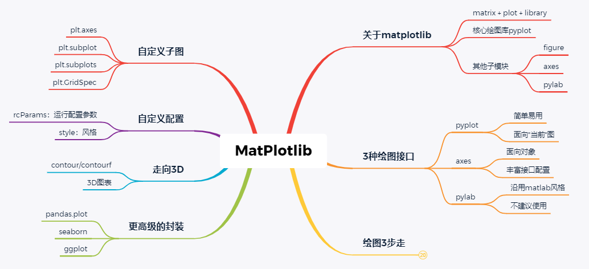

行文目录结构，重点是右三分支

### Ⅰ. 关于matplotlib

matplotlib是python的一个绘图库，与numpy、pandas共享数据科学三剑客的美誉，也是很多高级可视化库的基础。matplotlib不是python内置库，调用前需手动安装，且需依赖numpy库。截至当前，matplotlib发行版本号为3.2.1，适配python3.6及以上版本。

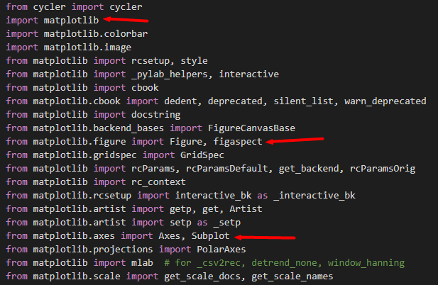

pyplot部分调用模块

前面说到，调用matplotlib库绘图一般是用pyplot子模块，其集成了绝大部分常用方法接口，查看pyplot源码文件可以发现，它内部调用了matplotlib路径下的大部分子模块（不是全部），共同完成各种丰富的绘图功能。其中有两个需要重点指出：figure和axes，其中前者为所有绘图操作定义了顶层类对象Figure，相当于是提供了画板；而后者则定义了画板中的每一个绘图对象Axes，相当于画板内的各个子图。换句话说，figure是axes的父容器，而axes是figure的内部元素，而我们常用的各种图表、图例、坐标轴等则又是axes的内部元素。

当然，之所以不能称pyplot为一级命名空间的原因，不仅仅在于它在形式上隶属于matplotlib，最主要的在于它还不算是matplotlib的“独裁者”，因为matplotlib的另一个重要模块——pylab——或许称得上是真正意义上的集大成者：pylab被定位是python中对MATLAB的替代产品，也就是说凡是MATLAB可以实现的功能，pylab通通都要有，例如矩阵运算（包括常规矩阵运算、线性代数、随机数、FFT等）、绘图功能等等。

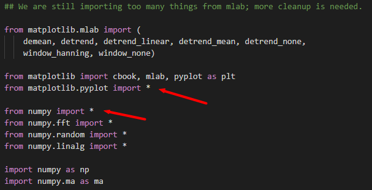

pylab导入的那些重量级模块

至此，关于matplotlib的pyplot和pylab两个子模块，我们可以得出2点结论：

- pyplot的功能定位决定其不能成为一级命名空间：即便是寻找matplotlib的替代包名，那么也该是pylab而不是pyplot
- 简单地讲，以后也不用import numpy 和 import matplotlib.pyplot了，直接import matplotlib.pylab就够了，毕竟它集成了二者的全部功能

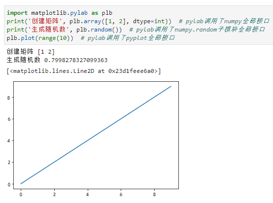

pylab集成了numpy和pyplot全部功能

> 当了解pylab模块功能之后，才真正理解开发者的深谋远虑：原以为matplotlib的意思是"面向矩阵的绘图库"，哪知其真正意义是"矩阵+绘图库"，绘图只是它的一半。不过，也正因为pylab模块集成了过多的功能，直接调用并不是一个明智的选择，官方已不建议用其绘图。

*注：按照惯例，本文后续多以plt作为matplotlib.pyplot别名使用。*

### Ⅱ. 3种绘图接口

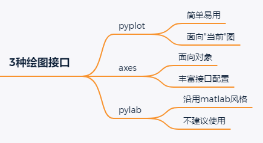

用matplotlib绘制可视化图表，主要有3种接口形式：

- plt接口，例如常用的plt.plot()，用官方文档的原话，它是matplotlib的一个state-based交互接口，相关操作不面向特定的实例对象，而是面向"当前"图
- 面向对象接口，这里的面向对象主要是指Figure和Axes两类对象。前文提到，Figure提供了容纳多个Axes的画板，而Axes则是所有图标数据、图例配置等绘图形元素的容器。面向对象的绘图，就是通过调用Figure或Axes两类实例的方法完成绘图的过程（当然，Figure和Axes发挥的作用是不同的）。通俗的说，就是将plt中的图形赋值给一个Figure或Axes实例，方便后续调用操作
- pylab接口，如前所述，其引入了numpy和pyplot的所有接口，自然也可用于绘制图表，仍然可看做是pyplot接口形式。因其过于庞大官方不建议使用

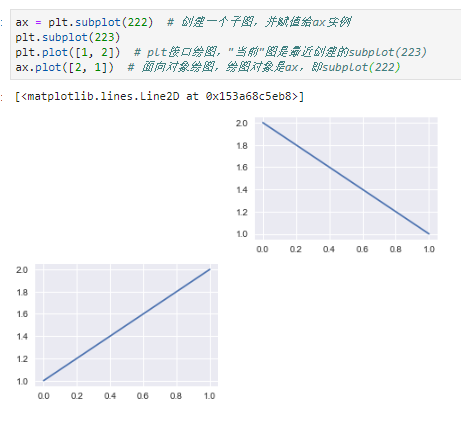

plt接口和面向对象接口混合绘图

鉴于pylab的特殊性，matplotlib绘图主要采用前2种方式。而在二者之间：

- 如果是简单的单图表绘制，或者是交互实验环境，则plt接口足以满足需要，且操作简单易用
- 如果是多图表绘制，需要相对复杂的图例配置和其他自定义设置，那么毫无疑问面向对象接口绘图是当之无愧的不二选择

需要指出，Axes从形式上是坐标轴axis一词的复数形式，但意义上却远非2个或多个坐标轴那么简单：如果将Figure比作是画板的话，那么Axes就是画板中的各个子图，这个子图提供了真正用于绘图的空间，除了包含纯粹的两个坐标轴(axes)外，自然还包括图形、图例等。所以准确的讲，如果说Axes和坐标轴有何关联的话，那么Axes应该算是广义的坐标轴，或简单称之为子图即可。

### Ⅲ. 绘图3步走

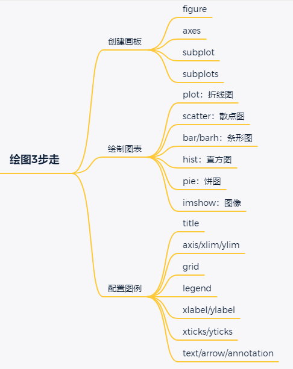

如同把大象装进冰箱需要3步一样，用matplotlib绘图一般也可以分3步。下面以plt接口绘图为例，面向对象接口绘图流程完全一致，仅仅是个别接口方法名略有改动：

- 创建画板，包括创建figure和axes对象，常用有3种方法

- - plt.figure，主要接收一个元组作为figsize参数设置图形大小，返回一个figure对象用于提供画板
  - plt.axes，接收一个figure或在当前画板上添加一个子图，返回该axes对象，并将其设置为"当前"图，缺省时会在绘图前自动添加
  - plt.subplot，主要接收3个数字或1个3位数（自动解析成3个数字，要求解析后数值合理）作为子图的行数、列数和当前子图索引，索引从1开始（与MATLAB保存一致），返回一个axes对象用于绘图操作。这里，可以理解成是先隐式执行了plt.figure，然后在创建的figure对象上添加子图，并返回当前子图实例
  - plt.subplots，主要接收一个行数nrows和列数ncols作为参数（不含第三个数字），创建一个figure对象和相应数量的axes对象，同时返回该figure对象和axes对象嵌套列表，并默认选择最后一个子图作为"当前"图

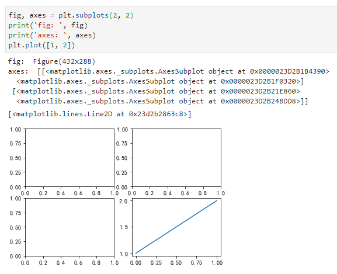

plt.subplots同时返回figure和axes实例

默认将最后一个axes子图作为"当前"图

- 绘制图表，常用图表形式包括：

- - plot，折线图或点图，实际是调用了line模块下的Line2D图表接口
  - scatter，散点图，常用于表述两组数据间的分布关系，也可由特殊形式下的plot实现
  - bar/barh，条形图或柱状图，常用于表达一组离散数据的大小关系，比如一年内每个月的销售额数据；默认竖直条形图，可选barh绘制水平条形图
  - hist，直方图，形式上与条形图很像，但表达意义却完全不同：直方图用于统计一组连续数据的分区间分布情况，比如有1000个正态分布的随机抽样，那么其直方图应该是大致满足钟型分布；条形图主要是适用于一组离散标签下的数量对比
  - pie，饼图，主要用于表达构成或比例关系，一般适用于少量对比
  - imshow，显示图像，根据像素点数据完成绘图并显示

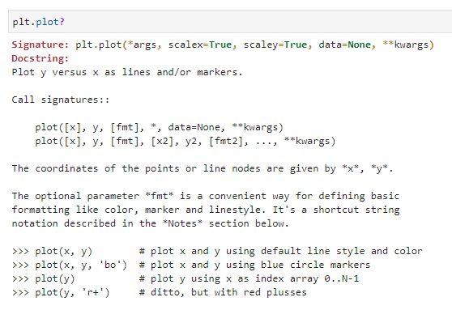

plot接口文档及部分参数

> 当然，各图表接口参数繁多且不尽一致，全部熟记几乎不现实，可仅记住常用参数及相关可选项，其他留作使用时查阅即可

- 配置图例：对所绘图形进一步添加图例元素，例如设置标题、坐标轴、文字说明等，常用接口如下：

- - title，设置图表标题
  - axis/xlim/ylim，设置相应坐标轴范围，其中axis是对后xlim和ylim的集成，接受4个参数分别作为x和y轴的范围参数
  - grid，添加图表网格线
  - legend，在图表中添加label图例参数后，通过legend进行显示
  - xlabel/ylabel，分别用于设置x、y轴标题
  - xticks/yticks，分别用于自定义坐标轴刻度显示
  - text/arrow/annotation，分别在图例指定位置添加文字、箭头和标记，一般很少用

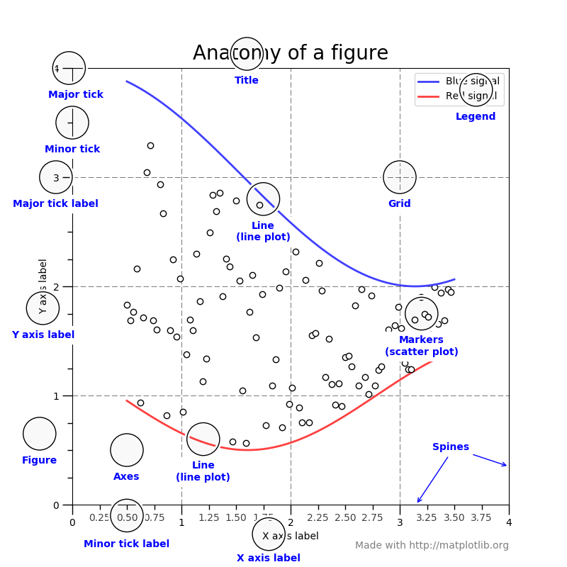

关于图例配置的官方解释

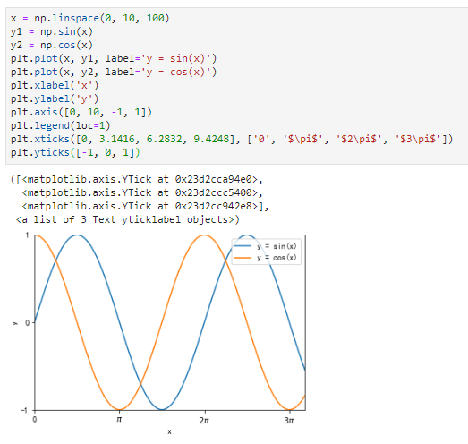

plt接口绘图中配置常用图例

前面提到，绘图接口有2种形式，分别是面向"当前"图的plt接口和面向对象接口，在这2种方式的相应接口中，多数接口名是一致的，例如：plt.plot()和axes.plot()、plt.legend()和axes.legend()，但也有一些不一致的接口：

- plt.axes()——fig.add_axes()
- plt.subplot()——fig.add_subplot()
- plt.GridSped()——fig.add_gridspec()
- plt.xlabel()——axes.set_xlabel()
- plt.ylabel()——axes.set_ylabel()
- plt.xlim()——axes.set_xlim()
- plt.ylim()——axes.set_ylim()
- plt.title()——axes.set_title()

对此，一方面两类接口虽然略有区别，但也还算有规律；另一方面，在面向对象绘图配置图例时，有更为便捷的设置图例接口axes.set()，其可以接收多种参数一次性完成所有配置，这也正是面向对象绘图的强大之处。

### Ⅳ. 自定义子图

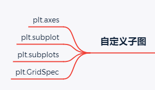

前面提到，figure为绘图创建了画板，而axes基于当前画板创建了1个或多个子图对象。为了创建各种形式的子图，matplotlib主要支持4种添加子图的方式。

常用的添加子图的方法莫过于subplot和subplots两个接口，其中前者用于一次添加一个子图，而后者则是创建一组子图。

除此之外，plt.axes也可通过接收尺寸参数实现多子图绘制：在添加子图时传入一个含有4个数值的元组，分别表示子图的底坐标和左坐标（设置子图原点位置）、宽度和高度（设置子图大小），从而间接实现子图仅占据画板的一块子区域。相应的方法接口在面向对象接口中是fig.add_axes()，仅仅是接口名字不同，但参数和原理是一致的。例如：

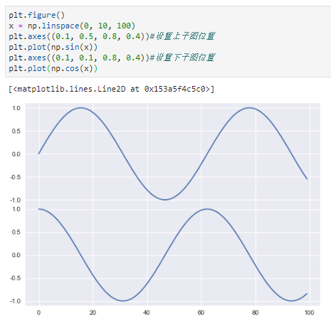

应用plt.axes绘制多子图

通过axes绘制多子图，应对简单需求尚可，但面对复杂图表绘制时难免过于繁琐：需要手工计算各子图的原点位置和大小，意味着可能需要多次尝试。此时，可选的另一种绘制多子图的接口是plt.GridSpec。实际上，GridSpec只是对subplot接口的一个变形，本质上仍然是执行类似subplot多子图流程：通过切片将多子图合并，实现不规则多子图的绘制。与subplot、axes在面向对象和plt两类绘图接口间的区别类似，GridSpec在面向对象时的接口为add_gridspec()。

这里直接给出官网的一个绘制图例，具体可查看官方示例代码：

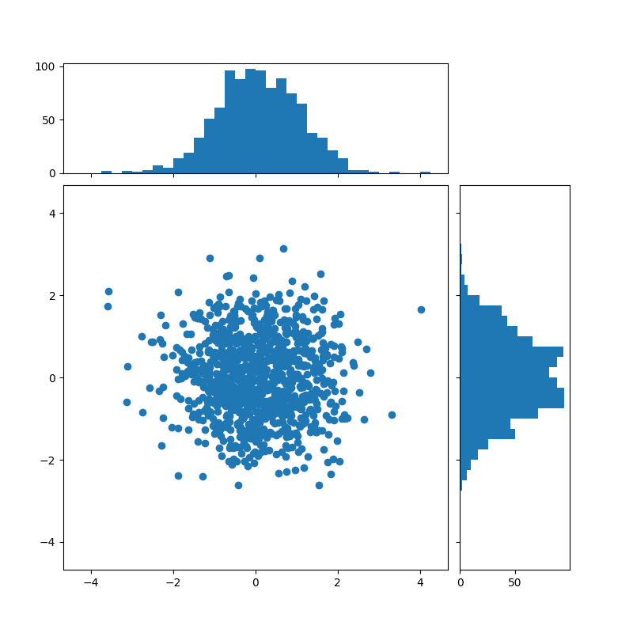

应用plt.GridSpec实现复杂多子图绘制

### Ⅴ. 自定义配置

实际上，前述在配置图例过程中，每次绘制都需要进行大量自定义代码设置（这也是matplotlib的一个短板），在少量绘图工作时尚可接受，但在大量相似绘图存在重复操作时，仍然采取这一方法不会是一个明智的选择（虽然也可以简单的封装成一个函数）。

为此，matplotlib提供了自定义参数实现批量配置——rcParams，全称runtime configuration Parameters，即运行时配置参数。顾名思义，就是在python程序运行时临时执行的配置参数。rcParams是一个字典格式，当前共有299个键值对，分别对应一组参数配置选项。其中用得最多的可能是通过设置字体和减号编码来解决乱码的问题，但实际上它的功能强大之处可远非如此。

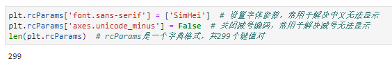

设置rcParams解决中文乱码的问题

另一个简单易用的自定义配置选项是style，即设置绘图风格，最早在matplotlib1.4版本中引入，当前共支持26种绘图风格，这里的绘图风格类似于很多IDE支持不同主题。可以通过plt.style.available命令查看，返回一个可选风格的列表。例如，以下命令设置绘图为senborn风格

设置seaborn绘图风格

### Ⅵ. 走向3D

在可视化愈发重要的当下，matplotlib当然不仅支持简单的2D图表绘制，其也提供了对3D绘图的丰富接口。

- contour，实际上是一个伪3D图形，仍然是在2维空间绘图，但可以表达3维信息。例如在机器学习中，contour常用于绘制分类算法的超平面

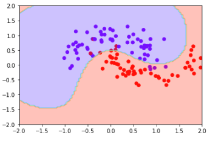

如果需要绘制真3D图形，则需要额外导入matplotlib专用3D绘图库：mpl_toolkits，包括3D版的Axes对象和常用图表的3D版：

- plot3D，3D版plot，可用于绘制3维空间的折线图或点图
- scatter3D，3维散点图
- bar3D，3维条形图
- contour3D，3维等高线

### Ⅶ. 更高级的封装

matplotlib提供了大量丰富的可视化绘图接口，但仍然存在短板：例如绘图操作略显繁琐、图表不够美观。为此，在matplotlib基础上产生了一些封装更为便捷的可视化库，实现更为简单易用的接口和美观的图表形式，包括：

- pandas.plot，一个最直接的对matplotlib绘图的封装，接口方法非常接近
- seaborn，是对matplotlib的高级封装，具有更为美观的图形样式和颜色配置，并提供了常用的统计图形接口，如pairplot()适用于表达多组数据间的关系
- ggplot，也是对matplotlib进行二次封装的可视化库，主要适用于pandas的DataFrame数据结构

