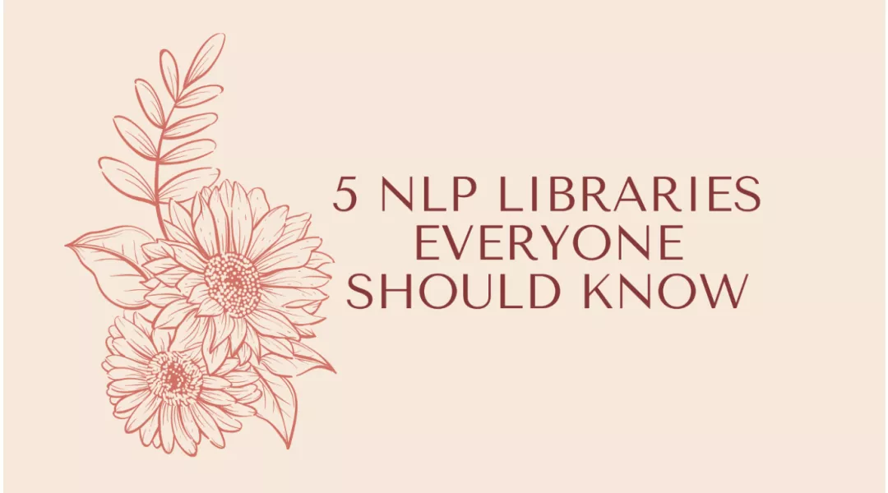

## 自然语言处理5大语义分析技术及14类应用

> 自然语言处理（Natural Language Processing，NLP）技术是与自然语言的计算机处理有关的所有技术的统称，其目的是使计算机能够理解和接受人类用自然语言输入的指令，完成从一种语言到另一种语言的翻译功能。
>
> 自然语言处理技术的研究，可以丰富计算机知识处理的研究内容，推动人工智能技术的发展。

### Ⅰ. 语义分析技术

**自然语言处理技术的核心为语义分析。**语义分析是一种基于自然语言进行语义信息分析的方法，不仅进行词法分析和句法分析这类语法水平上的分析，而且还涉及单词、词组、句子、段落所包含的意义，目的是用句子的语义结构来表示语言的结构。语义分析技术具体包括如下几点。

#### 1. 词法分析

词法分析包括词形分析和词汇分析两个方面。一般来讲，词形分析主要表现在对单词的前缀、后缀等进行分析，而词汇分析则表现在对整个词汇系统的控制，从而能够较准确地分析用户输入信息的特征，最终准确地完成搜索过程。

#### 2. 句法分析

句法分析是对用户输入的自然语言进行词汇短语的分析，目的是识别句子的句法结构，以实现自动句法分析的过程。

#### 3. 语用分析

语用分析相对于语义分析又增加了对上下文、语言背景、语境等的分析，即从文章的结构中提取出意象、人际关系等附加信息，是一种更高级的语言学分析。它将语句中的内容与现实生活中的细节关联在一起，从而形成动态的表意结构。

#### 4. 语境分析

语境分析主要是指对原查询语篇之外的大量“空隙”进行分析，以便更准确地解释所要查询语言的技术。这些“空隙”包括一般的知识、特定领域的知识以及查询用户的需求等。

#### 5. 自然语言生成

AI驱动的引擎能够根据收集的数据生成描述，通过遵循将数据中的结果转换为散文的规则，在人与技术之间创建无缝交互的软件引擎。结构化性能数据可以通过管道传输到自然语言引擎中，以自动编写内部和外部的管理报告。

自然语言生成接收结构化表示的语义，以输出符合语法的、流畅的、与输入语义一致的自然语言文本。早期大多采用管道模型研究自然语言生成，管道模型根据不同的阶段将研究过程分解为如下三个子任务。

- **内容选择：**决定要表达哪些内容。
- **句子规划：**决定篇章及句子的结构，进行句子的融合、指代表述等。
- **表层实现：**决定选择什么样的词汇来实现一个句子的表达。

早期基于规则的自然语言生成技术，在每个子任务上均采用了不同的语言学规则或领域知识，实现了从输入语义到输出文本的转换。

鉴于基于规则的自然语言生成系统存在的不足之处，近几年来，**学者们开始了基于数据驱动的自然语言生成技术的研究**，从浅层的统计机器学习模型，到深层的神经网络模型，对语言生成过程中每个子任务的建模，以及多个子任务的联合建模，开展了相关的研究，目前主流的自然语言生成技术主要有基于数据驱动的自然语言生成技术和基于深度神经网络的自然语言生成技术。

### Ⅱ. 自然语言处理应用

自然语言处理应用的技术体系主要包括字词级别的自然语言处理，句法级别的自然语言处理和篇章级别的自然语言处理。

- **字词级别的分析**主要包括中文分词、命名实体识别、词性标注、同义词分词、字词向量等；
- **句法级别的分析**主要包括依存文法分析、词位置分析、语义归一化、文本纠错等；
- **篇章级别的分析**主要包括标签提取、文档相似度分析、主题模型分析、文档分类和聚类等。

#### 1. 中文分词

中文分词是计算机根据语义模型，自动将汉字序列切分为符合人类语义理解的词汇。**分词就是将连续的字序列按照一定的规范重新组合成词序列的过程。**

在英文的行文中，单词之间是以空格作为自然分界符的，而中文只是字、句和段能够通过明显的分界符来进行简单的划界，唯独词没有一个形式上的分界符，虽然英文也同样存在短语的划分问题，不过在词这一层面上，**中文比英文要复杂得多、困难得多。**

#### 2. 命名实体识别

命名实体识别又称作“专名识别”（NER），是指对具有特定意义的实体进行自动识别的技术，是信息提取、知识图谱、问答系统、句法分析、搜索引擎、机器翻译等应用的重要基础。

#### 3. 词性标注

词性标注（Part-of-Speech tagging或POS tagging）又称词类标注，是指为分词结果中的每个单词标注一个正确的词性的程序。具体来说就是，确定每个词是名词、动词、形容词或者是其他词性的过程。

▲词性标注

**在汉语中，词性标注比较简单**，因为汉语词汇词性多变的情况比较少见，大多数词语只有一个词性，或者出现频次最高的词性远远高于第二位的词性。**常用的方法有：**基于最大熵的词性标注、基于统计的最大概率输出词性、基于隐马尔可夫模型（HMM）的词性标注。

#### 4. 同义词分析

由于不同地区的文化差异，输入的查询文字很可能会出现描述不一致的问题。此时，业务系统需要对用户的输入做同义词、纠错、归一化处理。同义词挖掘是一项基础工作，同义词算法包括词典、百科词条、元搜索数据、上下文相关性挖掘，等等。

#### 5. 词向量分析

词向量技术是指将词转化为稠密向量，相似的词对应的词向量也相近。在自然语言处理应用中，词向量作为深度学习模型的特征进行输入。因此，最终模型的效果在很大程度上取决于词向量的效果。一般来说，字词表示有两种方式：one-hot及分布式表示。

- **one-hot**是指向量中只有一个维度的值为1，其余维度为0，这个维度代表了当前词。
- **分布式表示**（word embedding）指的是将词转化为一种分布式表示，又称词向量，分布式表示将词表示成一个定长的稠密向量。

词向量的生成可分为两种方法：基于统计方法（例如，共现矩阵、奇异值分解（SVD）和基于语言模型（例如，word2vec中使用的CBOW、Skip-gram等）。

#### 6. 依存文法分析

依存文法通过分析语言单位内成分之前的依存关系解释其句法结构，主张句子中的核心谓语动词是支配其他成分的中心成分。而它本身却不会受到其他任何成分的支配，所有受支配的成分都以某种关系从属于支配者，如下图所示。

▲依存文法分析距离

从分析结果中我们可以看到，句子的核心谓语动词为“召开”，主语是“民航局”，“召开”的宾语是“会”，“会”的修饰语是“通用航空发展工作专题”。有了上面的句法分析结果，我们就可以比较容易地看到，是“民航局”“召开”了会议，而不是“促进”了会议，即使“促进”距离“会”更近。

#### 7. 词位置分析

文章中不同位置的词对文章语义的贡献度也不同。文章首尾出现的词成为主题词、关键词的概率要大于出现在正文中的词。对文章中的词的位置进行建模，赋予不同位置不同的权重，从而能够更好地对文章进行向量化表示。

#### 8. 语义归一化

语义归一化通常是指从文章中识别出具有相同意思的词或短语，其主要的任务是**共指消解**。共指消解是自然语言处理中的核心问题，在机器翻译、信息抽取以及问答等领域都有着非常重要的作用。

就拿常见的信息抽取的一个成型系统来讲，微软的学术搜索引擎会存有一些作者的档案资料，这些信息可能有一部分就是根据共指对象抽取出来的。比如，在一个教授的访谈录中，教授的名字可能只会出现一两次，更多的可能是“我”“某某博士”“某某教授”或“他”之类的代称，不出意外的话，这其中也会有一些同样的词代表记者，**如何将这些词对应到正确的人，将会成为信息抽取的关键所在。**

#### 9. 文本纠错

文本纠错任务指的是，对于自然语言在使用过程中出现的错误进行自动地识别和纠正。文本纠错任务主要包含两个子任务，分别为错误识别和错误修正。错误识别的任务是指出错误出现的句子的位置，错误修正是指在识别的基础上自动进行更正。

相比于英文纠错来说，中文纠错的主要困难在于中文的语言特性：中文的词边界以及中文庞大的字符集。**由于中文的语言特性，两种语言的错误类型也是不同的。**

英文的修改操作包括插入、删除、替换和移动（移动是指两个字母交换顺序等），而对于中文来说，因为每一个中文汉字都可独立成词，因此插入、删除和移动的错误都只是作为语法错误。由于大部分的用户均为母语用户，且输入法一般会给出正确提示，语法错误的情况一般比较少，因此，中文输入纠错主要集中在替换错误上。

#### 10. 标签提取

文档的标签通常是几个词语或者短语，并以此作为对该文档主要内容的提要。标签是人们快速了解文档内容、把握主题的重要方式，在科技论文、信息存储、新闻报道中具有极其广泛的应用。文档的标签通常具有可读性、相关性、覆盖度等特点。

- **可读性**指的是其本身作为一个词语或者短语就应该是有意义的；
- **相关性**指的是标签必须与文档的主题、内容紧密相关；
- **覆盖度**指的是文档的标签能较好地覆盖文档的内容，而不能只集中在某一句话中。

#### 11. 文本相似度

文本相似度在不同领域受到了广泛的讨论，然而由于应用场景的不同，其内涵也会有差异，因此没有统一的定义。

从信息论的角度来看，相似度与文本之间的共性和差异度有关，共性越大、差异度越小，则相似度越高；共性越小、差异度越大，则相似度越低；相似度最大的情况是文本完全相同。

**相似度计算一般是指计算事物的特征之间的距离，如果距离小，那么相似度就大；如果距离大，那么相似度就小。**

相似度计算的方法可以分为四大类：基于字符串的方法、基于语料库的方法、基于知识的方法和其他方法。

- **基于字符串的方法**是指从字符串的匹配度出发，以字符串共现和重复程度为相似度的衡量标准；
- **基于语料库的方法**是指利用从语料库中获取的信息计算文本的相似度；
- **基于知识的方法**是指利用具有规范组织体系的知识库计算文本的相似度。

#### 12. 主题模型

主题分析模型（Topic Model）是以非监督学习的方式对文档的隐含语义结构进行统计和聚类，以用于挖掘文本中所蕴含的语义结构的技术。隐含狄利克雷分布（Latent Dirichlet Allocation，LDA）是常用的主题模型计算方法。

#### 13. 文本分类

按照特定行业的文档分类体系，计算机自动阅读文档的内容并将其归属到相应类目的技术体系下。其典型的处理过程可分为训练和运转两种。即计算机预先阅读各个类目的文档并提取特征，完成有监督的学习训练，在运转阶段识别新文档的内容并完成归类。

#### 14. 文本聚类

文本聚类主要是依据著名的**聚类假设**：同类的文档相似度较大，而不同类的文档相似度较小。作为一种无监督的机器学习方法，聚类由于不需要训练过程，以及不需要预先对文档的类别进行手工标注，因此具有一定的灵活性和较高的自动化处理能力。

文本聚类已经成为对文本信息进行有效地组织、摘要和导航的重要手段。文本聚类的方法主要有基于划分的聚类算法、基于层次的聚类算法和基于密度的聚类算法。

### Ⅲ. 常用的Python NLP代码库

这些软件包可处理多种NLP任务，例如词性（POS）标注，依存分析，文档分类，主题建模等等。

目前有许多工具和库用于解决NLP问题，**NLP库的基本目标是简化文本预处理。**

但是在此之前，应该掌握有关NLP的各个组成领域和主题的一些基础知识。

#### 扎实基础

对于学习自然语言处理的理论基础，网络上有丰富的资源可以学习：

- [**斯坦福课程**](http://web.stanford.edu/class/cs224n/)
- [**Deeplearning.ai**](https://www.coursera.org/specializations/natural-language-processing)
- [**自然语言处理，语音识别和计算语言学导论（又名NLP圣经）**](https://web.stanford.edu/~jurafsky/slp3/)
- [**统计自然语言处理的基础**](https://nlp.stanford.edu/fsnlp/)

#### 1. Spacy

spaCy 是Python中比较出名，专门用于自然语言处理的库。它有助于实现最先进的效率和敏捷性，并拥有活跃的开源组织积极贡献代码。

**加分项：**

- 与所有主要的深度学习框架很好地结合，并预装了一些出色且有用的语言模型
- 由于Cython支持，速度相对较快

**使用spaCy最适合做的事情**

1. **词性（POS）标注：**这是给单词标记制定语法属性（例如名词，动词，形容词，副词等）过程。
2. **实体识别：**将文本中发现的命名实体标记到预定义实体类型。
3. **依存分析：**分配语法依存标签，描述各个标记（例如主题或客体）之间的关系。
4. **文本分类：**为整个文档或文档的一部分分配类别或标签。
5. **句子边界检测（SBD）：**查找和分割单个句子。

**相关资源**

免费官方课程的链接：[基于spaCy的高级NLP](https://course.spacy.io/en/)

**更多资源**

- [**使用Python中的spaCy进行自然语言处理（入门博客）**](https://realpython.com/natural-language-processing-spacy-python/)
- [**Python Spacy简介（视频）**](https://realpython.com/natural-language-processing-spacy-python/)

#### 2. NLTK

NLTK是目前可用的最优秀的NLP模型训练库之一。该库是NLP入门python库。它是NLP的初学者常用的库。它具有许多预先训练的模型和语料库，可帮助我们非常快速地分析事物。

**加分项：**内置支持数十种语料库和训练完备的模型

使用NLTK可以实现一下需求：

1. **推荐**：可以基于相似性来推荐内容。
2. **情感分析**：通过自然语言处理来衡量人们的观点倾向
3. **Wordnet [1]支持：**我们可以使用Synset 在WordNet中查找单词。因此可以访问许多单词的同音异义词，上位词，同义词，定义，词族等
4. **机器翻译：**用于将源语言翻译成目标语言

**其他资源**

- [**官方的教材：《使用自然语言工具包分析文本》**](https://www.nltk.org/book/)
- [**Python的NLTK（自然语言工具包）教程**](https://www.guru99.com/nltk-tutorial.html)
- [**Wordnet文档— WordNet 3.0参考手册**](https://wordnet.princeton.edu/documentation)

与spaCy专注于提供用于生产用途的软件不同，NLTK被广泛用于教学和研究。

#### 3.Transformers

该Transformers库是开源，基于社区的信息库，使用和共享模型基于Transformer结构[2]如Bert[3]，Roberta[4]，GPT2 [5]，XLNet [6]，等等。

该库提供自然语言理解（NLU）和自然语言生成（NLG）任务预训练模型下载。

**加分项：**超过32种采用100种以上语言的训练的预训练模型，以及TensorFlow 2.0和PyTorch之间的深度互操作性。最适合深度学习。

**Transformers可以做到一下事情**

1. **摘要生成：**摘要是将文本/文章摘要为较短文本的任务。
2. **翻译：**将文本从一种语言翻译成另一种语言的任务。
3. **文本生成：**基于上下文，生成连贯的下文。
4. **抽取式问答：**从给定问题的文本中提取答案的任务。

**相关资源：**

- [**官方文档**](https://huggingface.co/transformers/)
- [**使用BERT，HuggingFace和AWS Lambda构建问题解答API**](https://towardsdatascience.com/serverless-bert-with-huggingface-and-aws-lambda-625193c6cc04)
- [**使用BERT和Transformers进行情感分析**](https://www.curiousily.com/posts/sentiment-analysis-with-bert-and-hugging-face-using-pytorch-and-python/)

#### 4. Gensim

Gensim是一个Python库，专门用于通过向量空间建模和主题建模工具包来识别两个文档之间的语义相似性

顺便说一下，它是“ Generate Similar”（Gensim）的缩写：)

**优点：**高水平的处理速度和可以处理大量文本。

**Gensim适合处理的需求：**

1. **分布式计算：**它可以在计算机集群上运行隐语义分析和隐Dirichlet分配。（可以处理大量数据的原因）
2. **文档索引：**将信息与文件或特定标签相关联的过程，以便以后可以轻松检索
3. **主题建模：**自动聚类单词group和定义一组文档的相似表达式。
4. **相似性检索：**处理文档存储库中相似信息的组织，存储，检索和评估（此处为文本信息）

**资源**

- [**官方API文档-API参考**](https://radimrehurek.com/gensim/apiref.html)
- [**官方教程- 核心教程**](https://radimrehurek.com/gensim/auto_examples/)
- [**使用Gensim LDA进行分层文档聚类— 使用Python进行文档聚类**](http://brandonrose.org/clustering#Latent-Dirichlet-Allocation)
- [**安装，处理等Gensim入门教程**](https://stackabuse.com/python-for-nlp-working-with-the-gensim-library-part-1/)

#### 5. Stanza

**Stanza将许多准确而有效自然语言处理工具收集在一起，组成工具包。从原始文本到句法分析和实体识别，Stanza将最新的NLP模型引入语言处理中。**

该工具包建立在PyTorch库的之上，并支持使用GPU和预训练的神经模型。

**此外，Stanza包括一个CoreNLP Java包的Python接口，并从那里继承了附加功能。**

**优点：快速，准确，并且能够支持几种主要语言。适用于生产部署环境。**

**资源：**[CoreNLP的Python包装器列表](http://stanfordnlp.github.io/CoreNLP/other-languages.html#python)

**Stanza适合处理的需求：**

1. **形态特征标记：**对于句子中的每个单词，Stanza都会评估其普遍的形态特征（例如，单身/复数，第一/第二/第三人称等）。
2. **多词令牌扩展：**将句子扩展成句法词，作为下游处理的基础。

**这五个库的固有特性使其成为依赖于机器对人类表达的理解的所有项目的首选。**

#### 参考文献

1. [WordNet简介：在线词汇数据库 — George A. Miller等。1993年](https://wordnetcode.princeton.edu/5papers.pdf)

2. [Attention Is All You Need — Vaswani等人，2017。](https://arxiv.org/abs/1706.03762)

3. [BERT：用于语言理解的深度双向Transformers的预训练 — Devlin等人，2018年。](https://arxiv.org/abs/1810.04805)

4. [RoBERTa：一种经过严格优化的BERT预训练方法 — Liu等，2019年。](https://arxiv.org/abs/1907.11692)

5. [语言模型是无监督的多任务学习者（GPT2） — Radford等人，2019年。](https://cdn.openai.com/better-language-models/language_models_are_unsupervised_multitask_learners.pdf)

6. [XLNet：用于语言理解的广义自回归预训练 — Yang等人，2019年。](https://arxiv.org/abs/1906.08237)

7. [Stanza：适用于多种人类语言的Python自然语言处理工具包 — Peng等人，2020年。](https://arxiv.org/abs/2003.07082)

