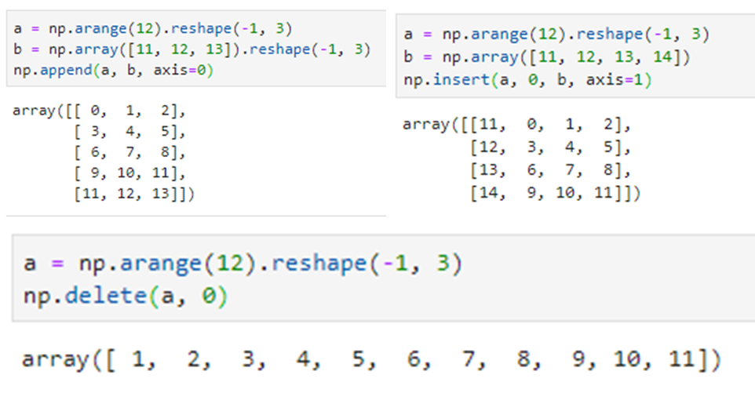

## Numpy入门详细教程

### Ⅰ. 基本介绍

- numpy：numerical python缩写，提供了底层基于C语言实现的数值计算库，与python内置的list和array数据结构相比，其支持更加规范的数据类型和极其丰富的操作接口，速度也更快
- numpy的两个重要对象是ndarray和ufunc，其中前者是数据结构的基础，后者是接口方法的基础
- ufunc，通函数，其意义是可以像执行标量运算一样执行数组运算，本质即是通过隐式的循环对各个位置依次进行标量运算。只不过这里的隐式循环交由底层C语言实现，因此相比直接用python循环实现，ufunc语法更为简洁、效率更为高效
- 索引、迭代和切片操作方式与普通列表比较类似，但是支持更为强大的bool索引

这部分内容比较基础，仅补充一个个人认为比较有用的ufunc加聚合的例子。ufunc本身属于方法（方法即是类内的函数接口），ufunc之上还支持4个方法：

- reduce，聚合方法
- accumulate，累计聚合
- reduceat，按指定轴向、指定切片聚合
- outer：外积

当然，后两个用处较少也不易理解，前两个在有些场景下则比较有用：

### Ⅱ. 数组创建

numpy中支持5类创建数组的方式：

- 从普通数据结构创建，如列表、元组等

- 从特定的array结构创建，支持大量方法，例如ones、zeros、empty等等

- - empty接收指定大小创建空数组，这里空数组的意义在于未进行数值初始赋值，随机产生，因而速度要更快一些
  - linspace和arange功能类似，前者创建指定个数的数值，后者按固定步长创建，其中linspace默认包含终点值（可以通过endpoint参数设置为false），而arange则不含终点

- 从磁盘读取特定的文件格式

- 从缓存或字符读入数组

- 从特定的库函数创建，例如random随机数包

以上方法中，最为常用的是方法1、2、5。

### Ⅲ. 数组增删

numpy提供了与列表类似的增删操作，其中

- append是在指定维度后面拼接数据，要求相应维度大小匹配
- insert可以在指定维度任意位置插入数据，要求维度大小匹配
- delete删除指定维度下的特定索引对应数据

三种方法需要接收一个axis参数，如果未指定，则均会先对目标数组展平至一维数组后再执行相应操作。

### Ⅳ. 数组变形

数组变形是指对给定数组重新整合各维度大小的过程，numpy封装了4类基本的变形操作：转置、展平、尺寸重整和复制。主要方法接口如下：

- reshape常用于对给定数组指定维度大小，原数组不变，返回一个具有新形状的新数组；如果想对原数组执行inplace变形操作，则可以直接指定其形状为合适维度

- resize与reshape功能类似，主要有3点区别：

- - resize面向对象操作时，执行inplace操作，调用np.resize类方法时则不改变原数组形状；而reshape无论如何都不改变原数组形状
  - resize变形后的数组大小可以不和原数组一致，会自动根据新尺寸情况进行截断或拼接
  - 正因为resize可以执行截断，所以要求接收确切的尺寸参数，不允许出现-1这样的"非法"数值；而reshape中常用-1的技巧实现某一维度的自动计算

另外，当resize新尺寸参数与原数组大小不一致时，要求操作对象具有原数组的，而不能是view或简单赋值。（具体参考08 视图与拷贝一节）

- ravel和flat功能类似，均返回对数组执行展平后的结果，且不改变原数组形状，区别在于：

- - 前者是方法接口，而后者是属性接口，
  - 前者返回对象类型仍然是数组，而后者返回对象类型是专用的flatten类型，一般用作迭代器对象

- transpose与T均执行转置操作，前者是方法，后者是属性

- tile和repeat方法类似，均为对给定数组执行复制操作，区别在于：

- - tile面向整个数组复制，而repeat面向数组元素复制
  - tile不接收维度参数，而repeat需指定维度参数，否则会对数组先展平再复制

### Ⅴ. 数组拼接

数组拼接也是常用操作之一，主要有3类接口：

- concatenate，对给定的多个数组按某一轴进行拼接，要求所有数组具有相同的维度（ndim相等）、且在非拼接轴大小一致

- stack系列，共6个方法：

- - hstack，column_stack：功能基本一致，均为水平堆叠（axis=1），或者说按列堆叠。唯一的区别在于在处理一维数组时：hstack按axis=0堆叠，且不要求两个一维数组长度一致，堆叠后仍然是一个一维数组；而column_stack则会自动将两个一维数组变形为Nx1的二维数组，并仍然按axis=1堆叠，自然也就要求二者长度一致，堆叠后是一个Nx2的二维数组

- - vstack，row_stack，功能一致，均为垂直堆叠，或者说按行堆叠，axis=0
  - dstack，主要面向三维数组，执行axis=2方向堆叠，输入数组不足3维时会首先转换为3维，主要适用于图像处理等领域
  - stack，进行**升维**堆叠，执行效果与前几种堆叠方式基本不同，要求所有数组必须具有相同尺寸。堆叠后，一维变二维、二维变三维……

- 魔法方法：r_[ ]，c_[ ]，效果分别与row_stack和column_stack类似，但具体语法要求略有不同。另外，虽然不是函数，但第一个参数可以是一个字符串实现特定功能设置。

### Ⅵ. 数组切分

数组切分可以看做是数组拼接的逆操作，分别对应：

- hsplit：水平切分，要求切分后大小相等，维数不变，可以切分一维数组
- vsplit：垂直切分，要求切分后大小相等，维数不变，要求至少二维以上
- dsplit：纵深切分，要求切分后大小相等，维数不变，至少三维数组
- split：通过接收一个axis参数实现任意切分，默认axis=0，若设置axis=1或2则可分别实现vstack和dstack
- array_split：前面4个方法均要求实现相同大小的子数组切分，当切分份数无法实现整除时会报错。array_split则可以适用于近似相等条件下的切分，也接受一个axis参数实现指定轴向

### Ⅶ. 基本统计量

numpy可以很方便的实现基本统计量，而且每种方法均包括对象方法和类方法：

- max，argmax分别返回最大值和最大值对应索引，可接收一个axis参数，指定轴线的聚合统计。对于二维及以上数组，若不指定axis，即axis=None，此时对数组所有数值求聚合统计
- min，argmin，与最大一致
- mean、std，分别求均值和标准差，也可接收一个缺省参数axis实现特定轴向聚合统计或全局聚合
- var、cov，分别求方差和协方差，与均值标准差类似
- sort、argsort，分别返回排序后的数组和相应索引，接收一个axis参数，默认为axis=-1，按最后一个轴向，若axis=None表示先展平成一维数组后再排序；另外可设置排序算法，如快排、堆排或归并等

### Ⅷ. 视图与拷贝

与列表的操作类似，numpy的数组类型也存在深浅拷贝之分：

- 直接赋值：无拷贝，相当于是引用
- view()：建立视图，浅拷贝，形状可以不一致，但数据相同
- copy()：深拷贝，完全独立的对象

注：正因为赋值和view操作后两个数组的数据共享，所以在前面resize试图更改数组形状时可以执行、但更改元素个数时会报错。

### Ⅸ. 特殊常量

numpy提供了一些特殊的常量，值得注意的是np.newaxis可以用作是对数组执行升维操作，效果与设置为None一致。

### Ⅹ. 随机数包

Random是numpy下的一个子包，内置了大量的随机数方法接口，包括绝大部分概率分布接口，常用的主要还是均匀分布和正态分布：

- 均匀分布：random、rand、uniform，三者功能具有相似性，其中前两者均产生指定个数的0-1之间均匀分布，而uniform可通过设置参数实现任意区间的均匀分布；当需要产生整数均匀分布时，可用randint

- 正态分布：randn，normal，前者生成标准正态分布（均值为0，方差为1），后者产生任意正态分布，接收一个loc参数作为均值，scale参数作为标准差

- permutation、shuffle，对给定序列实现随机排列，前者返回一个新数组，后者是inplace操作

- seed，因为计算机中的随机数严格讲都是伪随机，需要依赖一个随机数种子来不断生成新的随机数，seed可以用于固定这个随机种子。当指定随机数种子后，后续的随机将得到固化

### Ⅺ. 线性代数包

除了随机数包，numpy下的另一个常用包是线性代数包，常见的矩阵操作均位于此包下。由于点积dot()和向量点积vdot()操作使用较为频繁，所以全局可用。

### Ⅻ. 关于axis的理解

由于numpy的基本数据结构是多维数组，很多接口方法均存在维度的问题，按照不同维度执行操作结果往往不同，例如拼接、拆分、聚合统计等，此时一般需要设置一个维度参数，即axis。由于很多教程因为翻译或语言习惯不同，存在众说纷纭、口径不一的问题，有的说axis=0是横轴，有的说是纵向，所以如何理解axis的含义可能是很多numpy初学者的常见困扰之一，笔者也是如此。

这一问题困扰了好久，直至一次无意间看到了相关源码中的注释：

例如，在sort方法中，axis参数的解释为"Axis along which to sort"，翻译过来就是沿着某一轴执行排序。这里的**沿着** 一词用得恰到好处，形象的描述了参数axis的作用，即相关操作是如何与轴向建立联系的，在具体解释之前，先介绍下axis从小到大的顺序问题。axis从小到大对应轴的出场顺序先后，或者说变化快慢：axis=0对应主轴，沿着行变化的方向，可以理解为在多重for循环中最外面的一层，对应行坐标，数值变化最慢；而axis=1对应次轴，沿着列变化的方向，在多重for循环中变化要快于axis=0的轴向。类似地，如果有更高维度则依次递增。

至此，**再来理解这里axis沿着的意义** 。举个例子，axis=0代表沿着行变化的方向，那么自然地，切分方法split(axis=0)接口对应vsplit，因为是对行切分，即垂直切分；而split(axis=1)接口则对应hsplit，因为是对列切分，即水平切分；split(axis=2)则对应dsplit。类似的，np.sort(axis=0)必然是沿着行方向排序，也就是分别对每一列执行排序。

想必这样理解，应该不会存在混淆了。

### XIII. 关于广播机制

可能困扰numpy初学者的另一个用法是numpy的一大利器：广播机制。广播机制是指执行ufunc方法（即对应位置元素1对1执行标量运算）时，可以确保在数组间形状不完全相同时也可以自动的通过广播机制扩散到相同形状，进而执行相应的ufunc方法。

当然，这里的广播机制是有条件的：

条件很简单，即**从两个数组的最后维度开始比较，如果该维度满足维度相等或者其中一个大小为1，则可以实现广播** 。当然，维度相等时相当于未广播，所以严格的说广播仅适用于某一维度从1广播到N；如果当前维度满足广播要求，则同时前移一个维度继续比较。

为了直观理解这个广播条件，举个例子，下面的情况均满足广播条件：

而如下例子则无法完成广播：

好吧，以上例子其实都源自numpy官方文档。具体可参考../numpy/doc/Broadcasting.py文件。另外，doc包下还包括很多说明文档，对于深刻理解numpy运行机制大有裨益。

再补充一句：这里或许有人好奇，为什么必须要1对N才能广播，N的任意因数（比如N/2、N/3等）不是都可以"合理"广播到N吗？对此，个人也曾有此困惑，我的理解是这里的合理只是数学意义下的合理，但数组表征值意义下往往不合理，因为缺乏解释性！比如2可以广播到12，但此时该怎样理解这其中的广播意义呢？奇偶不同？那3广播到12呢？4广播到12呢？还是欠缺解释性。所以numpy限制必须是1广播到N或者二者相等，才可以广播。

