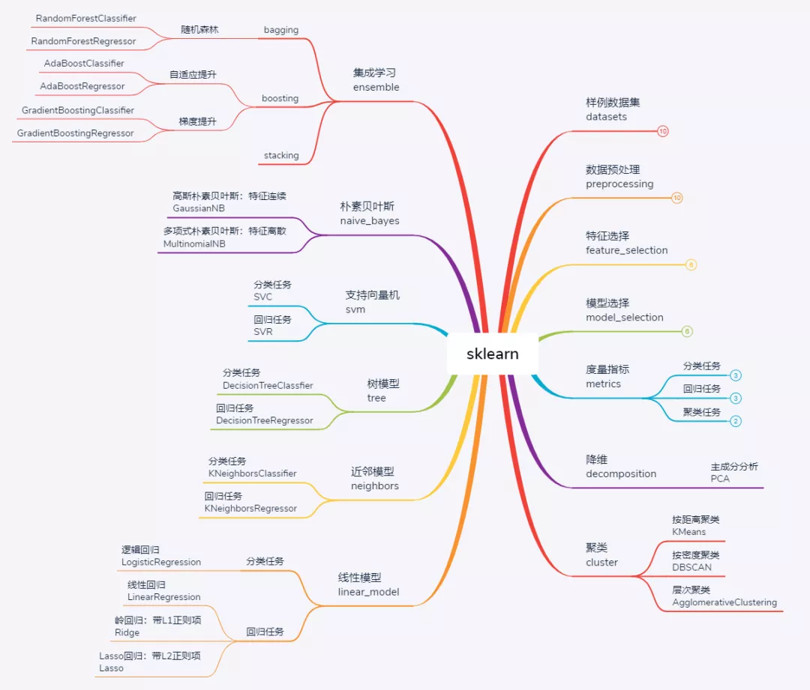
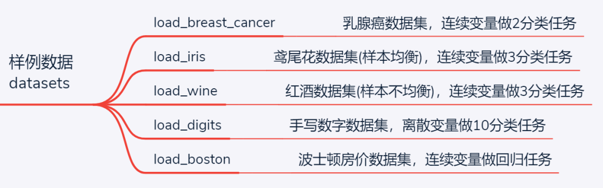
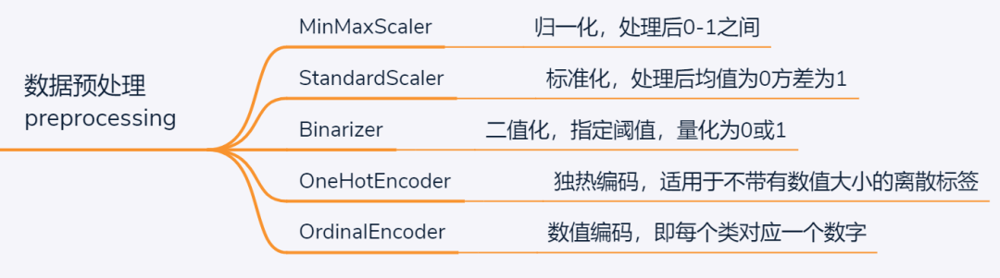
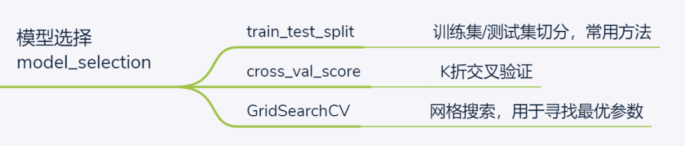
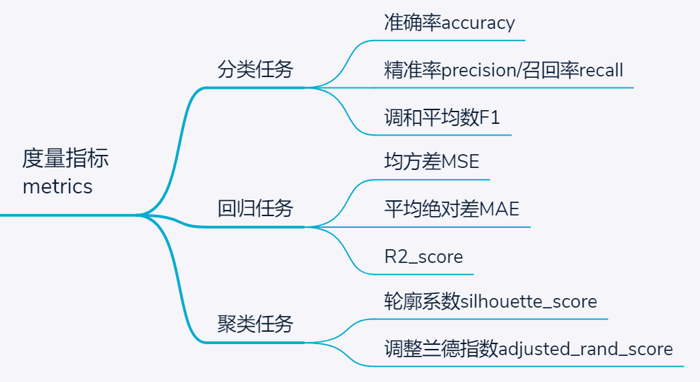
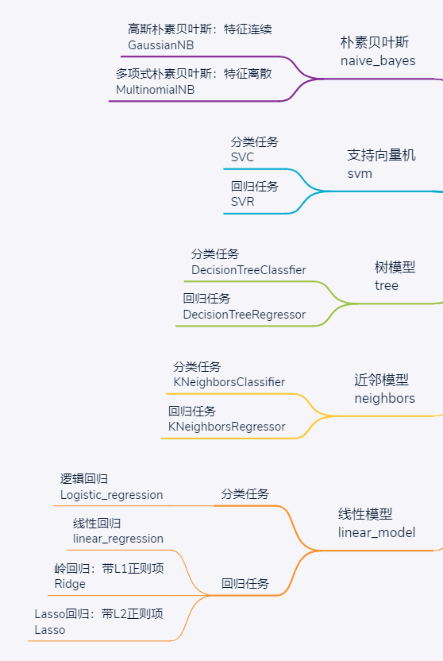
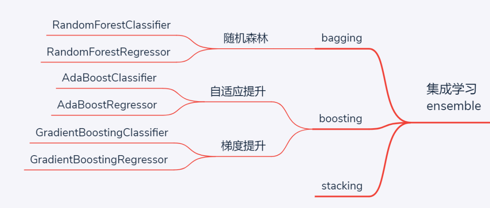

## Sklearn库主要模块功能简介

### Ⅰ. sklearn简介

sklearn，全称scikit-learn，是python中的机器学习库，建立在numpy、scipy、matplotlib等数据科学包的基础之上，涵盖了机器学习中的样例数据、数据预处理、模型验证、特征选择、分类、回归、聚类、降维等几乎所有环节，功能十分强大，目前sklearn版本是0.23。与深度学习库存在pytorch、TensorFlow等多种框架可选不同，sklearn是python中传统机器学习的首选库，不存在其他竞争者。

本文将分别围绕下图中各大子模块进行分别介绍，不会面面俱到、但求提纲挈领。

sklearn常用模块一览

### Ⅱ. 样例数据集

sklearn为初学者提供了一些经典数据集，通过这些数据集可快速搭建机器学习任务、对比模型性能。数据集主要围绕分类和回归两类经典任务，对于不同需求，常用数据集简介如下：

- load_breast_cancer：乳腺癌数据集，特征为连续数值变量，标签为0或1的二分类任务
- load_iris：经典鸢尾花数据集，特征为连续数值变量，标签为0/1/2的三分类任务，且各类样本数量均衡，均为50个
- load_wine：红酒数据集，与鸢尾花数据集特点类似，也是用于连续特征的3分类任务，不同之处在于各类样本数量轻微不均衡
- load_digits：小型手写数字数据集（之所以称为小型，是因为还有大型的手写数字数据集mnist），包含0-9共10种标签，各类样本均衡，与前面3个数据集最大不同在于特征也是离散数值0—16之间，例如在进行多项式朴素贝叶斯模型、ID3树模型时，可用该数据集
- load_boston：波士顿房价数据集，连续特征拟合房价，适用于回归任务

值得指出，sklearn除了load系列经典数据集外，还支持自定义数据集make系列和下载数据集fetch系列（load系列为安装sklearn库时自带，而fetch则需额外下载），这为更多的学习任务场景提供了便利。

### Ⅲ. 数据预处理

sklearn中的各模型均有规范的数据输入输出格式，一般以np.array和pd.dataframe为标准格式，所以一些字符串的离散标签是不能直接用于模型训练的；同时为了加快模型训练速度和保证训练精度，往往还需对数据进行预处理，例如在以距离作为度量进行训练时则必须考虑去量纲化的问题。为此，sklearn提供了一些常用的数据预处理功能，常用的包括：

- MinMaxScaler：归一化去量纲处理，适用于数据有明显的上下限，不会存在严重的异常值，例如考试得分0-100之间的数据可首选归一化处理
- StandardScaler：标准化去量纲处理，适用于可能存在极大或极小的异常值，此时用MinMaxScaler时，可能因单个异常点而将其他数值变换的过于集中，而用标准正态分布去量纲则可有效避免这一问题
- Binarizer：二值化处理，适用于将连续变量离散化
- OneHotEncoder：独热编码，一种经典的编码方式，适用于离散标签间不存在明确的大小相对关系时。例如对于民族特征进行编码时，若将其编码为0-55的数值，则对于以距离作为度量的模型则意味着民族之间存在"大小"和"远近"关系，而用独热编码则将每个民族转换为一个由1个"1"和55个"0"组成的向量。弊端就是当分类标签过多时，容易带来维度灾难，而特征又过于稀疏
- Ordinary：数值编码，适用于某些标签编码为数值后不影响模型理解和训练时。例如，当民族为待分类标签时，则可将其简单编码为0-55之间的数字

### Ⅳ. 特征选择

机器学习中有句经典的台词是：数据和特征决定学习上限，模型和算法只是逼近这个上限，可见特征工程在机器学习中的重要性。一般而言，传统机器学习中的特征工程主要包括两方面需求：

- 特征维度过多时，为加快模型训练速度，进行特征选择即过滤掉不重要的特征；
- 特征较少或模型训练性能不好时，可通过对问题的理解尝试构建特征提升维度。

这里简单介绍几种特征选择的方式：

- from_model：顾名思义，从模型选择特征，这是因为很多模型在训练后都提供了特征的重要性结果feature_importance，据此可作为特征选择的依据
- VarianceThreshold：根据方差阈值做特征选择，实际上当某一特征的方差越大时意味着该特征越能带来更好的分类区分度，否则由于特征取值比较集中，很难对应不同的分类效果
- SelectKBest：指定K个特征选择结果，具体也需依赖选择的标准

### Ⅴ. 模型选择

模型选择是机器学习中的重要环节，涉及到的操作包括数据集切分、参数调整和验证等。对应常用函数包括：

- train_test_split：常用操作之一，切分数据集和测试集，可设置切分比例
- cross_val_score：交叉验证，默认K=5折，相当于把数据集平均切分为5份，并逐一选择其中一份作为测试集、其余作为训练集进行训练及评分，最后返回K个评分
- GridSearchCV：调参常用方法，通过字典类型设置一组候选参数，并制定度量标准，最后返回评分最高的参数

### Ⅵ. 度量指标

不同的度量指标可以学到不同的最优模型。对于不同类型任务，sklearn提供了多种度量指标，包括：

- 分类任务：准确率，所有样本中分类正确样本所占比例；精准率和召回率，一对相互矛盾的指标，适用于分类样本数量不均衡时，此时为了保证既定目标，可只选其中一个指标；调和平均数F1，相当于兼顾了精准率和召回率两项指标
- 回归任务：常用的包括MSE、MAE，但R2_score实质上是更为公允和直观的评价指标，其意义是R2_Score = MSE / VAR，即预测分类和实际分类的均方差与实际分类方差的比值
- 聚类任务：聚类任务属于无监督学习，所以根据是否有先验标签信息，聚类结果的度量指标包括轮廓系数（无需先验标签，用组内距离与组外最近距离的比值度量）、调整兰德指数（基于真实分簇标签和聚类标签计算）

### Ⅶ. 降维

降维也属于无监督学习的一种，当特征维度过多时可通过矩阵的QR分解实现在尽可能保留原有信息的情况下降低维度，一般用于图像数据预处理，且降维后的特征与原特征没有直接联系，使得模型训练不再具有可解释性。

### Ⅷ. 聚类

聚类是一种典型的无监督学习任务，但也是实际应用中较为常见的需求。在不提供样本真实标签的情况下，基于某些特征对样本进行物以类聚。根据聚类的原理，主要包括三种：

- 基于距离聚类，典型的就是K均值聚类，通过不断迭代和重新寻找最小距离，对所有样本划分为K个簇，有一款小游戏《拥挤城市》应该就是基于K均值聚类实现
- 基于密度聚类，与距离聚类不同，基于密度聚类的思想是源于通过距离判断样本是否连通（需指定连通距离的阈值），从而完成样本划分。由于划分结果仅取决于连通距离的阈值，所以不可指定聚类的簇数。典型算法模型是DBSCAN
- 基于层次聚类，具体又可细分为自顶向下和自底向上，以自底向上层次聚类为例：首先将所有样本划分为一类，此时聚类簇数K=样本个数N，遍历寻找K个簇间最相近的两个簇并完成合并，此时还有K-1个簇，如此循环直至划分为指定的聚类簇数。当然，这里评价最相近的两个簇的标准又可细分为最小距离、最大距离和平均距离。

### Ⅸ. 基本学习模型

分类和回归任务是机器学习中的经典场景，同属于有监督学习。经典的学习算法主要包括5种：

- 线性模型，回归任务中对应线性回归，分类任务则对应即逻辑回归，或者叫对数几率回归，实质是通过线性回归拟合对数几率的方式来实现二分类
- K近邻，最简单易懂的机器学习模型，无需训练（惰性模型），仅仅是通过判断自己所处位置周边的样本判断类比或者拟合结果
- 支持向量机，一个经典的机器学习模型，最初也是源于线性分类，通过最大化间隔实现最可靠的分类边界。业界相传：支持向量机有三宝、间隔对偶核函数。其中"间隔"由硬间隔升级为软间隔解决了带异常值的线性不可分场景，"对偶"是在优化过程中求解拉格朗日问题的一个小技巧，而核函数才是支持向量机的核心，通过核实的核函数可以实现由线性可分向线性不可分的升级、同时避免了维度灾难
- 朴素贝叶斯，源于概率论中贝叶斯全概率公式，模型训练的过程就是拟合各特征分布概率的过程，而预测的过程则是标出具有最大概率的类比，是一个纯粹的依据概率完成分类任务的模型。而像逻辑回归、K近邻、支持向量机以及决策树，虽然也都可以预测出各类别概率，但并不是纯粹意义上的概率
- 决策树，这是一个直观而又强大的机器学习模型，训练过程主要包括特征选择-切分-剪枝，典型的3个决策树是ID3、C4.5和CART，其中CART树既可用于分类也可用于回归。更重要的是，决策树不仅模型自身颇具研究价值，还是众多集成学习模型的基学习器。

在以上5个经典的基本学习模型中，除了朴素贝叶斯仅用于分类任务外，其他4个模型都是既可分类也可回归的模型。

### Ⅹ. 集成学习模型

当基本学习模型性能难以满足需求时，集成学习便应运而生。集成学习，顾名思义，就是将多个基学习器的结果集成起来汇聚出最终结果。而根据汇聚的过程，集成学习主要包括3种流派：

- bagging，即bootstrap aggregating，通过自助取样（有放回取样）实现并行训练多个差异化的基学习器，虽然每个学习器效果可能并不突出，但通过最后投票得到的最终结果性能却会稳步提升。当基学习器采取决策树时，bagging思想的集成学习模型就是随机森林。另外，与bagging对应的另一种方式是无放回取样，相应的方法叫pasting，不过应用较少
- boosting，即提升法。与bagging模型并行独立训练多个基学习器不同，boosting的思想是基于前面训练结果逐渐训练更好的模型，属于串行的模式。根据实现细节不同，又具体分为两种boosting模型，分别是Adaboost和GBDT，二者的核心思想差异在于前者的提升聚焦于之前分错的样本、而后者的提升聚焦于之前漏学的残差。另外一个大热的XGBoost是对GBDT的一个改进，实质思想是一致的。
- stacking，即堆栈法，基本流程与bagging类似而又不同：stacking也是并行独立训练多个基学习器，而后又将这些训练的结果作为特征进行再次学习。有些类似于深度学习中的多层神经网络。

### Ⅺ. 小节

以上，对sklearn中的常用子模块进行了粗略简介，基本涵盖了常用的模型和辅助函数，对于sklearn入门来说是足够的。当然，本文仅旨在建立对sklearn库的宏观框架，更为深入的学习当然还是要查阅专项教程。

